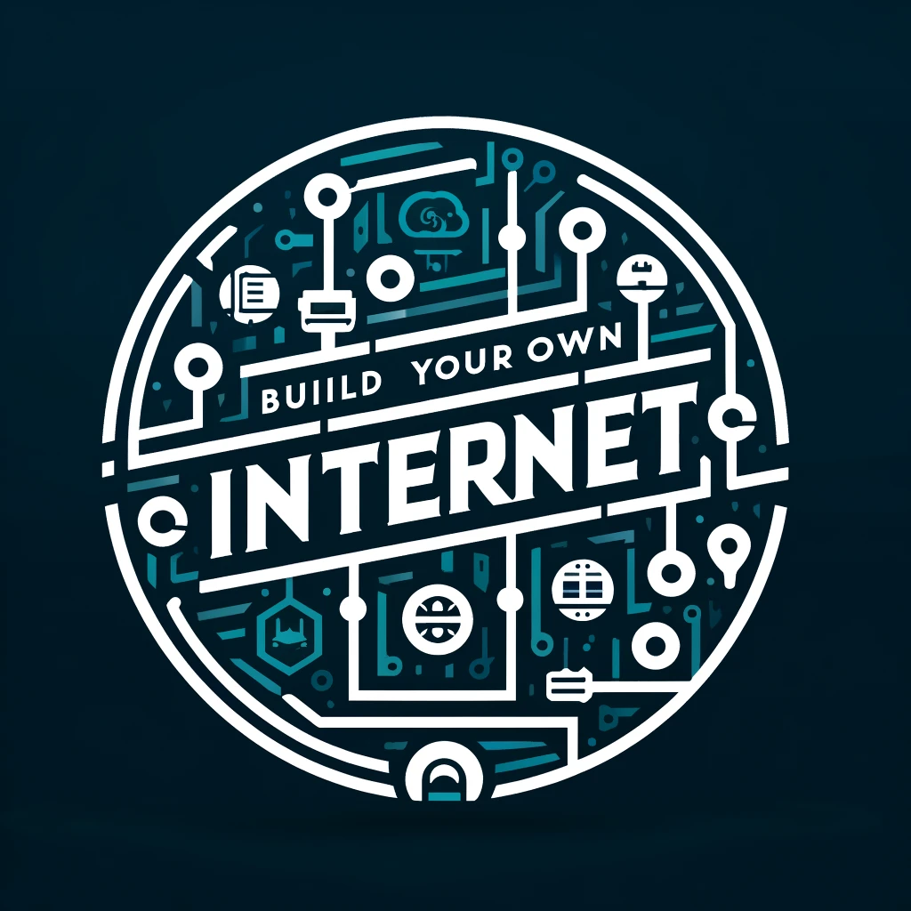

# build-your-own-internet

[![CC BY-NC-SA 4.0][cc-by-nc-sa-shield]][cc-by-nc-sa]

## How to approach this repo

The intention behind this project is discovery and understanding. The idea is to explore how the internet is put together and use common industry tools to see and understand all the communications necessary to make the services and apps we use work.

We decided to take notes that create a reproducible experience. We document our questions, discovery, and our processes so other people who may want to take a similar journey can have a path to follow. We have broken up our exploration into chapters. Each chapter has a README that documents our exploration and whatever files we create or modify in our exploration. Some chapters have a /final directory that contain the artifacts for the chapter in their final state. If you get lost in a chapter and need a reference point, these may be artifacts to help move you forward. There is, at least as of yet, very little actual software to run from this repo. Instead, the intent is to guide the experience and the learning process.

### Folders

* `appendix`: polished documents that dive deep into concepts that are useful to understand, but that we don't have a curriculum to build from scratch.
* `bin`: useful scripts used in our explorations.
* `chapters`: The primary folder of this repo. That runs through the learning process of building up an internet from scratch.
* `future`: ideas we want to explore in the future, some of which have some outlines of how we intend to start thinking about those topics.
* `miscellaneous`: mostly explorations that were discarded because they turned out to be tangential docker problems/learnings.

## Pre-requisites

### Knowledge

* a basic understanding of terminals and [bash](https://www.linkedin.com/learning/learning-bash-scripting-17063287/learning-bash-scripting)
* a basic understanding of [IPv4 and subnets](./appendix/prefixes-and-subnet-masks.md)
* optional but highly recommended: a basic understanding of docker [Course link](https://www.linkedin.com/learning/learning-docker-2018/why-create-containers-using-docker)
* optional for the super motivated: understand the [communication protocol layers](https://datatracker.ietf.org/doc/rfc1122/) we'll be working with

### Software

You will need to install [colima](https://smallsharpsoftwaretools.com/tutorials/use-colima-to-run-docker-containers-on-macos/) or [docker desktop](https://www.docker.com/products/docker-desktop/) to manage your docker instances. We go into more detail what these software are and how to get started with them in [our prequel chapter 000](./chapters/000-prequel-how-does-this-work/README.md).

## DISCLAIMERS

We've put some effort into [explaining the commands](./chapters/command-reference-guide.md) that we're using. However, if we use a command with a flag that doesn't have explanation, check the command's `help` for more details; e.g. `ping --help`. Alternatively, check the command's manpage; e.g. `man ping`.

## Stages of the project

We now have a [future](./future/) folder with some ideas on technology we would like to implement in our internet. But... here's a rough flow of how we started thinking about the order.

### [COMPLETE] STAGE 0: What is the bare minimum to make an internet?

* having machines running on three or more networks
* being able to send packets between those machines on those different networks
* using basic software to be able to view what's happening on those networks

### STAGE 1: What makes large internets possible?

* BGP/IGP:Dozen nodes running BGP
* DNS (root nodes)

### STAGE 2: Secure that shit

* TLS: load/use basic Server/client certificates (generate using openssl)

### STAGE 3: Make it look like the internet we know and love

* Applications (HTTP servers)

### Stage 4: How can we replace some of these things with stuff we build

* Set up a Root CA (Boulder) and import root certificates to Chrome
* Build our own BGP implementation?
* Build our own DNS server?

### Side Quests?

Here's some interesting topics that came up in the course of our exploration that didn't fit in at the time. We may come back to these?

* DHCP
* Proxy ARP
* Firewalls
* Caching

## TODOs

* improve footnotes
* table of contents?

This work is licensed under a [Creative Commons Attribution-NonCommercial-ShareAlike 4.0 International License][cc-by-nc-sa].

[![CC BY-NC-SA 4.0][cc-by-nc-sa-image]][cc-by-nc-sa]

[cc-by-nc-sa]: http://creativecommons.org/licenses/by-nc-sa/4.0/
[cc-by-nc-sa-image]: https://licensebuttons.net/l/by-nc-sa/4.0/88x31.png
[cc-by-nc-sa-shield]: https://img.shields.io/badge/License-CC%20BY--NC--SA%204.0-lightgrey.svg
