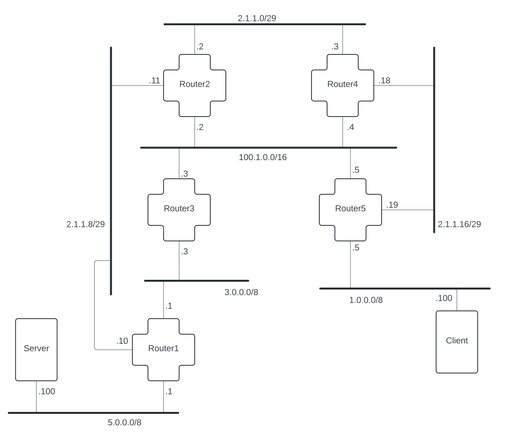

# How to Read a Network Map

Everything that we build in this project depends on us understanding the shape of the networks and internetworks we're working with in each chapter. To help us visualize what our internets look like, we'll use a tool called a 'network map'. They may look confusing and overwhelming to begin with, but we can break it down into something more manageable.

## The Basics: A Single Network

Let's start with a very simple network map:

So, what's going on here? First, what's probably most obvious about this map is that we have 2 machines on our network: a `Client` and a `Server`. Now, look at how each machine has a thin line coming out of it that connects it to a thicker line. That thick line symbolizes the network, and the thin lines from each machine symbolize their connections to that network.

So basically, in this picture, we have a single network and 2 machines that are connected to that network. But, we still need a way to programmatically identify the machines on the network. This is where IP addresses are going to come in. An IP address is a unique locator for one or more machines on an internet. But in order to find that machine, we need to know what network it's on. You'll see `10.1.1.0/24` under the thick black network line in this map. The network address is identified by an IP prefix, `10.1.1.0`, followed by a subnet mask, `/24`. You might take the time to read the appendix on [Prefixes and Subnet Masks](prefixes-and-subnet-masks.md), but much of what's discussed there will become clearer as you work through the chapters.

So we've identified that the network is `10.1.1.0/24`, but we also need to know the specific IP addresses of the individual machines on this network. Find the single number under each machine, e.g. `.3` under `Client`. For our network maps, we're using that number in the final octet of the IP address to identify that machine. So, `Client` has an interface on the `10.1.1.0/24` network, and it has the `.3` identifier under it, so for this network map, `Client`'s IP address is going to be `10.1.1.3`.

## Step it up a Notch: A Smol Internet(work)

So, we now know how to read a network map for a single network. But we're looking to build a full internet! That means multiple networks! Let's look at a slightly more complicated network map:

OK, some of this should already look familiar. See if you can identify each of the following:

- We've got a few machines.
- Each machine has a line that intersects with at least one network (the thick black lines).
- We can see some IP addresses next to each network, so we know what addresses that network covers.
- And we can see some numbers next to the interface(s) for each machine that help us know what the IP address is for that machine.

Sweet! Great starting point! The primary new thing in this map is the `Router`, the plus shaped machine in the center of our diagram. Routers are just more machines on the internet. There are only 2 things that make routers special:

1. They have interfaces on more than one network.
2. They can forward packets (more on this as you read through the chapters).

When we look at this network map, we can see that the `Router` has a connection on BOTH `10.1.1.0/24` and `10.1.2.0/24`. We made the IP address for the router end in `.3` in both cases, just to make it simple for this internet. This does not always need to be the case in reality.

## Break it Down: Can You Find the Path?

Alright, let's make this more interesting. Take a look at this slightly chonkier internet map:

See if you can complete the following exercises:

1. What is `Server`'s IP address? What is `Router4`'s IP address on `2.1.1.0/29`?
2. Use the lines that connect the machines to their networks to find a path for requests from `Client` to reach `Server`. 3. What do you think is the best path? Write down the IP addresses of each machine that will be used in that path.
