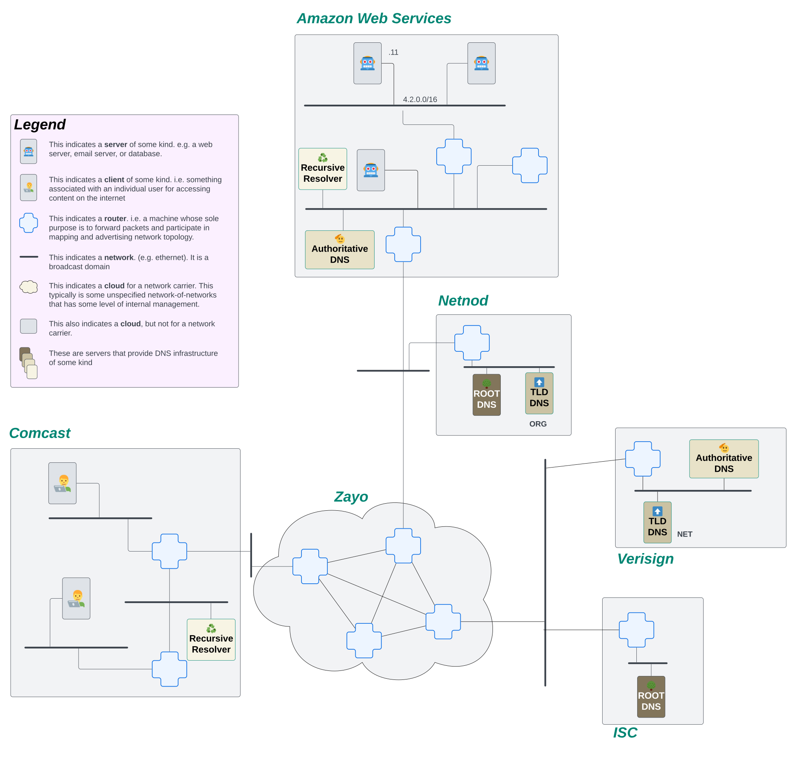
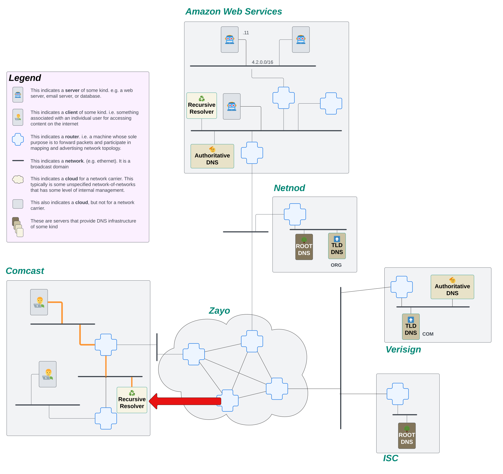

# How Does Recursive DNS Work?

Name resolution is the process of converting a human readable name, e.g. `www.happycat.com`, into an IP address. There's a bunch of different ways to perform name resolution, but on The Internet, we'll mostly see this done in the Domain Name System, or DNS.

But if I wanna make a request to look up what the IP address is for a particular name, what's actually performing the lookup for me? And how does it know what server to send its request to?

## High Level: How is DNS Name Resolution Performed?

At a very high level, DNS name resolution is performed by asking a bunch of different machines what the IP address is for a particular name. Each machine gets us closer to our answer.

Think of it this way... Let's say someone mentions to you that they just had a great vacation hiking in the Grand Canyon. It sounds really rad, so you wanna look up if you could take a similar vacation. But, how can you find somewhere to stay? What else is there to do in the area? Where do you even start to figure this out? We need some kind of centralized place where everyone knows they can go to gather this kind of information. For this scenario, we'll go to the Google machine.

OK, so you ask Google hotels near the Grand Canyon, and Google comes back with some information. Neat! But it's not booking you a room. It's just telling you where to go so you can book a room. You click on the link for the hotel chain, and it doesn't take you to a reservation page. It takes you to a home site where you can select a location for the hotel you want to stay in. You select the location and you're finally where you want to be; on a form to book a room for your stay.

In that process, we started with a very wide search, asking generally for hotels near the Grand Canyon. Then we found a hotel chain, but the information was still too broad, we needed to narrow it down to a specific building for that chain. Finally, we get to the right place to do what we need. This is a recursive process, each step getting us closer to the end goal of booking a room for our vacation.

A DNS lookup on The Internet follows a similar recursive process to find the DNS records for a name. The process starts at a Root DNS server that has a global knowledge of names on the internet, but it doesn't know anything specific. Instead, the Root DNS server will say to go ask a different machine, a Top Level Domain (TLD) server, that knows a bit more of the specifics. The TLD server still doesn't know about the specific DNS records for the name, but it does know which machine should have those records. So it will point to the Authoritative DNS machine for the name. Finally, a request can land on the Authoritative DNS server, which can answer the DNS queries it recieves.

## The Hardware

Before we can look at the process, we need to learn a little bit about the specific machines involved in DNS. We'll use a [new network map](./how-to-read-a-network-map.md) with a few new machines defined on it:

Let's briefly break down what we're seeing in this network map. If you haven't already, it would behoove you to read over [How to Read a Network Map](./how-to-read-a-network-map.md) before continuing this section.

One major thing we added to this map is that the internet is made up of networks of networks. But the networks aren't necessarily a single prefix. Within a network, the owner can break up it's IP addresses however they want. So this network map shows that the internet knows about Comcast, for example, as a network. But within Comcast, they've broken up their larger prefixes. This bit is largely irrelevant to this discussion, but we wanted to call that out to avoid confusion!

We color coded this map a bit to make it easier to find the machines we're talking about. All of the machines that are various shades of brown and have labels on them are part of the DNS infrastructure on our internet. Look for the following machines in our internet diagram above:

- Root DNS
- TLD DNS
- Authoritative DNS
- Recursive Resolver

Let's see how each of these machines is used in our recursive DNS lookup.

## The Process: A Recursive DNS Lookup in Slow Motion

_**NOTE** For the purposes of this explanation, we're going to ignore that caching exists._

First. Let’s just define the actual goal of what we’re trying to accomplish. Using the network map above, we're going to pretend we're sitting on a client machine.

Now, the user on this machine really wants to go visit `www.happycat.com`. Before the user can revel in GIFs and shorts of cats being awesome in the world, they need to resolve `www.happycat.com` to an IP address. The first thing this machine is going to do is send a request to their ISP's (Comcast in this case) recursive resolver.

The recursive resolver's job is to keep asking questions about what the DNS records are for a name until it gets a final answer. It will continue to initiate new requests until it either receives a response with the DNS records it was looking for or it receives an error. Only then will it respond back to the client.

So, what's the first thing it needs to do? It doesn't know what server on the internet might know about `www.happycat.com`, but! Fortunately, every resolver comes installed with a file called `root.hints`. This file provides the resolver the IP addresses of ALL of the root servers around the world. Since, for this explanation, we're ignoring the cache, the only thing the resolver knows about on the internet are those root servers. It will start by firing off a request to the Root DNS servers, asking them what the IP address is for `www.happycat.com`.

