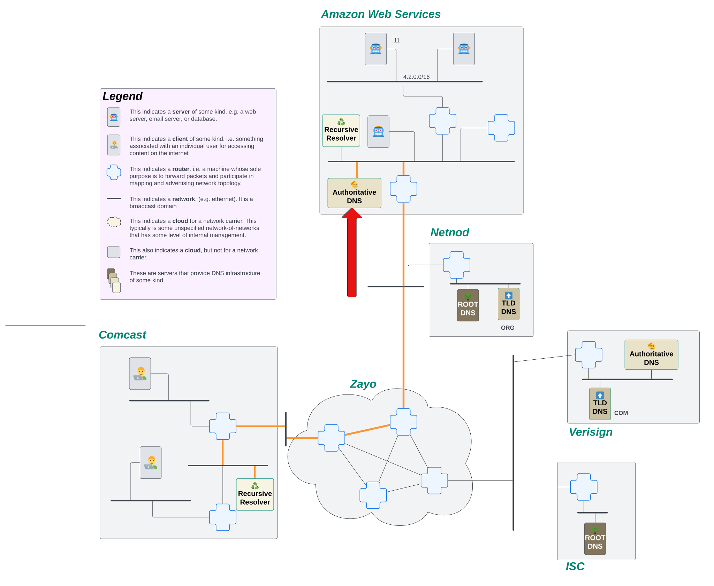

# How Does Recursive DNS Work?

Name resolution is the process of converting a human readable name, e.g. `www.awesomecat.com`, into an IP address. There's a bunch of different ways to perform name resolution, but on The Internet, we'll mostly see this done in the Domain Name System, or DNS.

But if I wanna make a request to look up what the IP address is for a particular name, what's actually performing the lookup for me? And how does it know what server to send its request to?

## High Level: How is DNS Name Resolution Performed?

At a very high level, DNS name resolution is performed by asking a bunch of different machines what the IP address is for a particular name. Each machine gets us closer to our answer.

Think of it this way... Let's say someone mentions to you that they just had a great vacation hiking in the Grand Canyon. It sounds really rad, so you wanna look up if you could take a similar vacation. But, how can you find somewhere to stay? What else is there to do in the area? Where do you even start to figure this out? We need some kind of centralized place where everyone knows they can go to gather this kind of information. For this scenario, we'll go to the Google machine.

OK, so you ask Google hotels near the Grand Canyon, and Google comes back with some information. Neat! But it's not booking you a room. It's just telling you where to go so you can book a room. You click on the link for the hotel chain, and it doesn't take you to a reservation page. It takes you to a home site where you can select a location for the hotel you want to stay in. You select the location and you're finally where you want to be; on a form to book a room for your stay.

In that process, we started with a very wide search, asking generally for hotels near the Grand Canyon. Then we found a hotel chain, but the information was still too broad, we needed to narrow it down to a specific building for that chain. Finally, we get to the right place to do what we need. This is a recursive process, each step getting us closer to the end goal of booking a room for our vacation.

A DNS lookup on The Internet follows a similar recursive process to find the DNS records for a name. The process starts at a Root DNS server that has a global knowledge of names on the internet, but it doesn't know anything specific. Instead, the Root DNS server will say to go ask a different machine, a Top Level Domain (TLD) server, that knows a bit more of the specifics. The TLD server still doesn't know about the specific DNS records for the name, but it does know which machine should have those records. So it will point to the Authoritative DNS machine for the name. Finally, a request can land on the Authoritative DNS server, which can answer the DNS queries it recieves.

But why go through all this process? Why don't we just have those root servers answer all the DNS queries? The problem is load. There are millions of DNS queries being made on the internet every second. There isn't a machine on earth that could handle the load for all domain names on the internet. Instead, we ask machines to delegate responsibility by the label. So the root servers are responsible for pointing the resolver to the TLDs, which handle a much smaller portion of the traffic. In turn, the TLDs delegate to the authoritative servers, which handle a fraction of the TLD traffic. In this way, the internet doesn't take down any machine and we can handle the load for all the DNS queries!

## The Hardware

Before we can look at the process, we need to learn a little bit about the specific machines involved in DNS. We'll use a new network map with a few new machines defined on it:


Let's briefly break down what we're seeing in this network map. If you haven't already, it would behoove you to read over [How to Read a Network Map](../../appendix/how-to-read-a-network-map.md) before continuing this section.

One major thing we added to this map is that the internet is made up of networks of networks. But the networks aren't necessarily a single prefix. Within a network, the owner can break up it's IP addresses however they want. So this network map shows that the internet knows about Comcast, for example, as a network. But within Comcast, they've broken up their larger prefixes. This bit is largely irrelevant to this discussion, but we wanted to call that out to avoid confusion!

We color coded this map a bit to make it easier to find the machines we're talking about. All of the machines that are various shades of brown and have labels on them are part of the DNS infrastructure on our internet. Look for the following machines in our internet diagram above:

- Root DNS
- TLD DNS
- Authoritative DNS
- Recursive Resolver

Let's see how each of these machines is used in our recursive DNS lookup.

## The Process: A Recursive DNS Lookup in Slow Motion

_**NOTE** For the purposes of this explanation, we're going to ignore that caching exists._

First. Let’s just define the actual goal of what we’re trying to accomplish. Using the network map above, we're going to pretend we're sitting on a client machine.


Now, the user on this machine really wants to go visit `www.awesomecat.com`. Before the user can revel in GIFs and shorts of cats being awesome in the world, they need to resolve `www.awesomecat.com` to an IP address. The first thing this machine is going to do is send a request to their ISP's (Comcast in this case) recursive resolver.


The recursive resolver's job is to keep asking questions about what the DNS records are for a name until it gets a final answer. It will continue to initiate new requests until it either receives a response with the DNS records it was looking for or it receives an error. Only then will it respond back to the client.

So, what's the first thing it needs to do? It doesn't know what server on the internet might know about `www.awesomecat.com`. Fortunately, every resolver comes installed with a file called [root.hints](https://www.internic.net/domain/named.root). This file provides the resolver the IP addresses of ALL of the root servers around the world. Since, for this explanation, we're ignoring the cache, the only thing the resolver knows about on the internet are those root servers. It will start by firing off a request to the Root DNS servers, asking them what the IP address is for `www.awesomecat.com`.


The role of the Root DNS server on The Internet is simple. All they do is tell the resolver which Top Level Domain (TLD) servers to go to. Root DNS servers don't know all the DNS records for every domain on the internet. That would be way too many requests and waaaaaaaay too many domain names! What they do know is where the next step to find those answers lives.

Let's look at the domain we're attempting to lookup again: `www.awesomecat.com`. The Root DNS server looks at the last label on this name, `com`, and tells the recursive resolver to go ask one of the `COM` TLD servers. This gets us one step closer to learning what the address records are for the domain we want to lookup!

Our resolver receives the response back from the Root server, and it recognizes that this is not the final answer it's looking for. But! It also sees that it now has IP addresses of another server that has more information about the domain it's attempting to look up! So, our stalwart resolver fires off requests to the `COM` TLD servers.


Much like the Root DNS server, our TLD servers see way too much traffic to be able to provide answers to every DNS query that hits them. Instead, they too delegate.

When `www.awesomecat.com` was created, a new record was added to the the `com.` TLD servers that instructed them to point any queries for any sub-domain under the `awesomecat.com` apex to a specific Authoritative DNS server. All over the internet, there are Authoritative DNS servers, servers that are responsible for providing answers to DNS queries for the names they know about.

So in the story of our little resolver trying to find the IP address for `www.awesomecat.com`, it sent a request to the TLD server for `com.`, but it got another brush off. It was told that it needs to go ask the Authoritative DNS server for `awesomecat.com`.

Our resolver receives that response, and undeterred, it initiates another new request, this time to the Authoritative server it just learned about.



The request lands on the Authoritative DNS server for this domain, and that server actually knows about the domain! It's able to send back an IP address for a server that knows how to handle queries for `www.awesomecat.com`!!!

The resolver receives the response, sees that it AT LAST has an IP address for `www.awesomecat.com`, and sends that response back to the client. The process is complete!

## Let's See The Recursive DNS Lookup Happen Programmatically

OK. That's all fine and good to see on our little internet, but what happens when this process is let loose in the real world? We're going to step out of our toy internet for a moment and interact with the real internet. We can pretend that we are a stalwart resolver out on the internet, bound and determined to find an IP address for `www.awesomecat.com`. While we don't have a network map for you to follow along with, we can simulate this process using a command line tool called `dig`.

### Understanding the output of a `dig` command

Let's start with some basic `dig` output for the query `dig www.awesomecat.com`:

```bash
$ dig www.awesomecat.com

; <<>> DiG 9.10.6 <<>> www.awesomecat.com
;; global options: +cmd
;; Got answer:
;; ->>HEADER<<- opcode: QUERY, status: NOERROR, id: 55033
;; flags: qr rd ra; QUERY: 1, ANSWER: 2, AUTHORITY: 0, ADDITIONAL: 1

;; OPT PSEUDOSECTION:
; EDNS: version: 0, flags:; udp: 512
;; QUESTION SECTION:
;www.awesomecat.com.  IN A

;; ANSWER SECTION:
www.awesomecat.com. 3600 IN A 76.223.54.146
www.awesomecat.com. 3600 IN A 13.248.169.48

;; Query time: 106 msec
;; SERVER: 2001:558:feed::1#53(2001:558:feed::1)
;; WHEN: Tue Oct 29 14:16:55 MDT 2024
;; MSG SIZE  rcvd: 79
```

Let's decipher what we're seeing here before we get too far into this explanation. The primary things we're going to be looking at are the `status`, `ANSWER`, `AUTHORITY`, `ADDITIONAL`, and `SERVER` sections of this response.

The `status` header tells us whether or not a request was able to return a response, and in cases where it couldn’t, why it couldn’t return a response. The most common statuses you’ll encounter are:

- `NOERROR`: The request for a domain was able to be successfully routed, and the server processing the request did not error out when looking up the name.
- `SERVFAIL`: The domain requested exists, but the DNS server either doesn’t have data or has bad data for it.
- `NXDOMAIN`: The domain requested doesn’t exist.
- `REFUSED`: The authoritative DNS server refused the request. The domain doesn’t exist and the server refuses to process requests for domains that do not exist.

The `AUTHORITY` and `ADDITIONAL` sections tell us where we can go to find DNS records for the name if the server we're querying doesn't have them.

The `ANSWER` section is, as you might have guessed, the actual response for the DNS query. It tells us the name that being resolved (e.g. `www.awesomecat.com`), the time to live (TTL) of the DNS response (e.g. `3600`), and the answer to the DNS query (e.g. `76.223.54.146`). This particular domain has 2 different IP addresses your machine can use! Neat!

### Understanding the record types

As we explore the process a recursive resolver goes through to resolve a name, we'll see a few different record types. Each record type performs a different service for the domain and/or the name resolution process. Let's take a look at a few common record types:

- `A`: an IPv4 record.
- `AAAA`: an IPv6 record.
- `NS`: a Name Server record. This points the resolver to a nameserver that should be authoritative over the domain.
- `TXT`:  a simple string record on the domain. This is frequently used for validating ownership over the domain.

### Querying a Each Server Directly

As we mentioned earlier, we might not know where to go to resolve a name. But, because we're filling in the place of a resolver, we can always know where to start! We just need to find our Root DNS servers!

Let's start by running a `dig` without including a name in the question. The output of this command will give us something similar to what would exist in a real resolver's [root.hints](https://www.internic.net/domain/named.root) file. Here we'll see a list of all the Root Servers in the world:

```bash
$ dig

; <<>> DiG 9.10.6 <<>>
;; global options: +cmd
;; Got answer:
;; ->>HEADER<<- opcode: QUERY, status: NOERROR, id: 36819
;; flags: qr rd ra ad; QUERY: 1, ANSWER: 13, AUTHORITY: 0, ADDITIONAL: 27

;; OPT PSEUDOSECTION:
; EDNS: version: 0, flags:; udp: 512
;; QUESTION SECTION:
;.    IN NS

;; ANSWER SECTION:
.   501023 IN NS i.root-servers.net.
.   501023 IN NS j.root-servers.net.
.   501023 IN NS k.root-servers.net.
.   501023 IN NS l.root-servers.net.
.   501023 IN NS m.root-servers.net.
.   501023 IN NS a.root-servers.net.
.   501023 IN NS b.root-servers.net.
.   501023 IN NS c.root-servers.net.
.   501023 IN NS d.root-servers.net.
.   501023 IN NS e.root-servers.net.
.   501023 IN NS f.root-servers.net.
.   501023 IN NS g.root-servers.net.
.   501023 IN NS h.root-servers.net.

;; ADDITIONAL SECTION:
a.root-servers.net. 393950 IN A 198.41.0.4
a.root-servers.net. 393975 IN AAAA 2001:503:ba3e::2:30
b.root-servers.net. 393960 IN A 170.247.170.2
b.root-servers.net. 393960 IN AAAA 2801:1b8:10::b
c.root-servers.net. 393950 IN A 192.33.4.12
c.root-servers.net. 393950 IN AAAA 2001:500:2::c
d.root-servers.net. 393955 IN A 199.7.91.13
d.root-servers.net. 393956 IN AAAA 2001:500:2d::d
e.root-servers.net. 400379 IN A 192.203.230.10
e.root-servers.net. 395774 IN AAAA 2001:500:a8::e
f.root-servers.net. 393953 IN A 192.5.5.241
f.root-servers.net. 393953 IN AAAA 2001:500:2f::f
g.root-servers.net. 395782 IN A 192.112.36.4
g.root-servers.net. 399710 IN AAAA 2001:500:12::d0d
h.root-servers.net. 393962 IN A 198.97.190.53
h.root-servers.net. 393964 IN AAAA 2001:500:1::53
i.root-servers.net. 393955 IN A 192.36.148.17
i.root-servers.net. 393954 IN AAAA 2001:7fe::53
j.root-servers.net. 393972 IN A 192.58.128.30
j.root-servers.net. 393979 IN AAAA 2001:503:c27::2:30
k.root-servers.net. 393958 IN A 193.0.14.129
k.root-servers.net. 393960 IN AAAA 2001:7fd::1
l.root-servers.net. 393955 IN A 199.7.83.42
l.root-servers.net. 393955 IN AAAA 2001:500:9f::42
m.root-servers.net. 393951 IN A 202.12.27.33
m.root-servers.net. 393951 IN AAAA 2001:dc3::35

;; Query time: 15 msec
;; SERVER: 2001:558:feed::1#53(2001:558:feed::1)
;; WHEN: Tue Oct 29 14:25:46 MDT 2024
;; MSG SIZE  rcvd: 811
```

Let's take note of those fields we highlighted earlier.

First, we see that `status: NOERROR`, which means that our request was successful! We got back a meaningful response!

Next, take a look at that `ANSWER` section. We see a list of 13 servers, each identified by a letter followed by `root-servers.net.`. This is telling us what the names of each of the Root servers are around the world.

Finally, that `ADDITIONAL` section. Here, we're getting both the IPv4 and the IPv6 addresses for each of the names for the Root servers! This speeds up the DNS resolution process because our resolver doesn't have to make a separate query to find the address of the next server it needs to talk to.

OK, so now we know what our Root servers are, we want to ask them what they know about `www.awesomecat.com`. Let's run a `dig` that points that query to one of the root name servers: `dig www.awesomecat.com @i.root-servers.net.`

```bash
$ dig www.awesomecat.com @i.root-servers.net.

; <<>> DiG 9.10.6 <<>> www.awesomecat.com @i.root-servers.net.
;; global options: +cmd
;; Got answer:
;; ->>HEADER<<- opcode: QUERY, status: NOERROR, id: 33978
;; flags: qr rd; QUERY: 1, ANSWER: 0, AUTHORITY: 13, ADDITIONAL: 27
;; WARNING: recursion requested but not available

;; OPT PSEUDOSECTION:
; EDNS: version: 0, flags:; udp: 1232
;; QUESTION SECTION:
;www.awesomecat.com.  IN A

;; AUTHORITY SECTION:
com.   172800 IN NS i.gtld-servers.net.
com.   172800 IN NS a.gtld-servers.net.
com.   172800 IN NS d.gtld-servers.net.
com.   172800 IN NS m.gtld-servers.net.
com.   172800 IN NS l.gtld-servers.net.
com.   172800 IN NS c.gtld-servers.net.
com.   172800 IN NS b.gtld-servers.net.
com.   172800 IN NS g.gtld-servers.net.
com.   172800 IN NS f.gtld-servers.net.
com.   172800 IN NS h.gtld-servers.net.
com.   172800 IN NS e.gtld-servers.net.
com.   172800 IN NS j.gtld-servers.net.
com.   172800 IN NS k.gtld-servers.net.

;; ADDITIONAL SECTION:
m.gtld-servers.net. 172800 IN AAAA 2001:501:b1f9::30
l.gtld-servers.net. 172800 IN AAAA 2001:500:d937::30
k.gtld-servers.net. 172800 IN AAAA 2001:503:d2d::30
j.gtld-servers.net. 172800 IN AAAA 2001:502:7094::30
i.gtld-servers.net. 172800 IN AAAA 2001:503:39c1::30
h.gtld-servers.net. 172800 IN AAAA 2001:502:8cc::30
g.gtld-servers.net. 172800 IN AAAA 2001:503:eea3::30
f.gtld-servers.net. 172800 IN AAAA 2001:503:d414::30
e.gtld-servers.net. 172800 IN AAAA 2001:502:1ca1::30
d.gtld-servers.net. 172800 IN AAAA 2001:500:856e::30
c.gtld-servers.net. 172800 IN AAAA 2001:503:83eb::30
b.gtld-servers.net. 172800 IN AAAA 2001:503:231d::2:30
a.gtld-servers.net. 172800 IN AAAA 2001:503:a83e::2:30
m.gtld-servers.net. 172800 IN A 192.55.83.30
l.gtld-servers.net. 172800 IN A 192.41.162.30
k.gtld-servers.net. 172800 IN A 192.52.178.30
j.gtld-servers.net. 172800 IN A 192.48.79.30
i.gtld-servers.net. 172800 IN A 192.43.172.30
h.gtld-servers.net. 172800 IN A 192.54.112.30
g.gtld-servers.net. 172800 IN A 192.42.93.30
f.gtld-servers.net. 172800 IN A 192.35.51.30
e.gtld-servers.net. 172800 IN A 192.12.94.30
d.gtld-servers.net. 172800 IN A 192.31.80.30
c.gtld-servers.net. 172800 IN A 192.26.92.30
b.gtld-servers.net. 172800 IN A 192.33.14.30
a.gtld-servers.net. 172800 IN A 192.5.6.30

;; Query time: 59 msec
;; SERVER: 2001:7fe::53#53(2001:7fe::53)
;; WHEN: Tue Oct 29 14:34:00 MDT 2024
;; MSG SIZE  rcvd: 846
```

Again, we see `status: NOERROR`. Things are looking good!

But notice... There's no `ANSWER` section in this response. This means we haven't gotten back the IP addresses for the name we're asking about.

When we look at the `AUTHORITY` and `ADDITIONAL` sections, they look pretty similar to our query for just the root servers... But, if you look a little closer, you'll see that the response in the `AUTHORITY` section shows that it's providing answers for `com.`... A closer inspection of the suffix on those names shows us that it's pointing to `gtld-servers.net.`, which you might notice that `tld` is part of that name. So the Root server is saying "I don't know about this name, but if you go ask this `com.` TLD server, you'll probably get a better answer".

PROGRESS!

OK. Let's repeat that process, this time asking one of the `com.` TLD servers `dig www.awesomecat.com @i.gtld-servers.net.`:

```bash
$ dig www.awesomecat.com @i.gtld-servers.net.

; <<>> DiG 9.10.6 <<>> www.awesomecat.com @i.gtld-servers.net.
;; global options: +cmd
;; Got answer:
;; ->>HEADER<<- opcode: QUERY, status: NOERROR, id: 53629
;; flags: qr rd; QUERY: 1, ANSWER: 0, AUTHORITY: 2, ADDITIONAL: 3
;; WARNING: recursion requested but not available

;; OPT PSEUDOSECTION:
; EDNS: version: 0, flags:; udp: 4096
;; QUESTION SECTION:
;www.awesomecat.com.  IN A

;; AUTHORITY SECTION:
awesomecat.com.  172800 IN NS ns3.afternic.com.
awesomecat.com.  172800 IN NS ns4.afternic.com.

;; ADDITIONAL SECTION:
ns3.afternic.com. 172800 IN A 97.74.98.65
ns4.afternic.com. 172800 IN A 173.201.66.65

;; Query time: 42 msec
;; SERVER: 2001:503:39c1::30#53(2001:503:39c1::30)
;; WHEN: Tue Oct 29 14:38:39 MDT 2024
;; MSG SIZE  rcvd: 124
```

We're getting closer! Still no `ANSWER` section, but this time, the `AUTHORITY` section is pointing us to a couple of specific name servers, `ns3.afternic.com.` and `ns4.afternic.com.`. We see the IP addresses for those name servers in the `ADDITIONAL` section.

OK, we're still pretending to be our own resolver. So we don't give up yet! We're gonna make yet another query! Let's take a look at the output from `dig www.awesomecat.com @ns3.afternic.com.`:

```bash
$ dig www.awesomecat.com @ns3.afternic.com.

; <<>> DiG 9.10.6 <<>> www.awesomecat.com @ns3.afternic.com.
;; global options: +cmd
;; Got answer:
;; ->>HEADER<<- opcode: QUERY, status: NOERROR, id: 31304
;; flags: qr aa rd; QUERY: 1, ANSWER: 2, AUTHORITY: 2, ADDITIONAL: 1
;; WARNING: recursion requested but not available

;; OPT PSEUDOSECTION:
; EDNS: version: 0, flags:; udp: 1472
;; QUESTION SECTION:
;www.awesomecat.com.  IN A

;; ANSWER SECTION:
www.awesomecat.com. 3600 IN A 13.248.169.48
www.awesomecat.com. 3600 IN A 76.223.54.146

;; AUTHORITY SECTION:
www.awesomecat.com. 3600 IN NS ns4.afternic.com.
www.awesomecat.com. 3600 IN NS ns3.afternic.com.

;; Query time: 47 msec
;; SERVER: 97.74.98.65#53(97.74.98.65)
;; WHEN: Tue Oct 29 14:46:26 MDT 2024
;; MSG SIZE  rcvd: 124
```

HAHAH! We finally have an `ANSWER` section! Now we know the actual IP addresses for this name! We did it! We followed through the entire recursive process to resolve the name! Congratulations!

We completed this process by manually running every `dig` for every step of the recursive lookup. If you want to see this process run quickly, you can run `dig www.awesomecat.com +trace +answer +additional +authority`. The output will be long, but it should look pretty familiar at this point!

## Recap

So let's review what just happened here.

- The recursive DNS process is necessary because no single machine can be responsible for the entire internet.
- A recursive DNS lookup is performed by a resolver, a special software designed to keep making DNS queries until it receives a definitive answer.
- If a resolver doesn't know where else to go, it will query a root DNS server. The root DNS server will point to the TLD server that should have more information about the domain being requested.
- A TLD server is responsible for knowing which authoritative server owns the records for the next label; e.g. `awesomecat` in `awesomecat.com`.
- The authoritative server keeps track of the DNS records for any domain it is responsible for.
- Once the resolver has an answer, it will send the final response back to the client who initiated the query.

If you'd like to play around in this system, checkout our chapter on [name resolution with recursive DNS](../future/name-resolution/recursive-dns/)!
