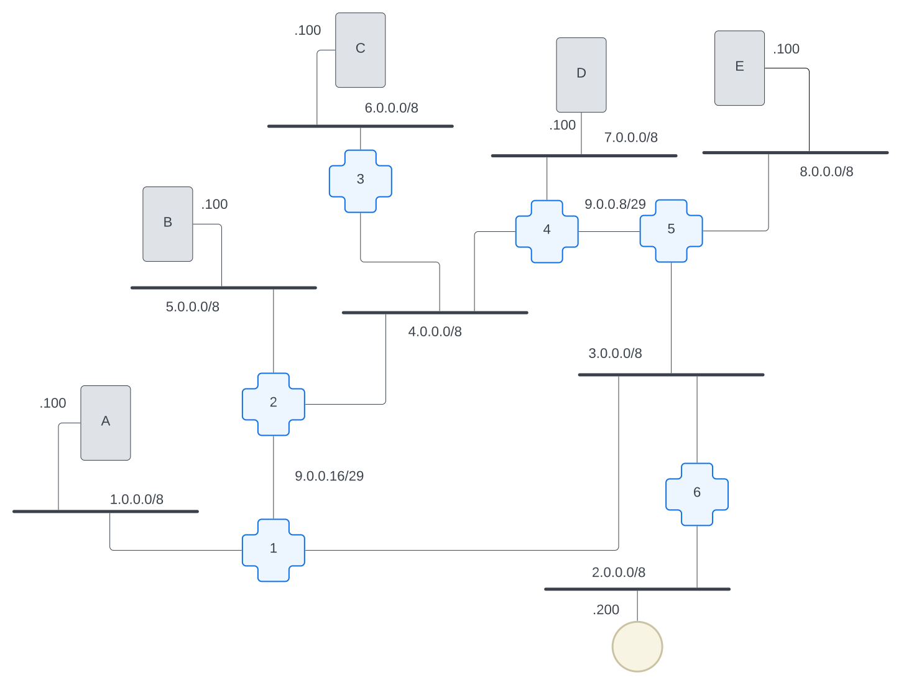

# Name Resolution

What is name resolution? What problem(s) does it solve? In previous chapters, we had to know the exact IP address of each [machine's](../../../chapters/glossary.md#machine) connection on each network to be able to ping. This became really tedious even with a network map in front of us to be able to see what the IP addresses should be. Wouldn't it be nice if we could reach machines over the internet using human-friendly names instead? That's where name resolution comes in! Name-resolution is the process of converting a human-friendly name into the IP address machines need to be able to route traffic across the Internet.

## Goals for this section

Let's take a look at the internet we'll be working with for this chapter. You'll notice we've made some changes from the network diagrams we've used in other chapters. In _this_ internet, we have a bunch of [hosts](../../../chapters/glossary.md#host) that would like to communicate with each other:



Let's say we set this internet up for sharing fun pictures. Perhaps your passion is dancing photos, and host A (1.0.0.101) contains a massive library of `.jpg` files of this genre. Perhaps your friend Squee's passion is adorable kitty pictures, and their host B (5.0.0.102) has photos of that kind. When all of our friends set up their image-sharing hosts, we're going to end up with a bunch of machines that contain specific files we want access to.

Here are some potential problems that could crop up on your new internet:

- How do we know which hosts have which files on it?
- How do we know when a new host with a new genre joins the group?
- What happens if a host moves to a new network?

Can you imagine how this might actually work in a real-life scenario? This is basically how the Internet started, and this is exactly the problem that people found themselves trying to figure out when stuff was all being made. What would _you_ do to solve this problem in the simplest way that could possibly work?

Maybe you could just have central person who has the canonical list of all of your hosts in your friend-group and she mails everyone a new copy whenever it changes? But eventually, you're gonna get tired of this. Why?

- IP addresses are hard to remember and boring to type in
- Someone has to keep meta-data about what each IP address is for since they're not self-explanatory
- If/when a host changes its locations, it's nice not to have to re-discover the host
- You might want more than one host to support a big website: one on the east coast; one the west coast. How do you do that?
- If you referencing web-pages only by IP address (e.g. `http://<ip-address>`), you can only have one web-page per host. What happens if you want more than one website on a host?
- If this scales to a really large number of hosts, even the most dedicated friend is going to quit in frustration
- In the end, this is just busy-work that a human is going to get tired of doing. Maybe a computer should do this instead?

When we have this many hosts, we need a convenient way to tell them apart and know which resources you'll retrieve from each one.  Our goal here is to implement a system to convert a human-readable easy-to-understand name into an IP address.

## Let's do some computers

Okay, we have a brand-new [docker-compose.yml](./docker-compose.yml) file and [Dockerfile](./Dockerfile) for you. This will build out the network that we showed above. Let's start by testing out that this internet works as expected.

Use the [restart](../../../bin/restart) command to start everything up, and use the [hopon](../../../bin/hopon) command to get into `host-a` and `ping` host-c (which is at `6.0.0.103`):

```bash
➜  001-nr-getting-started $ hopon host-a
root@host-a:/# ping 6.0.0.103 -c 2
PING 6.0.0.103 (6.0.0.103) 56(84) bytes of data.
64 bytes from 6.0.0.103: icmp_seq=1 ttl=61 time=0.416 ms
64 bytes from 6.0.0.103: icmp_seq=2 ttl=61 time=0.231 ms

--- 6.0.0.103 ping statistics ---
2 packets transmitted, 2 received, 0% packet loss, time 1062ms
rtt min/avg/max/mdev = 0.231/0.323/0.416/0.092 ms
```

Note that at this point none of the hosts on our network know the names of any of the other hosts on the network, so we need to refer to them with IP addresses only. In other words, `ping`ing `host-c` will not work yet!

```bash
root@host-a:/# ping host-c -c 2 -w 1
ping: host-c: Temporary failure in name resolution
```

## `/etc/hosts` files

`/etc/hosts` is a file used by the unix-family of machines for hard-coded name-resolution. It allows technically-savvy people to force name-resolution to a specific IP address.

> **📝 NOTE:**
> if you're using a Windows machine (non-unix) you'll need to google for the exact location of this file.

Let's take a look at how this works.

On the `host-a` machine, open the file with `nano /etc/hosts`. You'll see a bunch of names already defined:

```nano
127.0.0.1       localhost
::1     localhost ip6-localhost ip6-loopback
fe00::0 ip6-localnet
ff00::0 ip6-mcastprefix
ff02::1 ip6-allnodes
ff02::2 ip6-allrouters
1.0.0.101       host-a
```

The format of this file is to have an IP address starting each line, one or more blank spaces, and one or more human-readable names separated by blank space(s).

Let's add a new name! At the end of this list, add the following line and save the file:

`6.0.0.103 host-c`

**NOW** if you ping host-c, you'll get some feedback!

```bash
root@host-a:/# ping host-c -c2 -w1
PING host-c (6.0.0.103) 56(84) bytes of data.
64 bytes from host-c (6.0.0.103): icmp_seq=1 ttl=61 time=0.426 ms

--- host-c ping statistics ---
1 packets transmitted, 1 received, 0% packet loss, time 0ms
rtt min/avg/max/mdev = 0.426/0.426/0.426/0.000 ms
```

Name resolved! ✅

### NOTES

- [ ] Using the network with all the name-resolution done by docker-compose
      talk about using lynx to browse around our internet
- [X] Introduce the new inter-network and why we changed our design
- [X] Set up Docker/docker-compose for hosts
- [X] Have a _single_ `/etc/hosts` on one of the hosts
- [X] need to create an HTML document and place ASCII-image files on each host
- [ ] explain something about what each of these servers is offering
- [ ] Start with the basics: reach each host with http://<ip-address>
- [X] Cheat with docker by synchronizing that `/etc/hosts` files across all hosts
- [ ] Stop cheating and implement synchronization of `/etc/hosts` on each machine and see name-resolution work.

- [ ] think about stuff:
  - [ ] are we still going to have "hopon" ?
