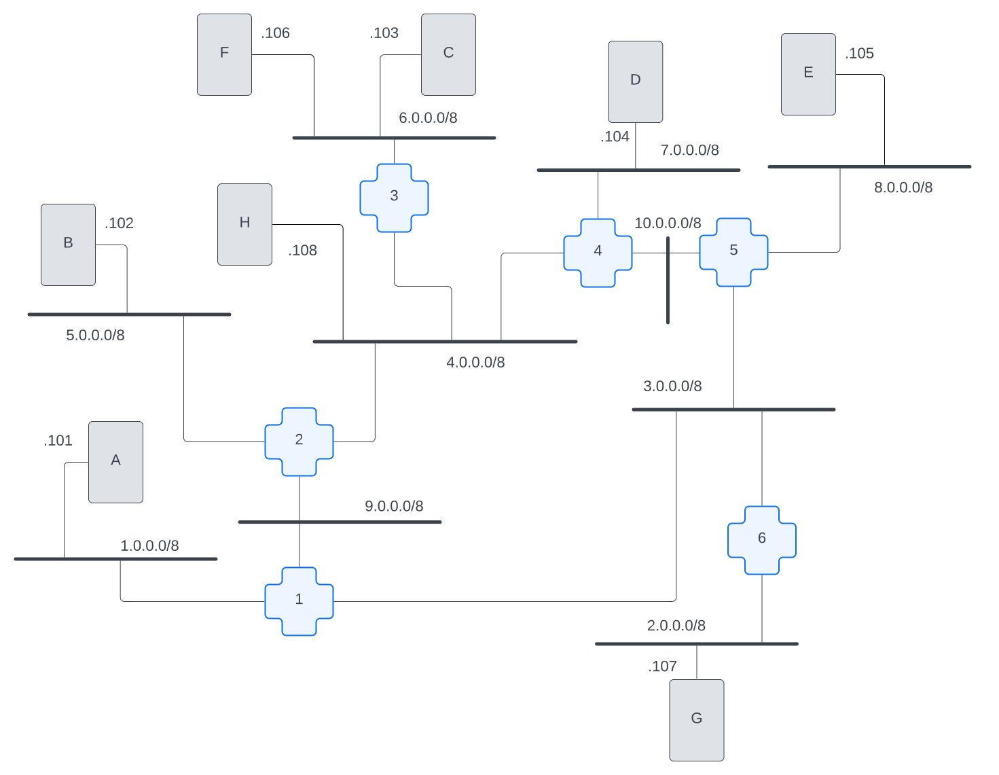

# Name Resolution

## Preface: the shape of our internet

First, let's check out what our little internet looks like for this chapter:



The significant things to note about this internet are that we have 2 machines on one network, `host-c` and `host-f` are on `6.0.0.0/8`, and we added a new host, `host-h` to the `4.0.0.0/8` network. `host-h` is only one hop away from `host-c` and `host-f`. This means that requests from `host-h` <=> `host-c` only need to be routed through one router. This simplifies what we're looking at when we are checking what's happening on our internet. We wanted to have a request path that involved one and only one router; adding `host-h` handled that for us.

## Goal

In the last chapter, we kinda cheated... We used our docker-compose.yaml file to insert entries into our `/etc/hosts` file for name resolution. In the real world, we don't have an option to modify the `/etc/hosts` files on every machine on the internet. In this chapter, we've removed those `/etc/hosts` entries, so we're starting off with nothing configured for name resolution. What can we do to solve the problem of name resolution _without_ using our little Docker hack?

Let's start with the simplest thing we can do. We're gonna head down the route of using a [multicast](../../../chapters/glossary.md#multicast) solution called `avahi`. By the end of this chapter, you should be able to `ping` or use `links` to reach each name for each host on our little internet.

What is this "multicast" stuff? Don't worry, you'll see it in action pretty soon!

## Avahi and avahi-daemon

Avahi is a program which uses [multicast](../../../chapters/glossary.md#multicast) to perform name resolution on local networks with minimal configuration. If you check the [Dockerfile](./Dockerfile) for this chapter, you'll see that we added a new software, `avahi-utils`.

You'll recall, in [chapter 1](../001-nr-getting-started/README.md#how-does-your-computer-know-where-to-go-to-resolve-a-name), we took a look at the contents of `/etc/nsswitch.conf`. We saw that the `hosts` line directed the computer how to resolve a name. It started with looking at the `files` on the system, e.g. `/etc/hosts`, and if it didn't find the name there, then it could use `dns` if it were configured.

Once you've `restart`ed for this chapter, `hopon` a host and `cat /etc/nsswitch.conf`. We'll see that `avahi-utils` added a couple new entries into that `hosts` line to direct name resolution requests for itself.

```bash
hosts:          files mdns4_minimal [NOTFOUND=return] dns
```

What looks different now? Let's look at what each of these is doing; a couple of them will be review:

* `files`: Is there an entry for this hostname in a local file? In UNIX based systems that file would be `/etc/hosts`.
* `mdns4_minimal`: can this name be resolved using a multicast resolver? This is specific to resolving hostnames in the local network.
* `[NOTFOUND=return]`: if the hostname matches the TLD for `mdns4_minimal`, e.g. `.local`, but the hostname cannot be resolved, don't send this request out to the open internet. For example, if we requested `host-x.local`, which doesn't exist on our little internet, don't make an open internet request.
* `dns`: We gotta outsource this request to the larger internet; check the `/etc/resolv.conf` file for where we should send our DNS queries.

>**📝 NOTE:**
> In order to ensure that Docker wasn't trying to help us with name resolution for these chapters, we nerfed the `/etc/resolv.conf` file. Therefore the `dns` entry in `/etc/nsswitch.conf` won't do anything on these hosts.

## Using Multicast to Resolve Names Between 2 Hosts on the Same Network

First, let's check to make sure `avahi-daemon` is already running on our hosts. Go ahead and `hopon host-c` and run `ps -aux` to get a list of processes that are currently running on the host.

```bash
root@host-c:/# ps aux | grep avahi
avahi         14  0.0  0.1   7236  2696 ?        S    18:14   0:00 avahi-daemon: running [host-c.local]
avahi         15  0.0  0.0   7136  1300 ?        S    18:14   0:00 avahi-daemon: chroot helper
root          42  0.0  0.0   3472  1792 pts/0    S+   18:20   0:00 grep --color=auto avahi
```

We can see that the `avahi-daemon` is running. Huzzah! We should be able to use it to perform local name resolution. Let's start by `ping`ing `host-f`. The first thing `ping` will have to do is resolve the hostname to an IP address. But, just like in other chapters, we wanna see what's happening in all this communication. Let's use our old friend `tcpdump`!

We'll need to open 3 terminal sessions:

* `host-f`: `tcpdump -nvvv`
* `host-c`: `tcpdump -nvvv`
* `host-c`: `ping -w1 host-f`

```bash
root@host-c:/# ping -w1 host-f
ping: host-f: Temporary failure in name resolution
```

Oh no... As you can see, we still have a name resolution failure here. We're not even seeing any packets on `host-c`'s `tcpdump`. It's not even attempting to send any packets across the network to figure out the IP address for `host-f`. Because `/etc/hosts` doesn't contain this name and because `/etc/resolv.conf` has been commented out to disable DNS, only multicast DNS (`mdns4_minimal`) is available to us.

When we check the [Avahi docs](https://avahi.org/), we can see that Avahi responds to the `*.local` hostname. Let's see what happens when we run the same ping, but this time to `host-f.local`:

```bash
root@host-c:/# ping -w1 host-f.local
PING host-f.local (6.0.0.106) 56(84) bytes of data.
64 bytes from 6.0.0.106: icmp_seq=1 ttl=64 time=0.309 ms

--- host-f.local ping statistics ---
1 packets transmitted, 1 received, 0% packet loss, time 0ms
rtt min/avg/max/mdev = 0.309/0.309/0.309/0.000 ms
```

All this output is a little overwhelming. You can click on each command to see the full output block of what we saw when we ran these commands on our machines.

<details>
<summary><b>host-c: tcpdump -nvvv</b></summary>

```bash
19:59:53.972283 IP (tos 0x0, ttl 255, id 50541, offset 0, flags [DF], proto UDP (17), length 58)
    6.0.0.103.5353 > 224.0.0.251.5353: [bad udp cksum 0xe799 -> 0x628b!] 0 A (QM)? host-f.local. (30)
19:59:53.973513 IP (tos 0x0, ttl 255, id 46184, offset 0, flags [DF], proto UDP (17), length 68)
    6.0.0.106.5353 > 224.0.0.251.5353: [bad udp cksum 0xe7a6 -> 0x578d!] 0*- [0q] 1/0/0 host-f.local. (Cache flush) [2m] A 6.0.0.106 (40)
19:59:53.975708 ARP, Ethernet (len 6), IPv4 (len 4), Request who-has 6.0.0.106 tell 6.0.0.103, length 28
19:59:53.975823 ARP, Ethernet (len 6), IPv4 (len 4), Reply 6.0.0.106 is-at 02:42:06:00:00:6a, length 28
19:59:53.975842 IP (tos 0x0, ttl 64, id 65145, offset 0, flags [DF], proto ICMP (1), length 84)
    6.0.0.103 > 6.0.0.106: ICMP echo request, id 20, seq 1, length 64
19:59:53.975981 IP (tos 0x0, ttl 64, id 47696, offset 0, flags [none], proto ICMP (1), length 84)
    6.0.0.106 > 6.0.0.103: ICMP echo reply, id 20, seq 1, length 64
19:59:59.124685 ARP, Ethernet (len 6), IPv4 (len 4), Request who-has 6.0.0.103 tell 6.0.0.106, length 28
19:59:59.124705 ARP, Ethernet (len 6), IPv4 (len 4), Reply 6.0.0.103 is-at 02:42:06:00:00:67, length 28
```

</details>

<details>
<summary><b>host-f: tcpdump -nvvv</b></summary>

```bash
19:59:53.972447 IP (tos 0x0, ttl 255, id 50541, offset 0, flags [DF], proto UDP (17), length 58)
    6.0.0.103.5353 > 224.0.0.251.5353: [bad udp cksum 0xe799 -> 0x628b!] 0 A (QM)? host-f.local. (30)
19:59:53.973418 IP (tos 0x0, ttl 255, id 46184, offset 0, flags [DF], proto UDP (17), length 68)
    6.0.0.106.5353 > 224.0.0.251.5353: [bad udp cksum 0xe7a6 -> 0x578d!] 0*- [0q] 1/0/0 host-f.local. (Cache flush) [2m] A 6.0.0.106 (40)
19:59:53.975768 ARP, Ethernet (len 6), IPv4 (len 4), Request who-has 6.0.0.106 tell 6.0.0.103, length 28
19:59:53.975786 ARP, Ethernet (len 6), IPv4 (len 4), Reply 6.0.0.106 is-at 02:42:06:00:00:6a, length 28
19:59:53.975877 IP (tos 0x0, ttl 64, id 65145, offset 0, flags [DF], proto ICMP (1), length 84)
    6.0.0.103 > 6.0.0.106: ICMP echo request, id 20, seq 1, length 64
19:59:53.975944 IP (tos 0x0, ttl 64, id 47696, offset 0, flags [none], proto ICMP (1), length 84)
    6.0.0.106 > 6.0.0.103: ICMP echo reply, id 20, seq 1, length 64
19:59:59.124551 ARP, Ethernet (len 6), IPv4 (len 4), Request who-has 6.0.0.103 tell 6.0.0.106, length 28
19:59:59.124771 ARP, Ethernet (len 6), IPv4 (len 4), Reply 6.0.0.103 is-at 02:42:06:00:00:67, length 28
```

</details>

Let's see if we can make sense of what we're seeing by following the timestamps in chronological order for each line of output from both machines. Look at the timestamps across all the output. What's the first thing you see happening?

> **host-c:**
> 19:59:53.972283 IP (tos 0x0, ttl 255, id 50541, offset 0, flags [DF], proto UDP (17), length 58)
    6.0.0.103.5353 > 224.0.0.251.5353: [bad udp cksum 0xe799 -> 0x628b!] 0 A (QM)? host-f.local. (30)

Before `host-c` can send out the ICMP packets, it needs to know the IP address of the machine its sending them to. We know that `host-c` is configured through `/etc/nsswitch.conf` to use multicast to lookup any `.local` address. Any address within the `224.0.0.0/4` subnet is designated as a multicast address; specifically, `224.0.0.251` is reserved for multicast DNS requests. We can also see that it's using the port `5353`, which is also reserved for multicast DNS requests.

So, on this line, we see that `host-c` (`6.0.0.103`) is making a request to a known multicast DNS IP address and port for name resolution for `host-f.local`.

> **host-f:**
> 19:59:53.972447 IP (tos 0x0, ttl 255, id 50541, offset 0, flags [DF], proto UDP (17), length 58)
    6.0.0.103.5353 > 224.0.0.251.5353: [bad udp cksum 0xe799 -> 0x628b!] 0 A (QM)? host-f.local. (30)

We see the name resolution request packet that `host-c` sent hitting `host-f`. This is exact same packet we saw above, except this time from `host-f`'s perspective.

Why is `host-f` receiving a packet for `224.0.0.251`? That's not its IP address!

So now, let's go back to the question of "what is this 'multicast' stuff?" Multicast is a protocol that provides a structure for a machine on an internetwork to communicate with other machines on an internetwork without already knowing their IP addresses.

We've seen a similar protocol in previous chapters, ARP ([a quick reminder on how ARP and ethernet works](../../../appendix/ip-and-mac-addresses.md)). ARP is a protocol that enables IP discovery between machines on a network. ARP doesn't need to know the IP address of each machine ahead of time because it can send packets to all machines to find out which machine owns an address. Similarly, multicast doesn't need to know the IP addresses of the hosts taht it wants to communicate with. Both ARP and multicast using the same underlying capability within the ethernet, namely, ethernet broadcast.

An ethernet broadcast frame goes to a special ethernet MAC address, `ff:ff:ff:ff:ff:ff`. Any frames destined for that MAC address go to EVERY machine on that network. However, routers don't route those packets. A multicast packet, even though its being broadcast on an ethernet network, CAN be picked up by a router and forwarded throughout an internet network. But the routers have to be specially configured for that and the vast majority of the time, they aren't.

> **host-f:**
> 19:59:53.973418 IP (tos 0x0, ttl 255, id 46184, offset 0, flags [DF], proto UDP (17), length 68)
    6.0.0.106.5353 > 224.0.0.251.5353: [bad udp cksum 0xe7a6 -> 0x578d!] 0*- [0q] 1/0/0 host-f.local. (Cache flush) [2m] A 6.0.0.106 (40)

`host-f` sends response packets to the multicast DNS address basically saying "IT ME!", passing its own IP address, `6.0.0.106`. This message tells machines on the multicast network to flush their caches for this hostname and cache this new response for 2m (2 minutes).

> **host-c:**
> 19:59:53.973513 IP (tos 0x0, ttl 255, id 46184, offset 0, flags [DF], proto UDP (17), length 68)
    6.0.0.106.5353 > 224.0.0.251.5353: [bad udp cksum 0xe7a6 -> 0x578d!] 0*- [0q] 1/0/0 host-f.local. (Cache flush) [2m] A 6.0.0.106 (40)

`host-c` receives `host-f`'s response packet, which says "hey, if you have a cached response for `host-f.local`, go ahead and flush that cache and instead cache this IP address for 2m (2 minutes)".

Et voila! We have name resolution. If you follow the rest of the tcpdumps, you'll see content we've already talked about. ARP, followed by ICMP echo requests and replies.

## Using Multicast to Resolve Names Between Hosts on 2 Different Networks

OK! We got a `ping` working! But if we look at the network diagram pictured at the top of this chapter, we can see that `host-c` and `host-f` are on the same network. What happens if we try to `ping host-h`, which is on a different network?

```bash
root@host-c:/# ping -w2 host-h.local
ping: host-h.local: Name or service not known
```

Multicasting by default only works on local networks, in this case machines that can communicate directly with one another via ethernet. This is because ethernet provides an ability for a machine to broadcast to all other machines on the network.

Avahi uses IP multicast, which gets translated to ethernet broadcast messages. By default, routers ignore these messages, so the messages never get sent to the broader internet. To put this more simply, `host-c` and `host-f` are on the same network, so they can exchange ethernet broadcast messages with each other directly. `host-h`, however, has to be reached through our internet, which requires routers to either forward or proxy messages to it.

### Hacking some Routers

Ok, first off... Let's talk a little more about what Avahi can do for us. Within a local network, Avahi will help us with multicast name resolution. However, when it comes to traversing networks, it is STRONGLY discouraged to use multicast for name resolution. Fortunately for us, Avahi has some built-in tooling to allow us to resolve names across networks.

Soooooo, we kinda tricked you. The default build we created for this chapter only has `avahi-daemon` running on the hosts, not the routers. If you check the network diagram above, you'll see that the network `host-c` is on and the network `host-h` is on are connected by `router-3`. In order for name resolution to work between these networks, we need to get `router-3` in on the game!

`hopon router-3` and run `avahi-daemon --daemonize` to get Avahi set up for name resolution between these networks!

### See it work

Now that we've got it all configured, let's see name resolution working across networks. We're going to re-run that `ping` on `host-c`, but this time we need a few more terminal sessions open to watch what's happening on each machine:

* `host-h`: run `tcpdump -n`
* `router-3`: run `tcpdump -nvvvi eth0`
* `router-3`: run `tcpdump -nvvvi eth1`
* `host-c`: run `tcpdump -n`
* `host-c`: run `ping host-h.local -c2`

Make sure you keep track of which interface is on which network for `router-3`. We want to be able to examine the packets running through each machine, and knowing the interface will help you understand the story!

Let's start by looking at the `ping` output from host-c.

```bash
root@host-c:/# ping host-h.local -c2
PING host-h.local (4.0.0.108) 56(84) bytes of data.
64 bytes from 4.0.0.108: icmp_seq=1 ttl=63 time=0.209 ms
64 bytes from 4.0.0.108: icmp_seq=2 ttl=63 time=0.319 ms

--- host-h.local ping statistics ---
2 packets transmitted, 2 received, 0% packet loss, time 1031ms
rtt min/avg/max/mdev = 0.209/0.264/0.319/0.055 ms
```

Here we can see the name resolution was successful! That `PING host-h.local (4.0.0.108)...` shows that `host-c` knows that `host-h` resolves to `4.0.0.108`. It can now send packets to that IP in order to complete the `ping`. But let's look at what was involved in performing that name resolution.

Just like we saw before, the rest of this output is a little overwhelming. You can click on each command to see the full output block of what we saw when we ran these commands on our machines.

<details>
<summary><b>host-h: tcpdump -n</b></summary>

```bash
root@host-h:/# tcpdump -n
tcpdump: verbose output suppressed, use -v[v]... for full protocol decode
listening on eth0, link-type EN10MB (Ethernet), snapshot length 262144 bytes
19:58:36.777779 IP 4.0.3.1.5353 > 224.0.0.251.5353: 0 A (QM)? host-h.local. (30)
19:58:36.782619 IP 4.0.0.108.5353 > 224.0.0.251.5353: 0*- [0q] 1/0/0 (Cache flush) A 4.0.0.108 (40)
19:58:36.787645 IP 6.0.0.103 > 4.0.0.108: ICMP echo request, id 8, seq 1, length 64
19:58:36.787669 IP 4.0.0.108 > 6.0.0.103: ICMP echo reply, id 8, seq 1, length 64
19:58:37.819176 IP 6.0.0.103 > 4.0.0.108: ICMP echo request, id 8, seq 2, length 64
19:58:37.819206 IP 4.0.0.108 > 6.0.0.103: ICMP echo reply, id 8, seq 2, length 64
19:58:42.040638 ARP, Request who-has 4.0.3.1 tell 4.0.0.108, length 28
19:58:42.040762 ARP, Request who-has 4.0.0.108 tell 4.0.3.1, length 28
19:58:42.040850 ARP, Reply 4.0.0.108 is-at 02:42:04:00:00:6a, length 28
19:58:42.040916 ARP, Reply 4.0.3.1 is-at 02:42:04:00:03:01, length 28
^C
10 packets captured
10 packets received by filter
0 packets dropped by kernel
```

</details>

<details>
<summary><b>router-3: tcpdump -nvvvi eth0</b></summary>

```bash
root@router-3:/# tcpdump -nvvvi eth0
tcpdump: listening on eth0, link-type EN10MB (Ethernet), snapshot length 262144 bytes
19:58:36.777712 IP (tos 0x0, ttl 255, id 35930, offset 0, flags [DF], proto UDP (17), length 58)
    4.0.3.1.5353 > 224.0.0.251.5353: [bad udp cksum 0xe833 -> 0x61f1!] 0 A (QM)? host-h.local. (30)
19:58:36.782772 IP (tos 0x0, ttl 255, id 50413, offset 0, flags [DF], proto UDP (17), length 68)
    4.0.0.108.5353 > 224.0.0.251.5353: [bad udp cksum 0xe5a6 -> 0x5b8d!] 0*- [0q] 1/0/0 host-h.local. (Cache flush) [2m] A 4.0.0.108 (40)
19:58:36.787610 IP (tos 0x0, ttl 63, id 24750, offset 0, flags [DF], proto ICMP (1), length 84)
    6.0.0.103 > 4.0.0.108: ICMP echo request, id 8, seq 1, length 64
19:58:36.787697 IP (tos 0x0, ttl 64, id 8806, offset 0, flags [none], proto ICMP (1), length 84)
    4.0.0.108 > 6.0.0.103: ICMP echo reply, id 8, seq 1, length 64
19:58:37.819136 IP (tos 0x0, ttl 63, id 24918, offset 0, flags [DF], proto ICMP (1), length 84)
    6.0.0.103 > 4.0.0.108: ICMP echo request, id 8, seq 2, length 64
19:58:37.819244 IP (tos 0x0, ttl 64, id 8949, offset 0, flags [none], proto ICMP (1), length 84)
    4.0.0.108 > 6.0.0.103: ICMP echo reply, id 8, seq 2, length 64
19:58:42.040666 ARP, Ethernet (len 6), IPv4 (len 4), Request who-has 4.0.0.108 tell 4.0.3.1, length 28
19:58:42.040748 ARP, Ethernet (len 6), IPv4 (len 4), Request who-has 4.0.3.1 tell 4.0.0.108, length 28
19:58:42.040822 ARP, Ethernet (len 6), IPv4 (len 4), Reply 4.0.3.1 is-at 02:42:04:00:03:01, length 28
19:58:42.040929 ARP, Ethernet (len 6), IPv4 (len 4), Reply 4.0.0.108 is-at 02:42:04:00:00:6a, length 28
^C
10 packets captured
10 packets received by filter
0 packets dropped by kernel
```

</details>

<details>
<summary><b>router-3: tcpdump -nvvvi eth1</b></summary>

```bash
root@router-3:/# tcpdump -nvvvi eth1
tcpdump: listening on eth1, link-type EN10MB (Ethernet), snapshot length 262144 bytes
19:58:36.776906 IP (tos 0x0, ttl 255, id 6263, offset 0, flags [DF], proto UDP (17), length 58)
    6.0.0.103.5353 > 224.0.0.251.5353: [bad udp cksum 0xe799 -> 0x628b!] 0 A (QM)? host-h.local. (30)
19:58:36.785114 IP (tos 0x0, ttl 255, id 15580, offset 0, flags [DF], proto UDP (17), length 68)
    6.0.3.1.5353 > 224.0.0.251.5353: [bad udp cksum 0xea3d -> 0x56f6!] 0*- [0q] 1/0/0 host-h.local. (Cache flush) [2m] A 4.0.0.108 (40)
19:58:36.787590 IP (tos 0x0, ttl 64, id 24750, offset 0, flags [DF], proto ICMP (1), length 84)
    6.0.0.103 > 4.0.0.108: ICMP echo request, id 8, seq 1, length 64
19:58:36.787710 IP (tos 0x0, ttl 63, id 8806, offset 0, flags [none], proto ICMP (1), length 84)
    4.0.0.108 > 6.0.0.103: ICMP echo reply, id 8, seq 1, length 64
19:58:37.819110 IP (tos 0x0, ttl 64, id 24918, offset 0, flags [DF], proto ICMP (1), length 84)
    6.0.0.103 > 4.0.0.108: ICMP echo request, id 8, seq 2, length 64
19:58:37.819264 IP (tos 0x0, ttl 63, id 8949, offset 0, flags [none], proto ICMP (1), length 84)
    4.0.0.108 > 6.0.0.103: ICMP echo reply, id 8, seq 2, length 64
19:58:42.040599 ARP, Ethernet (len 6), IPv4 (len 4), Request who-has 6.0.0.103 tell 6.0.3.1, length 28
19:58:42.040775 ARP, Ethernet (len 6), IPv4 (len 4), Request who-has 6.0.3.1 tell 6.0.0.103, length 28
19:58:42.040877 ARP, Ethernet (len 6), IPv4 (len 4), Reply 6.0.3.1 is-at 02:42:06:00:03:01, length 28
19:58:42.040903 ARP, Ethernet (len 6), IPv4 (len 4), Reply 6.0.0.103 is-at 02:42:06:00:00:67, length 28
^C
10 packets captured
10 packets received by filter
0 packets dropped by kernel
```

</details>

<details>
<summary><b>host-c: tcpdump -n</b></summary>

```bash
root@host-c:/# tcpdump -n
tcpdump: verbose output suppressed, use -v[v]... for full protocol decode
listening on eth0, link-type EN10MB (Ethernet), snapshot length 262144 bytes
19:58:36.776848 IP 6.0.0.103.5353 > 224.0.0.251.5353: 0 A (QM)? host-h.local. (30)
19:58:36.785144 IP 6.0.3.1.5353 > 224.0.0.251.5353: 0*- [0q] 1/0/0 (Cache flush) A 4.0.0.108 (40)
19:58:36.787560 IP 6.0.0.103 > 4.0.0.108: ICMP echo request, id 8, seq 1, length 64
19:58:36.787743 IP 4.0.0.108 > 6.0.0.103: ICMP echo reply, id 8, seq 1, length 64
19:58:37.819056 IP 6.0.0.103 > 4.0.0.108: ICMP echo request, id 8, seq 2, length 64
19:58:37.819299 IP 4.0.0.108 > 6.0.0.103: ICMP echo reply, id 8, seq 2, length 64
19:58:42.040695 ARP, Request who-has 6.0.3.1 tell 6.0.0.103, length 28
19:58:42.040733 ARP, Request who-has 6.0.0.103 tell 6.0.3.1, length 28
19:58:42.040794 ARP, Reply 6.0.0.103 is-at 02:42:06:00:00:67, length 28
19:58:42.040942 ARP, Reply 6.0.3.1 is-at 02:42:06:00:03:01, length 28
^C
10 packets captured
10 packets received by filter
0 packets dropped by kernel
```

</details>

Just like we did when examining the output of the `tcpdump` of the `ping` from `host-c` to `host-f`, let's follow the timestamps in chronological order for each line of output from each machine.

> **host-c:**
> 19:58:36.776848 IP 6.0.0.103.5353 > 224.0.0.251.5353: 0 A (QM)? host-h.local. (30)

This is the same thing we saw before. `host-c` is sending a name resolution query for `host-h.local` on the multicast DNS IP address and port.

> **router-3, eth1**
> 19:58:36.776906 IP (tos 0x0, ttl 255, id 6263, offset 0, flags [DF], proto UDP (17), length 58)
    6.0.0.103.5353 > 224.0.0.251.5353: [bad udp cksum 0xe799 -> 0x628b!] 0 A (QM)? host-h.local. (30)

We see the name resolution request packet that `host-c` sent hitting `router-3`. This is exact same packet we saw above, except this time from `router-3`'s perspective.

> **router-3, eth0**
> 19:58:36.777712 IP (tos 0x0, ttl 255, id 35930, offset 0, flags [DF], proto UDP (17), length 58)
    4.0.3.1.5353 > 224.0.0.251.5353: [bad udp cksum 0xe833 -> 0x61f1!] 0 A (QM)? host-h.local. (30)

Here we see `router-3` generating its own request for name resolution for `host-h.local`. At first blush, this looks like the same packet we saw on `eth1` for `router-3`... but there's one big important difference. Look at the source IP address: `4.0.3.1`. That's `router-3`'s address on `4.0.0.0/8`, not `host-c`'s address on `6.0.0.0/8`...

What's happening here? `router-3` received `host-c`'s request, and rather than just forwarding `host-c`'s packet, `router-3` then initiated it's own name resolution process. It will respond back to `host-c` directly once it has an answer. This is textbook proxy behavior!

> **host-h**
> 19:58:36.777779 IP 4.0.3.1.5353 > 224.0.0.251.5353: 0 A (QM)? host-h.local. (30)

`host-h` receives the name resolution request from `router-3` for itself. Remember, this is the nature of multicasting. Any packet destined for a multicast IP address, anything in the `224.0.0.0/4` subnet, will be broadcast to EVERY machine on the multicast network.

> **host-h**
> 19:58:36.782619 IP 4.0.0.108.5353 > 224.0.0.251.5353: 0*- [0q] 1/0/0 (Cache flush) A 4.0.0.108 (40)

`host-h` sends response packets to the multicast DNS address, passing its own IP address, `4.0.0.108`. This packet also includes instructions to flush the cache for the name `host-h.local` and cache this new address instead.

> **router-3, eth0**
> 19:58:36.782772 IP (tos 0x0, ttl 255, id 50413, offset 0, flags [DF], proto UDP (17), length 68)
    4.0.0.108.5353 > 224.0.0.251.5353: [bad udp cksum 0xe5a6 -> 0x5b8d!] 0*- [0q] 1/0/0 host-h.local. (Cache flush) [2m] A 4.0.0.108 (40)

`router-3` receives `host-h`'s response packet.

> **router-3, eth1**
> 19:58:36.785114 IP (tos 0x0, ttl 255, id 15580, offset 0, flags [DF], proto UDP (17), length 68)
    6.0.3.1.5353 > 224.0.0.251.5353: [bad udp cksum 0xea3d -> 0x56f6!] 0*- [0q] 1/0/0 host-h.local. (Cache flush) [2m] A 4.0.0.108 (40)

`router-3` responds back to `host-c`'s initial request by letting every machine on the `6.0.0.0/8` network know that `host-h.local` is at `4.0.0.108` and that machines on that network should update their local name resolution cache accordingly.

> **host-c**
> 19:58:36.785144 IP 6.0.3.1.5353 > 224.0.0.251.5353: 0*- [0q] 1/0/0 (Cache flush) A 4.0.0.108 (40)

`host-c` receives the packet from `router-3` to cache `4.0.0.108` as the address for `host-h.local`.

> **host-c**
> 19:58:36.787560 IP 6.0.0.103 > 4.0.0.108: ICMP echo request, id 8, seq 1, length 64

Now that `host-c` knows the IP address to send its packets to, it initiates the ICMP ping request. The rest of this should be old hat to dedicated readers.

## Spreading the gossip

**TODO: update section title**

**TODO:** `restart` the network. `hopon` each host, `c`, `f`, `h`, and `b`. Run a `tcpdump`. get `avahi-daemon` running on routers `2` and `3`. `ping host-b.local` from `host-c`. discuss why we're seeing the name resolution query and response packets on every machine.

## Exercises

### Can `host-c` resolve `host-b.local`?

We've now used Avahi to be able to perform name resolution for machines on `6.0.0.0/8` to machines on `4.0.0.0/8`. Neat! But what about the rest of our little internet? Can you get `host-b.local` to resolve from `host-c`? What needs to change in order for that to work?

<details>
<summary>the super secret answer lies within...</summary>

When `host-c` couldn't reach `host-h.local`, we looked at the network map for this chapter and saw that `router-3` connected the networks these machines were on. Then, we ran `avahi-daemon --daemonize` on `router-3`. By running the Avahi daemon, we were able to use Avahi to connect our multicast networks.

Go check the network map. Which additional router do you need to run `avahi-daemon --daemonize` on for `host-c` to be able to resolve `host-b.local`?
</details>

### Now let's get the whole internet resolving correctly

Previously, we looked at how we `hopon router-*` and run `avahi-daemon --daemonize` to connect another network for name resolution. Obviously, you CAN go to each router and run this command, but that's some boring work if you don't wanna be repetitive. Another option is to update the [start-up.sh](./init/start-up.sh) script for this chapter. Try moving `avahi-daemon --daemonize` to before the conditional and `restart` your internet. Can you `ping` each `host-*.local`?

### Using links to browse our internet

Once you have `avahi-daemon` running on all the routers on our little internet, we should be able to use `links` to browse our images again! We'll need to be sure to use the `*.local` name:

```bash
root@host-c:/# links http://host-f.local
```

### Let's break it all

As [we went over previously](#avahi-and-avahi-daemon), Avahi name resolution works by editing the `hosts` entry in `/etc/nsswitch.conf`. Even if we have the `avahi-daemon` running on a machine, if we remove the `mdns4_minimal` entry from the `hosts` in `/etc/nsswitch.conf`, we'll break the name resolution process. Try it for yourself.

Can you explain why? If you're not comfortable with your explanation yet, review how a computer knows how to resolve a name in [chapter 1](../001-nr-getting-started/README.md#how-does-your-computer-know-where-to-go-to-resolve-a-name).

**TODOS:**

* consider if we should replace `ping` with an actual name resolution tool
  * what about just having a small section at the end that shows some tools/commands?
    * dig
    * getent
* exercise: `hopon host-a`, can you see name resolution packets for `host-b` hitting `host-a`. Maybe use this line: Since this is a multicast packet, every machine on the `6.0.0.0/8` network receives the packet.
* exercise: `restart` machines and perform name resolution for `host-c` => `host-h` again. run `tcpdump` on `host-f`. what are you seeing? why?
* finish Anycast/Multicast/Broadcast explanation
* add an end of the chapter exercises section. one exercise should be changing configuration settings on avahi-conf, e.g. change the hostname. maybe this explanation would help set the stage?

You'll see that `avahi-utils` has been added to your Dockerfile for this chapter to install the software for you on `restart`. We also needed to be able to configure the avahi server. You'll find the configuration settings in [the avahi-daemon.conf file](./init/avahi-daemon.conf) and you'll see the file copied into our containers in [the start-up.sh script](./init/start-up.sh).

## Appendix

### why enable-dbus=no?

started the daemon with `avahi-daemon --debug` and got an error:

```bash
dbus_bus_get_private(): Failed to connect to socket /var/run/dbus/system_bus_socket: No such file or directory
```

looked in `/etc/avahi/avahi-daemon.conf` and set `enable-dbus=no`

everything worked for a local setup, i.e. between host-c and host-f

### Unicast v. Anycast v. Broadcast v. Multicast

We've talked a lot in this chapter about multicast. But what makes multicast different from broadcast? Or hey, anycast and unicast for that matter? What do each of these routing protocols mean? Why would you use each one?

**Unicast** is what we think of when we think of most internet routing. Unicast means that there is a single machine out there on the internet that responds to the destination IP address on a packet. One and only one machine is out there advertising that it is responsible for that IP address. Think of a unicast address like an exact location that you can type into your GPS. You know exactly where you're going and exactly what address you're going to end up at.

**Anycast** is a protocol where more than one machine can answer queries for a single IP address. Each machine will advertise the same IP address into the internet. So, when client sends packets to an IP address that is anycasted from multiple machines, routers will make decisions on where to send the packets. Usually, routers are going to choose the shortest path to the destination, which will very likely be the closest machine. Importantly, the packets still end up on a single machine; they aren't sent to every machine that advertises the IP address. Think of anycast like doing a search for a business. You want to go to a Target. You don't care which location, you just need to get to any Target. You can type 'Target' into your favorite maps app, pick the location that's closest to you, and follow instructions on how to get there.

**Broadcast** is exactly what it sounds like; a message is sent out broadly, so every machine on a network will receive the packets being sent. Think of broadcast like political flyers on a presidential elecation year... They want those flyers to be at EVERY house. They want those flyers to be at every business. They want those flyers to be seen as far and wide as possible with absolutely no discression about who is going to see them.

**Multicast** is another protocol to send packages to many machines at once. Think of multicast like a delivery system for a library. We need to get a box of all the new books, movies, and music to each location so it'll be available for neighborhood patrons. We're gonna go to every location to drop off our packages, but we aren't going to drop packages at the hardware store on our way.


