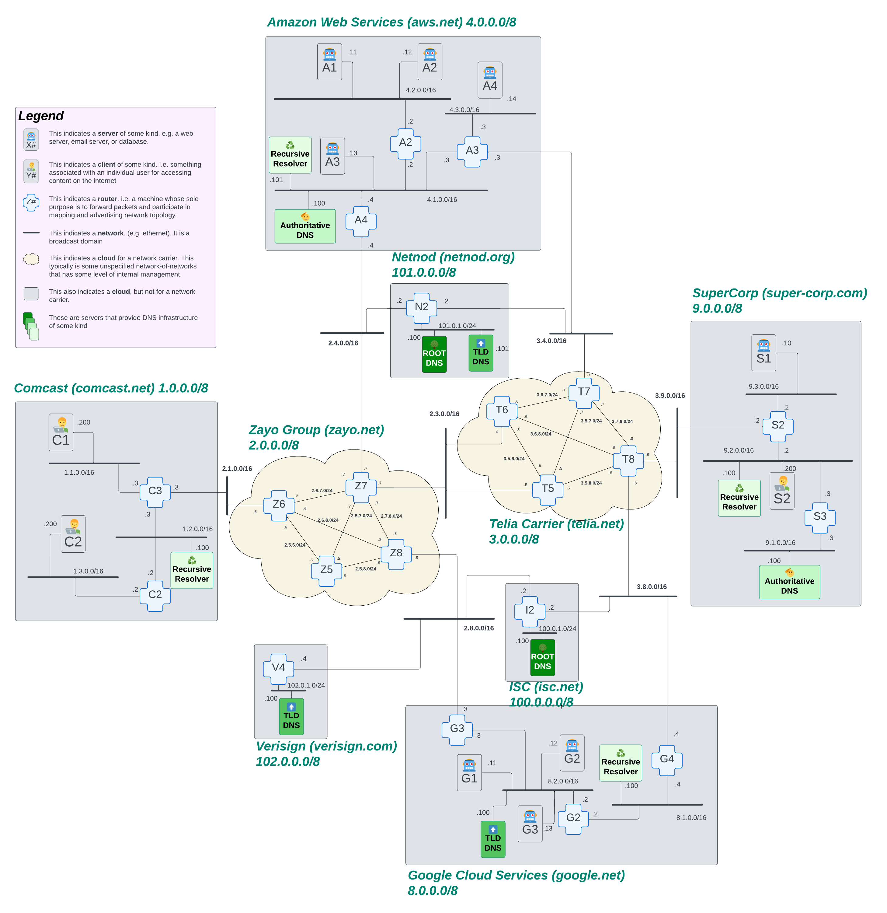

# Recursive DNS

In our previous chapter, we made a promise that we were going to build out a solution that could scale to the entire internet. But then, all we did was build a single DNS server. That single server is not particularly scalable to our internet. In our real world internet, we have millions of machines trying to access apps, sites, APIs, and general content all around the world. In order to do so, they need to convert those easy-for-humans-to-understand domain names into IP addresses. A single DNS server would fall over and cry in pain if it tried to handle all that traffic.

Not only that... We have a system where we don't really trust other people/organizations to manage our domain names for us. We need to have a system where people can be autonomous in managing their domains.

## Goals

0. Understand how recursive DNS works
1. Explore and make changes to the DNS infrastructure of our internet
2. Learn how to troubleshoot DNS errors
3. Build a recursive DNS infrastructure from scratch

## Disclaimer

In previous chapters, we have taken the approach of building our internet interactively where we mixed conversations about how things worked with sections focussed on building out the infrastructure. Given the complexity of DNS and the various systems involved, it feels like that approach won't get you, our audience, to see the value until much later. So, we are taking a new approach in this chapter, where we play with a built out infrastructure to learn about the details of recursive DNS and DNS configuration more broadly. Once you understand that, we will get to build the infrastructure together!

## What is the system we are working with?

This leads us to our map. If you need help understanding this map, check out our [appendix on how to read network maps](../../../appendix/how-to-read-a-network-map.md).



There are some new categories of machines we have added to this network. All of the machines are part of the DNS infrastructure, including:

* Root Nameservers
* Top Level Domain (TLD) Nameservers
* Authoritative Nameservers
* Recursive Resolvers

<!-- TODO: We don't like that an appendix is load bearing to understanding of this section. Come back to it! -->
We go deeper into what roles these different machines play in the context of Recursive DNS in our [appendix on the subject](../../../appendix/recursive-dns.md).

<!--TODO: Ensure that the appendix clearly spells out why recursive DNS is useful -->

## Let's explore how this all works

As promised, we are going to teach you how to use the system before we build the system. Towards that end, we have created sections on useful or interesting things people do when it comes to managing their DNS. So let's dive right in!

### Add a new name

Our current internet has a few names already defined in the DNS. We want to add another one, `www.awesomecat.com`. For most people, they just go to the registrar to add a new name. However, we are in the business of digging deep. So we will explore what happens behind the scenes!

To get started, go ahead and `byoi-rebuild` to bring up the internet we'll be using for this chapter.

Now, where do we start? If you recall the recursive DNS lookup process, a resolver will start by asking the root server where the domain is. The root server will point the resolver to the Top Level Domain (TLD) server for that domain. In this case, `com.`. We know that the root servers in our toy internet already know where the `com.` TLD server is, so we don't need to do that step. Let's go see what the response is to a `dig` for our domain.

First, let's `hopon client-c1` so we can run our query:

```bash
root@client-c1:/# dig www.awesomecat.com

; <<>> DiG 9.18.28-0ubuntu0.24.04.1-Ubuntu <<>> www.awesomecat.com
;; global options: +cmd
;; Got answer:
;; ->>HEADER<<- opcode: QUERY, status: NXDOMAIN, id: 17867
;; flags: qr rd ra; QUERY: 1, ANSWER: 0, AUTHORITY: 1, ADDITIONAL: 1

;; OPT PSEUDOSECTION:
; EDNS: version: 0, flags:; udp: 1232
;; QUESTION SECTION:
;www.awesomecat.com.  IN A

;; AUTHORITY SECTION:
com.   3600 IN SOA tlddns-g.google.com. tlddns-g.google.com. 2024041501 3600 900 604800 86400

;; Query time: 7 msec
;; SERVER: 1.2.0.100#53(1.2.0.100) (UDP)
;; WHEN: Wed Nov 06 21:23:54 UTC 2024
;; MSG SIZE  rcvd: 99
```

Ok, there's several things we learn from this response. First, `status: NXDOMAIN` and `ANSWER: 0` tells us that this domain does not yet exist on our toy internet. Then, in the `AUTHORITY SECTION`, we see that the last machine our recursive resolver could hit was the `com.` TLD server:

```bash
com.   3600 IN SOA tlddns-g.google.com. tlddns-g.google.com. 2024041501 3600 900 604800 86400
```

This also tells us the name of the TLD server for `com.`: `tlddns-g.google.com.`. Now we know we need to `hopon tlddns-g` in order to start adding our DNS records for `www.awesomecat.com`. The software that we use to run our DNS servers for this toy internet is called [knot](https://www.knot-dns.cz/). If you didn't know the software that was running, you could run a simple `netstat` command:

```bash
root@tlddns-g:/# netstat -tulpn
Active Internet connections (only servers)
Proto Recv-Q Send-Q Local Address           Foreign Address         State       PID/Program name
tcp        0      0 8.2.0.100:53            0.0.0.0:*               LISTEN      20/knotd
tcp        0      0 127.0.0.11:39525        0.0.0.0:*               LISTEN      -
udp        0      0 8.2.0.100:53            0.0.0.0:*                           20/knotd
udp        0      0 8.2.0.100:53            0.0.0.0:*                           20/knotd
udp        0      0 127.0.0.11:34177        0.0.0.0:*                           -
```

You'll notice that `knotd` is running on port `53` on a number of these lines (both TCP and UDP). Port 53 is the standard port used for all DNS queries. This confirms that we're running `knot` as our DNS server.

Now, let's look at what the full command is that started this process:

```bash
root@tlddns-g:/# ps aux | grep knot
root          20  0.0  0.0 1546476 6108 ?        Ssl  21:06   0:02 /usr/sbin/knotd --config /config/knot.conf --daemonize
root          46  0.0  0.0   3324  1536 pts/0    S+   21:53   0:00 grep knot
```

So, here we see `/usr/sbin/knotd --config /config/knot.conf --daemonize`, which tells us that the knot server was started using the config file in `/config/knot.conf`. Let's take a look at that file.

```bash
root@tlddns-g:/# cat /config/knot.conf
# Define the server options
server:
  listen: 8.2.0.100@53

# Define the zone
zone:
  - domain: com
    file: "/etc/knot/com.zone"
    storage: "/var/lib/knot"
```

The first thing to notice is that knot is only listening on requests that come in on IP address `8.2.0.100` on port `53`. The IP address there is the address for this machine on our toy internet.

Then we have a list of [zones](../../../chapters/glossary.md#dns-zone). In this config, there is only one zone: `com`. When this server receives a DNS request for a domain, it will check the next label of the name (`awesomecat`) against the file for that zone, `"/etc/knot/com.zone"`. If it finds the name in that file, it can send back the IP address for the server that is the authority over that next label. So let's take a look what currently exists in the `com` zonefile:

```bash
root@tlddns-g:/# cat /etc/knot/com.zone
$ORIGIN com.
@       IN SOA (
                tlddns-g.google.com.     ; MNAME
                tlddns-g.google.com.     ; RNAME
                2024041501               ; serial
                3600                     ; refresh (1 hour)
                900                      ; retry (15 minutes)
                604800                   ; expire (1 week)
                86400                    ; minimum (1 day)
                )

; Top-level domain delegations
com.    IN NS   tlddns-g.google.com.

; All the labels that the TLD knows about
comcast         IN NS  authoritative-s.supercorp.com.
supercorp       IN NS  authoritative-s.supercorp.com.
aws             IN NS  authoritative-a.aws.com.
google          IN NS  authoritative-a.aws.com.

; glue records for the authoritative DNS servers that the TLD knows about
; i.e. if google is using the same authoritative server as aws, it's one glue record
authoritative-a.aws.com.           IN A   4.1.0.100
authoritative-s.supercorp.com.     IN A   9.1.0.100
```

### Add a new TLD

# Exercises

* watching tcp dump of name resolution

* add a new name
* add a new tld
* zone cut at a higher level
* Common DNS issues debugging
  * Leave a DNS entry in a zone file that does not have the dot at the end of it
  * Have a screwed up resolv.conf file (e.g. point to an non-existent recursive resolver)
* bad.horse

NOTES:
Lots of different use-cases:

1. A simple IP address for a single host
2. Multiple names on a single host
3. Multiple IP addresses for a single host
4. A name that resolves to multiple IP addresses
5. Names that differ Inside and outside

## how do I build this from the ground up

## Watch recursive resolution using tcpdump
