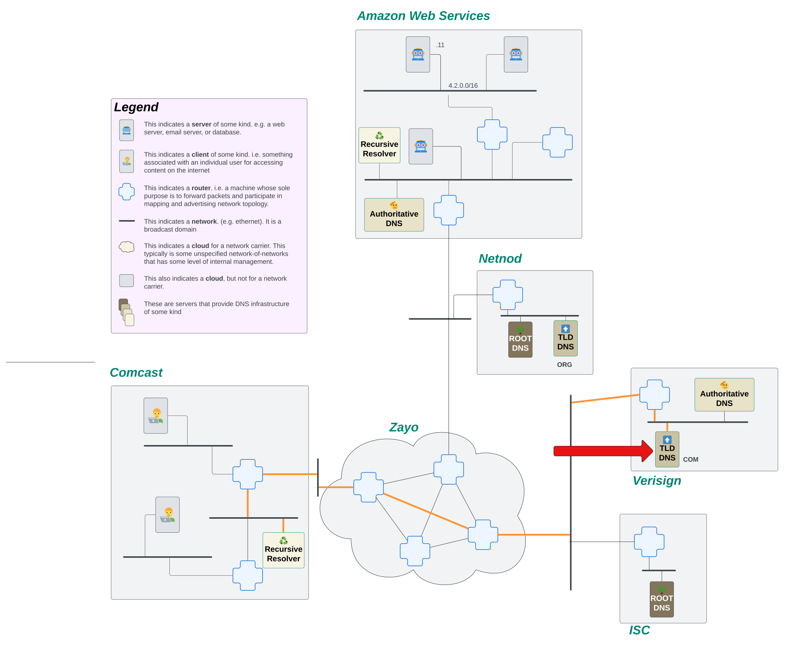

# Recursive DNS

In our previous chapter, we made a promise that we were going to build out a solution that could scale to the entire internet. But then, all we did was build a single DNS server.

In our real world Internet, we have millions of machines trying to access apps, sites, APIs, and general content all around the world. In order to do so, they need to convert those easy-for-humans-to-understand domain names into IP addresses. A single DNS server would fall over and cry in pain if it tried to handle all that traffic.

Not only that... We have a system where we don't really trust other people/organizations to manage our domain names for us. We need to have a system where people can be autonomous in managing their domains.

## Goals

Alright, what we're going to play around with a completely realistic full-size DNS infrastructure with you. This is going to be Full Strength™ DNS as you would see in the Real Internet. To do that, we need to spend a little time talking about how the DNS protocol changes when we shift from a single-dns-server deployment to a realistic multi-server system.

In previous chapters, we have taken the approach of building our internet interactively where we mixed conversations about how things worked with sections focused on building out the infrastructure. Given the complexity of DNS and the various systems involved, it feels like that approach won't get you, our audience, to see the value until much later. So, we are taking a new approach in this chapter, where we play with a built-out infrastructure to learn about the details of recursive DNS and DNS configuration more broadly. In actually managing the DNS system, you'll have an opportunity to see how it all fits together. By the end, we'll ask you to add new elements to the system which will give you the experience of building the system out.

The flow of this chapter, then, will be:

0. Understand how recursive DNS works
1. Explore and make changes to the DNS infrastructure of our internet
2. Describe the basics of DNS troubleshooting
3. Give you some exercises in which you can play around with DNS on your own

## 0. Understand how recursive DNS works

Name resolution is the process of converting a human readable name, e.g. `www.awesomecat.com`, into an IP address. There's a bunch of different ways to perform name resolution, but on The Internet, we'll mostly see this done in the Domain Name System, or DNS.

But if I wanna make a request to look up what the IP address is for a particular name, what's actually performing the lookup for me? And how does it know what server to send its request to?

### High Level: How is DNS Name Resolution Performed?

At a very high level, DNS name resolution is performed by asking a bunch of different machines what the IP address is for a particular name. Each machine gets us closer to our answer.

Think of it this way... Let's say someone mentions to you that they just had a great vacation hiking in the Grand Canyon. It sounds really rad, so you wanna look up if you could take a similar vacation. But, how can you find somewhere to stay? What else is there to do in the area? Where do you even start to figure this out? We need some kind of centralized place where everyone knows they can go to gather this kind of information. For this scenario, we'll go to the Google machine.

OK, so you ask Google hotels near the Grand Canyon, and Google comes back with some information. Neat! But it's not booking you a room. It's just telling you where to go so you can book a room. You click on the link for the hotel chain, and it doesn't take you to a reservation page. It takes you to a home site where you can select a location for the hotel you want to stay in. You select the location and you're finally where you want to be; on a form to book a room for your stay.

In that process, we started with a very wide search, asking generally for hotels near the Grand Canyon. Then we found a hotel chain, but the information was still too broad, we needed to narrow it down to a specific building for that chain. Finally, we get to the right place to do what we need. This is a recursive process, each step getting us closer to the end goal of booking a room for our vacation.

A DNS lookup on The Internet follows a similar recursive process to find the DNS records for a name. The process starts at a Root DNS server that has a global knowledge of names on the internet, but it doesn't know anything specific. Instead, the Root DNS server will say to go ask a different machine, a Top Level Domain (TLD) server, that knows a bit more of the specifics. The TLD server still doesn't know about the specific DNS records for the name, but it does know which machine should have those records. So it will point to the Authoritative DNS machine for the name. Finally, a request can land on the Authoritative DNS server, which can answer the DNS queries it recieves.

But why go through all this process? Why don't we just have those root servers answer all the DNS queries? The problem is load. There are millions of DNS queries being made on the internet every second. There isn't a machine on earth that could handle the load for all domain names on the internet. Instead, we ask machines to delegate responsibility by the label. So the root servers are responsible for pointing the resolver to the TLDs, which handle a much smaller portion of the traffic. In turn, the TLDs delegate to the authoritative servers, which handle a fraction of the TLD traffic. In this way, the internet doesn't take down any machine and we can handle the load for all the DNS queries!

### The Hardware

Before we can look at the process, we need to learn a little bit about the specific machines involved in DNS. We'll use a [new network map](./how-to-read-a-network-map.md) with a few new machines defined on it:


Let's briefly break down what we're seeing in this network map. If you haven't already, it would behoove you to read over [How to Read a Network Map](./how-to-read-a-network-map.md) before continuing this section.

One major thing we added to this map is that the internet is made up of networks of networks. But the networks aren't necessarily a single prefix. Within a network, the owner can break up it's IP addresses however they want. So this network map shows that the internet knows about Comcast, for example, as a network. But within Comcast, they've broken up their larger prefixes. This bit is largely irrelevant to this discussion, but we wanted to call that out to avoid confusion!

We color coded this map a bit to make it easier to find the machines we're talking about. All of the machines that are various shades of brown and have labels on them are part of the DNS infrastructure on our internet. Look for the following machines in our internet diagram above:

- Root DNS
- TLD DNS
- Authoritative DNS
- Recursive Resolver

Let's see how each of these machines is used in our recursive DNS lookup.

### The Process: A Recursive DNS Lookup in Slow Motion

_**NOTE** For the purposes of this explanation, we're going to ignore that caching exists._

First. Let’s just define the actual goal of what we’re trying to accomplish. Using the network map above, we're going to pretend we're sitting on a client machine.


Now, the user on this machine really wants to go visit `www.awesomecat.com`. Before the user can revel in GIFs and shorts of cats being awesome in the world, they need to resolve `www.awesomecat.com` to an IP address. The first thing this machine is going to do is send a request to their ISP's (Comcast in this case) recursive resolver.


The recursive resolver's job is to keep asking questions about what the DNS records are for a name until it gets a final answer. It will continue to initiate new requests until it either receives a response with the DNS records it was looking for or it receives an error. Only then will it respond back to the client.

So, what's the first thing it needs to do? It doesn't know what server on the internet might know about `www.awesomecat.com`. Fortunately, every resolver comes installed with a file called [root.hints](https://www.internic.net/domain/named.root). This file provides the resolver the IP addresses of ALL of the root servers around the world. Since, for this explanation, we're ignoring the cache, the only thing the resolver knows about on the internet are those root servers. It will start by firing off a request to the Root DNS servers, asking them what the IP address is for `www.awesomecat.com`.


The role of the Root DNS server on The Internet is simple. All they do is tell the resolver which Top Level Domain (TLD) servers to go to. Root DNS servers don't know all the DNS records for every domain on the internet. That would be way too many requests and waaaaaaaay too many domain names! What they do know is where the next step to find those answers lives.

Let's look at the domain we're attempting to lookup again: `www.awesomecat.com`. The Root DNS server looks at the last label on this name, `com`, and tells the recursive resolver to go ask one of the `COM` TLD servers. This gets us one step closer to learning what the address records are for the domain we want to lookup!

Our resolver receives the response back from the Root server, and it recognizes that this is not the final answer it's looking for. But! It also sees that it now has IP addresses of another server that has more information about the domain it's attempting to look up! So, our stalwart resolver fires off requests to the `COM` TLD servers.



Much like the Root DNS server, our TLD servers see way too much traffic to be able to provide answers to every DNS query that hits them. Instead, they too delegate.

When `www.awesomecat.com` was created, a new record was added to the the `COM` TLD servers that instructed them to point any queries for any sub-domain under the `awesomecat.com` apex to a specific Authoritative DNS server. All over the internet, there are Authoritative DNS servers, servers that are responsible for providing answers to DNS queries for the names they know about.

So in the story of our little resolver trying to find the IP address for `www.awesomecat.com`, it sent a request to the TLD server for `COM`, but it got another brush off. It was told that it needs to go ask the Authoritative DNS server for `awesomecat.com`.

Our resolver receives that response, and undeterred, it initiates another new request, this time to the Authoritative server it just learned about.


The request lands on the Authoritative DNS server for this domain, and that server actually knows about the domain! It's able to send back an IP address for a server that knows how to handle queries for `www.awesomecat.com`!!!

The resolver receives the response, sees that it AT LAST has an IP address for `www.awesomecat.com`, and sends that response back to the client. The process is complete!

### Let's See The Recursive DNS Lookup Happen Programmatically

OK. That's all fine and good to see on our little internet, but what happens when this process is let loose in the real world? We can pretend that we are a stalwart resolver out on the internet, bound and determined to find an IP address for `www.awesomecat.com`. While we don't have a network map for you to follow along with, we can simulate this process using a command line tool called `dig`.

#### Understanding the output of a `dig` command

Let's start with some basic `dig` output for the query `dig www.awesomecat.com`:

```bash
$ dig www.awesomecat.com

; <<>> DiG 9.10.6 <<>> www.awesomecat.com
;; global options: +cmd
;; Got answer:
;; ->>HEADER<<- opcode: QUERY, status: NOERROR, id: 55033
;; flags: qr rd ra; QUERY: 1, ANSWER: 2, AUTHORITY: 0, ADDITIONAL: 1

;; OPT PSEUDOSECTION:
; EDNS: version: 0, flags:; udp: 512
;; QUESTION SECTION:
;www.awesomecat.com.  IN A

;; ANSWER SECTION:
www.awesomecat.com. 3600 IN A 76.223.54.146
www.awesomecat.com. 3600 IN A 13.248.169.48

;; Query time: 106 msec
;; SERVER: 2001:558:feed::1#53(2001:558:feed::1)
;; WHEN: Tue Oct 29 14:16:55 MDT 2024
;; MSG SIZE  rcvd: 79
```

Let's decipher what we're seeing here before we get too far into this explanation. The primary things we're going to be looking at are the `status`, `ANSWER`, `AUTHORITY`, `ADDITIONAL`, and `SERVER` sections of this response.

The `status` header tells us whether or not a request was able to return a response, and in cases where it couldn’t, why it couldn’t return a response. The most common statuses you’ll encounter are:

- `NOERROR`: The request for a domain was able to be successfully routed, and the server processing the request did not error out when looking up the name.
- `SERVFAIL`: The domain requested exists, but the DNS server either doesn’t have data or has bad data for it.
- `NXDOMAIN`: The domain requested doesn’t exist.
- `REFUSED`: The authoritative DNS server refused the request. The domain doesn’t exist and the server refuses to process requests for domains that do not exist.

The `AUTHORITY` and `ADDITIONAL` sections tell us where we can go to find DNS records for the name if the server we're querying doesn't have them.

The `ANSWER` section is, as you might have guessed, the actual response for the DNS query. It tells us the name that being resolved (e.g. `www.awesomecat.com`), the time to live (TTL) of the DNS response (e.g. `3600`), and the answer to the DNS query (e.g. `76.223.54.146`). This particular domain has 2 different IP addresses your machine can use! Neat!

#### Understanding the record types

As we explore the process a recursive resolver goes through to resolve a name, we'll see a few different record types. Each record type performs a different service for the domain and/or the name resolution process. Let's take a look at a few common record types:

- `A`: an IPv4 record.
- `AAAA`: an IPv6 record.
- `NS`: a Name Server record. This points the resolver to a nameserver that should be authoritative over the domain.
- `TXT`:  a simple string record on the domain. This is frequently used for validating ownership over the domain.

#### Querying a Each Server Directly

As we mentioned earlier, we might not know where to go to resolve a name. But, because we're filling in the place of a resolver, we can always know where to start! We just need to find our Root DNS servers!

Let's start by running a `dig` without including a name in the question. The output of this command will give us something similar to what would exist in a real resolver's [root.hints](https://www.internic.net/domain/named.root) file. Here we'll see a list of all the Root Servers in the world:

```bash
$ dig

; <<>> DiG 9.10.6 <<>>
;; global options: +cmd
;; Got answer:
;; ->>HEADER<<- opcode: QUERY, status: NOERROR, id: 36819
;; flags: qr rd ra ad; QUERY: 1, ANSWER: 13, AUTHORITY: 0, ADDITIONAL: 27

;; OPT PSEUDOSECTION:
; EDNS: version: 0, flags:; udp: 512
;; QUESTION SECTION:
;.    IN NS

;; ANSWER SECTION:
.   501023 IN NS i.root-servers.net.
.   501023 IN NS j.root-servers.net.
.   501023 IN NS k.root-servers.net.
.   501023 IN NS l.root-servers.net.
.   501023 IN NS m.root-servers.net.
.   501023 IN NS a.root-servers.net.
.   501023 IN NS b.root-servers.net.
.   501023 IN NS c.root-servers.net.
.   501023 IN NS d.root-servers.net.
.   501023 IN NS e.root-servers.net.
.   501023 IN NS f.root-servers.net.
.   501023 IN NS g.root-servers.net.
.   501023 IN NS h.root-servers.net.

;; ADDITIONAL SECTION:
a.root-servers.net. 393950 IN A 198.41.0.4
a.root-servers.net. 393975 IN AAAA 2001:503:ba3e::2:30
b.root-servers.net. 393960 IN A 170.247.170.2
b.root-servers.net. 393960 IN AAAA 2801:1b8:10::b
c.root-servers.net. 393950 IN A 192.33.4.12
c.root-servers.net. 393950 IN AAAA 2001:500:2::c
d.root-servers.net. 393955 IN A 199.7.91.13
d.root-servers.net. 393956 IN AAAA 2001:500:2d::d
e.root-servers.net. 400379 IN A 192.203.230.10
e.root-servers.net. 395774 IN AAAA 2001:500:a8::e
f.root-servers.net. 393953 IN A 192.5.5.241
f.root-servers.net. 393953 IN AAAA 2001:500:2f::f
g.root-servers.net. 395782 IN A 192.112.36.4
g.root-servers.net. 399710 IN AAAA 2001:500:12::d0d
h.root-servers.net. 393962 IN A 198.97.190.53
h.root-servers.net. 393964 IN AAAA 2001:500:1::53
i.root-servers.net. 393955 IN A 192.36.148.17
i.root-servers.net. 393954 IN AAAA 2001:7fe::53
j.root-servers.net. 393972 IN A 192.58.128.30
j.root-servers.net. 393979 IN AAAA 2001:503:c27::2:30
k.root-servers.net. 393958 IN A 193.0.14.129
k.root-servers.net. 393960 IN AAAA 2001:7fd::1
l.root-servers.net. 393955 IN A 199.7.83.42
l.root-servers.net. 393955 IN AAAA 2001:500:9f::42
m.root-servers.net. 393951 IN A 202.12.27.33
m.root-servers.net. 393951 IN AAAA 2001:dc3::35

;; Query time: 15 msec
;; SERVER: 2001:558:feed::1#53(2001:558:feed::1)
;; WHEN: Tue Oct 29 14:25:46 MDT 2024
;; MSG SIZE  rcvd: 811
```

Let's take note of those fields we highlighted earlier.

First, we see that `status: NOERROR`, which means that our request was successful! We got back a meaningful response!

Next, take a look at that `ANSWER` section. We see a list of 13 servers, each identified by a letter followed by `root-servers.net.`. This is telling us what the names of each of the Root servers are around the world.

Finally, that `ADDITIONAL` section. Here, we're getting both the IPv4 and the IPv6 addresses for each of the names for the Root servers! This speeds up the DNS resolution process because our resolver doesn't have to make a separate query to find the address of the next server it needs to talk to.

OK, so now we know what our Root servers are, we want to ask them what they know about `www.awesomecat.com`. Let's run a dig that points that query to one of the name servers: `dig www.awesomecat.com @i.root-servers.net.`

```bash
$ dig www.awesomecat.com @i.root-servers.net.

; <<>> DiG 9.10.6 <<>> www.awesomecat.com @i.root-servers.net.
;; global options: +cmd
;; Got answer:
;; ->>HEADER<<- opcode: QUERY, status: NOERROR, id: 33978
;; flags: qr rd; QUERY: 1, ANSWER: 0, AUTHORITY: 13, ADDITIONAL: 27
;; WARNING: recursion requested but not available

;; OPT PSEUDOSECTION:
; EDNS: version: 0, flags:; udp: 1232
;; QUESTION SECTION:
;www.awesomecat.com.  IN A

;; AUTHORITY SECTION:
com.   172800 IN NS i.gtld-servers.net.
com.   172800 IN NS a.gtld-servers.net.
com.   172800 IN NS d.gtld-servers.net.
com.   172800 IN NS m.gtld-servers.net.
com.   172800 IN NS l.gtld-servers.net.
com.   172800 IN NS c.gtld-servers.net.
com.   172800 IN NS b.gtld-servers.net.
com.   172800 IN NS g.gtld-servers.net.
com.   172800 IN NS f.gtld-servers.net.
com.   172800 IN NS h.gtld-servers.net.
com.   172800 IN NS e.gtld-servers.net.
com.   172800 IN NS j.gtld-servers.net.
com.   172800 IN NS k.gtld-servers.net.

;; ADDITIONAL SECTION:
m.gtld-servers.net. 172800 IN AAAA 2001:501:b1f9::30
l.gtld-servers.net. 172800 IN AAAA 2001:500:d937::30
k.gtld-servers.net. 172800 IN AAAA 2001:503:d2d::30
j.gtld-servers.net. 172800 IN AAAA 2001:502:7094::30
i.gtld-servers.net. 172800 IN AAAA 2001:503:39c1::30
h.gtld-servers.net. 172800 IN AAAA 2001:502:8cc::30
g.gtld-servers.net. 172800 IN AAAA 2001:503:eea3::30
f.gtld-servers.net. 172800 IN AAAA 2001:503:d414::30
e.gtld-servers.net. 172800 IN AAAA 2001:502:1ca1::30
d.gtld-servers.net. 172800 IN AAAA 2001:500:856e::30
c.gtld-servers.net. 172800 IN AAAA 2001:503:83eb::30
b.gtld-servers.net. 172800 IN AAAA 2001:503:231d::2:30
a.gtld-servers.net. 172800 IN AAAA 2001:503:a83e::2:30
m.gtld-servers.net. 172800 IN A 192.55.83.30
l.gtld-servers.net. 172800 IN A 192.41.162.30
k.gtld-servers.net. 172800 IN A 192.52.178.30
j.gtld-servers.net. 172800 IN A 192.48.79.30
i.gtld-servers.net. 172800 IN A 192.43.172.30
h.gtld-servers.net. 172800 IN A 192.54.112.30
g.gtld-servers.net. 172800 IN A 192.42.93.30
f.gtld-servers.net. 172800 IN A 192.35.51.30
e.gtld-servers.net. 172800 IN A 192.12.94.30
d.gtld-servers.net. 172800 IN A 192.31.80.30
c.gtld-servers.net. 172800 IN A 192.26.92.30
b.gtld-servers.net. 172800 IN A 192.33.14.30
a.gtld-servers.net. 172800 IN A 192.5.6.30

;; Query time: 59 msec
;; SERVER: 2001:7fe::53#53(2001:7fe::53)
;; WHEN: Tue Oct 29 14:34:00 MDT 2024
;; MSG SIZE  rcvd: 846
```

Again, we see `status: NOERROR`. Things are looking good!

But notice... There's no `ANSWER` section in this response. This means we haven't gotten back the IP addresses for the name we're asking about.

When we look at the `AUTHORITY` and `ADDITIONAL` sections, they look pretty similar to our query for just the root servers... But, if you look a little closer, you'll see that the response in the `AUTHORITY` section shows that it's providing answers for `com.`... A closer inspection of the suffix on those names shows us that it's pointing to `gtld-servers.net.`, which you might notice that `tld` is part of that name. So the Root server is saying "I don't know about this name, but if you go ask this `com.` TLD server, you'll probably get a better answer".

PROGRESS!

OK. Let's repeat that process, this time asking that TLD server `dig www.awesomecat.com @i.gtld-servers.net.`:

```bash
$ dig www.awesomecat.com @i.gtld-servers.net.

; <<>> DiG 9.10.6 <<>> www.awesomecat.com @i.gtld-servers.net.
;; global options: +cmd
;; Got answer:
;; ->>HEADER<<- opcode: QUERY, status: NOERROR, id: 53629
;; flags: qr rd; QUERY: 1, ANSWER: 0, AUTHORITY: 2, ADDITIONAL: 3
;; WARNING: recursion requested but not available

;; OPT PSEUDOSECTION:
; EDNS: version: 0, flags:; udp: 4096
;; QUESTION SECTION:
;www.awesomecat.com.  IN A

;; AUTHORITY SECTION:
awesomecat.com.  172800 IN NS ns3.afternic.com.
awesomecat.com.  172800 IN NS ns4.afternic.com.

;; ADDITIONAL SECTION:
ns3.afternic.com. 172800 IN A 97.74.98.65
ns4.afternic.com. 172800 IN A 173.201.66.65

;; Query time: 42 msec
;; SERVER: 2001:503:39c1::30#53(2001:503:39c1::30)
;; WHEN: Tue Oct 29 14:38:39 MDT 2024
;; MSG SIZE  rcvd: 124
```

We're getting closer! Still no `ANSWER` section, but this time, the `AUTHORITY` section is pointing us to a couple of specific name servers, `ns3.afternic.com.` and `ns4.afternic.com.`. We see the IP addresses for those name servers in the `ADDITIONAL` section.

OK, we're still pretending to be our own resolver. So we don't give up yet! We're gonna make yet another query! Let's take a look at the output from `dig www.awesomecat.com @ns3.afternic.com.`:

```bash
$ dig www.awesomecat.com @ns3.afternic.com.

; <<>> DiG 9.10.6 <<>> www.awesomecat.com @ns3.afternic.com.
;; global options: +cmd
;; Got answer:
;; ->>HEADER<<- opcode: QUERY, status: NOERROR, id: 31304
;; flags: qr aa rd; QUERY: 1, ANSWER: 2, AUTHORITY: 2, ADDITIONAL: 1
;; WARNING: recursion requested but not available

;; OPT PSEUDOSECTION:
; EDNS: version: 0, flags:; udp: 1472
;; QUESTION SECTION:
;www.awesomecat.com.  IN A

;; ANSWER SECTION:
www.awesomecat.com. 3600 IN A 13.248.169.48
www.awesomecat.com. 3600 IN A 76.223.54.146

;; AUTHORITY SECTION:
www.awesomecat.com. 3600 IN NS ns4.afternic.com.
www.awesomecat.com. 3600 IN NS ns3.afternic.com.

;; Query time: 47 msec
;; SERVER: 97.74.98.65#53(97.74.98.65)
;; WHEN: Tue Oct 29 14:46:26 MDT 2024
;; MSG SIZE  rcvd: 124
```

HAHAH! We finally have an `ANSWER` section! Now we know the actual IP addresses for this name! We did it! We followed through the entire recursive process to resolve the name! Congratulations!

We completed this process by manually running every `dig` for every step of the recursive lookup. If you want to see this process run quickly, you can run `dig www.awesomecat.com +trace +answer +additional +authority`. The output will be long, but it should look pretty familiar at this point!

### Recap

So let's review what just happened here.

- The recursive DNS process is necessary because no single machine can be responsible for the entire internet.
- A recursive DNS lookup is performed by a resolver, a special software designed to keep making DNS queries until it receives a definitive answer.
- If a resolver doesn't know where else to go, it will query a root DNS server. The root DNS server will point to the TLD server that should have more information about the domain being requested.
- A TLD server is responsible for knowing which authoritative server owns the records for the next label; e.g. `awesomecat` in `awesomecat.com`.
- The authoritative server keeps track of the DNS records for any domain it is responsible for.
- Once the resolver has an answer, it will send the final response back to the client who initiated the query.

Next, we're going to to play around in this system!

## 1. Explore and make changes to the DNS infrastructure of our internet

This leads us to our map! If you need help understanding this map, check out our [appendix on how to read network maps](../../../appendix/how-to-read-a-network-map.md).


You might recognize some of these new machines from our previous description on how recursive DNS works. See if you can find the machines that are part of the complete DNS infrastructure, including:

- Root Nameservers
- Top Level Domain (TLD) Nameservers
- Authoritative Nameservers
- Recursive Resolvers

### Let's explore how this all works

First, let's do a `byoi-rebuild` to get the internet for this chapter up and running. Once that's complete, we're going to run through a few different configuration changes that will each take you one level deeper into how recursive DNS works!

The tasks we want to complete before we set you off on your own:

- add a new name on this Internet
- add a new top-level domain

#### Add a new name

Our current internet has a few names already defined in the DNS. We want to add another one, `www.awesomecat.com`. For most people, they just go to the registrar to add a new name. However, we are in the business of digging deep. So we will explore what happens behind the scenes!

This is going to require a few steps:

- add a new apex domain (`awesomecat.com`) to our TLD server
- add a new entry to the authoritative server for `awesomecat.com`
- add a new zone file to our authoritative server for `awesomecat.com`

Now, where do we start? If you recall the recursive DNS lookup process, a resolver will start by asking the root server where the domain is. The root server will point the resolver to the Top Level Domain (TLD) server for that domain. In this case, `com.`. We have already set this network up for you such that the root servers in our toy internet already know where the `com.` TLD server is, so we don't need to do that step. Let's go see what the response is to a `dig` for our new domain.

First, let's `hopon client-c1` so we can run our query:

```bash
root@client-c1:/# dig www.awesomecat.com

; <<>> DiG 9.18.28-0ubuntu0.24.04.1-Ubuntu <<>> www.awesomecat.com
;; global options: +cmd
;; Got answer:
;; ->>HEADER<<- opcode: QUERY, status: NXDOMAIN, id: 17867
;; flags: qr rd ra; QUERY: 1, ANSWER: 0, AUTHORITY: 1, ADDITIONAL: 1

;; OPT PSEUDOSECTION:
; EDNS: version: 0, flags:; udp: 1232
;; QUESTION SECTION:
;www.awesomecat.com.  IN A

;; AUTHORITY SECTION:
com.   3600 IN SOA tlddns-g.google.com. tlddns-g.google.com. 2024041501 3600 900 604800 86400

;; Query time: 7 msec
;; SERVER: 1.2.0.100#53(1.2.0.100) (UDP)
;; WHEN: Wed Nov 06 21:23:54 UTC 2024
;; MSG SIZE  rcvd: 99
```

Ok, there's several things we learn from this response. First, `status: NXDOMAIN` and `ANSWER: 0` tells us that this domain does not yet exist on our toy internet. Then, in the `AUTHORITY SECTION`, we see that the last machine our recursive resolver could hit was the `com.` TLD server:

```bash
com.   3600 IN SOA tlddns-g.google.com. tlddns-g.google.com. 2024041501 3600 900 604800 86400
```

This also tells us the name of the TLD server for `com.`: `tlddns-g.google.com.`. That means that this particular server is responsible for answering 100% of all DNS queries that end in `.com`. Note that the Real Internet has many more servers that accomplish this task because `.com` is a very popular top-level domain name and if there were only one server for this, we'd have a lot problems.

If you reference the network map, you'll see that we have a TLD DNS server in our toy "google.com" network. In the Real Internet, we cannot just hop on to a TLD server and make configuration changes. But in our toy internet, we can do whatever we want (in fact, we'll need to if we want to make this work)!

So let's `hopon tlddns-g` in order to start adding our DNS records for `www.awesomecat.com` and find what software is running to handle DNS requests. As we've done in other chapters, you could see a list of all the running software on a machine with the `ps -aux` command. However, we're going to use a slightly different approach this time. In this case, let's look at all the software that is listening for incoming network requests with the `netstat` command:

```bash
root@tlddns-g:/# netstat -tulpn
Active Internet connections (only servers)
Proto Recv-Q Send-Q Local Address           Foreign Address         State       PID/Program name
tcp        0      0 8.2.0.100:53            0.0.0.0:*               LISTEN      20/knotd
tcp        0      0 127.0.0.11:39525        0.0.0.0:*               LISTEN      -
udp        0      0 8.2.0.100:53            0.0.0.0:*                           20/knotd
udp        0      0 8.2.0.100:53            0.0.0.0:*                           20/knotd
udp        0      0 127.0.0.11:34177        0.0.0.0:*                           -
```

Take a look at the `Local Address` column in this output. Here we can see that there are five listening ports on this particular machine. Two of them are listening on local IP addresses (i.e. `127.0.0.11`), which means they will not be accessible from the network and are part of Docker doing its job. We can ignore these.

The other three entries in this list are all bound to `8.2.0.100`, which is the IP address of this machine, and you can see a `:53` at the end, which means that it's listening on port `53`. Port 53 is the standard port used for all DNS queries!

Next, if we look at the `PID/Program name` column in this output, we can see that the software that's listening on this port is `knot`.
That's right: we set this toy internet up to use [knot](https://www.knot-dns.cz/) as our DNS server.

Now, let's go back to our old friend, `ps aux` to look at what the full command is that started knot:

```bash
root@tlddns-g:/# ps aux
USER         PID %CPU %MEM    VSZ   RSS TTY      STAT START   TIME COMMAND
root           1  0.0  0.0   3924  2944 ?        Ss   19:38   0:00 /bin/bash /dns-start-up.sh
root          20  0.1  0.0 1546476 6176 ?        Ssl  19:38   0:00 /usr/sbin/knotd --config /config/knot.conf --daemonize
root          21  0.0  0.0   2484  1152 ?        S    19:38   0:00 /usr/bin/sleep infinity
root          38  0.0  0.0   4188  3456 pts/0    Ss   19:39   0:00 /bin/bash
root          50 25.0  0.0   8088  4096 pts/0    R+   19:45   0:00 ps aux
```

So, here we see `/usr/sbin/knotd --config /config/knot.conf --daemonize`, which tells us that the knot server was started using the config file in `/config/knot.conf`. Let's take a look at that file:

```bash
root@tlddns-g:/# cat /config/knot.conf
# Define the server options
server:
  listen: 8.2.0.100@53

# Define the zone
zone:
  - domain: com
    file: "/etc/knot/com.zone"
    storage: "/var/lib/knot"
```

The first thing to notice is that knot is only listening for requests that come in on IP address `8.2.0.100` on port `53`. This confirms what we saw on our `netstat` command above.

Then we have a list of [zones](../../../chapters/glossary.md#dns-zone). In this config, there is only one zone: `com`. When this server receives a DNS request for a domain, it will check the next label of the name (`awesomecat`) against the file for that zone, `"/etc/knot/com.zone"`. If it finds the name in that file, it can send back the IP address for the server that is the authority over that next label. So let's take a look what currently exists in the `com` zonefile:

```bash
root@tlddns-g:/# cat /etc/knot/com.zone
$ORIGIN com.
@       IN SOA (
                tlddns-g.google.com.     ; MNAME
                tlddns-g.google.com.     ; RNAME
                2024041501               ; serial
                3600                     ; refresh (1 hour)
                900                      ; retry (15 minutes)
                604800                   ; expire (1 week)
                86400                    ; minimum (1 day)
                )

; Top-level domain delegations
com.    IN NS   tlddns-g.google.com.

; All the labels that the TLD knows about
comcast         IN NS  authoritative-s.supercorp.com.
supercorp       IN NS  authoritative-s.supercorp.com.
aws             IN NS  authoritative-a.aws.com.
google          IN NS  authoritative-a.aws.com.

; glue records for the authoritative DNS servers that the TLD knows about
; i.e. if google is using the same authoritative server as aws, it's one glue record
authoritative-a.aws.com.           IN A   4.1.0.100
authoritative-s.supercorp.com.     IN A   9.1.0.100
```

The first thing we should look at is the block for the `SOA`, or Start of Authority. An SOA record indicates to any interested party which server is the authority over all records within a particular zone. In this case, the zone is `com`, and the server is our `tlddns-g.google.com` server.

The next set of lines in this config file look like what we would expect in the `ANSWER` section of a `dig` command.

```unset
com.            IN NS  tlddns-g.google.com.
comcast         IN NS  authoritative-s.supercorp.com.
supercorp       IN NS  authoritative-s.supercorp.com.
aws             IN NS  authoritative-a.aws.com.
google          IN NS  authoritative-a.aws.com.
```

The type of record we see for `com.`, `comcast`, `supercorp`, etc are all [`NS` records](#understanding-the-record-types). This type of record tells [resolvers](../../../chapters/glossary.md#resolver) that we haven't reached the end of our query yet. Instead, the resolvers should query the next server indicated by the record, which will be the authority over the next label.

If you look at `comcast`, for example, you'll see that it's pointing to `authoritative-s.supercorp.com.`, which you'll find in the Supercorp network of our network map. But, that name doesn't actually help the resolver make its query. The resolver still needs an IP address to know where to send it's next DNS query. A few lines below, we see the glue records for the authoritative servers on our toy internet:

```unset
authoritative-a.aws.com.           IN A   4.1.0.100
authoritative-s.supercorp.com.     IN A   9.1.0.100
```

Glue records are A or AAAA [records](#understanding-the-record-types) that point to the IP address of another server that a resolver will need to query in order to continue the process of resolving a name. That means, in this example, that while everything under the comcast label is pointed to `authoritative-s.supercorp.com`, the resolver does not need to do an additional lookup on `authoritative-s.supercorp.com` to continue resolving `www.comcast.com`. It can use the "glue record" provided to know it can send its next query to `9.1.0.100` immediately. Glue records are populated in our dig output in the ADDITIONAL section that we looked at previously.

In other words, if the resolver asks the TLD server "where is `www.awesomecat.com`?", and the TLD server says, "Oh, that name can be resolved by the DNS server called `dns.amazon.com`.", that's not super helpful to the resolver. In this case, the resolver would then need to then ask the TLD DNS server, "Okay, dude, but now I need to go talk to `dns.amazon.com`, and I now need **its** IP address. So what's that"?

A more efficient response from be TLD DNS server would be, "Yeah, that can be resolved by `dns.amazon.com`, and by the way, the IP address of `dns.amazon.com` (since I know you're gonna need it), is `X.X.X.X`."

##### Configure the TLD server

Okay, let's stop talking about how this works, and let's start making some changes to get our new domain-name working. The first thing we need to do is add our `awesomecat` label to this zone file. Let's use the `authoritative-a` server in our AWS network as the authority for this name (that's an arbitrary choice-- we could have chosen _any_ authoritative server for this job). Add a new line below the entry for `google` that looks like:

```unset
awesomecat      IN NS  authoritative-a.aws.com.
```

> 📝 Note: Why aren't we including the `com.` after each of our labels? If you look at the beginning of the file, you'll see a line, `$ORIGIN com.`. This tells our DNS server to add the `com.` label to any entry that does not already include it.

##### Restart the knot process

OK, let's make sure we added this record correctly. But... if we run our `dig` again now, the resolver will get the same answer from `knot`. This is because we haven't yet signalled to `knot` that we made a configuration change so let's give it a signal to reload its configuration files without interrupting any potential traffic on our super busy toy internet. The `kill -HUP` command tells the machine to re-read any config files for the process.

First, let's get the process ID again:

```bash
root@tlddns-g:/# ps aux
USER         PID %CPU %MEM    VSZ   RSS TTY      STAT START   TIME COMMAND
root           1  0.0  0.0   3924  2944 ?        Ss   19:38   0:00 /bin/bash /dns-start-up.sh
root          20  0.1  0.0 1546476 6176 ?        Ssl  19:38   0:00 /usr/sbin/knotd --config /config/knot.conf --daemonize
root          21  0.0  0.0   2484  1152 ?        S    19:38   0:00 /usr/bin/sleep infinity
root          38  0.0  0.0   4188  3456 pts/0    Ss   19:39   0:00 /bin/bash
root          50 25.0  0.0   8088  4096 pts/0    R+   19:45   0:00 ps aux
```

We can see that knot is process ID is `20` (note that this process-id might be different when you try this yourself). Let's run our command:

```bash
kill -HUP 20
```

Now we can run our `dig` again, but let's make a minor adjustment. With `dig`, we can tell the command exactly which server to send the query to. We know that we just added this name to the `tlddns-g.google.com` server, so let's run this:

```bash
root@tlddns-g:/# dig www.awesomecat.com @tlddns-g.google.com

; <<>> DiG 9.18.28-1~deb12u2-Debian <<>> www.awesomecat.com @tlddns-g.google.com
;; global options: +cmd
;; Got answer:
;; ->>HEADER<<- opcode: QUERY, status: NOERROR, id: 23289
;; flags: qr rd; QUERY: 1, ANSWER: 0, AUTHORITY: 1, ADDITIONAL: 2
;; WARNING: recursion requested but not available

;; OPT PSEUDOSECTION:
; EDNS: version: 0, flags:; udp: 1232
;; QUESTION SECTION:
;www.awesomecat.com.  IN A

;; AUTHORITY SECTION:
awesomecat.com.  3600 IN NS authoritative-a.aws.com.

;; ADDITIONAL SECTION:
authoritative-a.aws.com. 3600 IN A 4.1.0.100

;; Query time: 0 msec
;; SERVER: 8.2.0.100#53(tlddns-g.google.com) (UDP)
;; WHEN: Fri Nov 08 19:58:33 UTC 2024
;; MSG SIZE  rcvd: 97
```

Look at that! We don't have an answer, but we have a new response in our `AUTHORITY` section! This shows that `tlddns-g` knows that a resolver should go ask the `authoritative-a.aws.com` server about any record pertaining to `awesomecat.com`. AND! We see the glue records included in the `ADDITIONAL` section. This tells the resolver where to send the query without having to first resolve the `authoritative-a.aws.com` name. Neat!

##### Configure the authoritative server

Now that the `com.` nameserver knows where to send a resolver asking for `awesomecat.com`, we need tell that authoritative server how to respond to _those_ queries. Let's `hopon authoritative-a` and open the config file `/config/knot.conf`:

```unset
# Define the server options
server:
  listen: 4.1.0.100@53

# Define the zone
zone:
  - domain: aws.com
    file: "/etc/knot/aws.com.zone"
    storage: "/var/lib/knot"
  - domain: aws.net
    file: "/etc/knot/aws.net.zone"
    storage: "/var/lib/knot"
  - domain: aws.org
    file: "/etc/knot/aws.org.zone"
    storage: "/var/lib/knot"
  - domain: google.com
    file: "/etc/knot/google.com.zone"
    storage: "/var/lib/knot"
  - domain: isc.org
    file: "/etc/knot/isc.org.zone"
    storage: "/var/lib/knot"
  - domain: zayo.net
    file: "/etc/knot/zayo.net.zone"
    storage: "/var/lib/knot"
```

On this server, we see significantly more zones than we saw on the `com.` TLD server! Let's edit that config file and add a new section for our `awesomecat` zone:

```unset
  - domain: awesomecat.com
    file: "/etc/knot/awesomecat.com.zone"
    storage: "/var/lib/knot"
```

Ok, so now we're referencing a file that doesn't exist. To create that file, you can paste the following command wholesale into your terminal:

```bash
cat << ZONEFILE > /etc/knot/awesomecat.com.zone
\$ORIGIN awesomecat.com.
@       IN SOA (
                host-dns.awesomecat.com.; MNAME
                admin.awesomecat.com.   ; RNAME
                2024111501              ; serial
                3600                    ; refresh (1 hour)
                900                     ; retry (15 minutes)
                604800                  ; expire (1 week)
                86400                   ; minimum (1 day)
                )

www      IN A      4.2.0.11

ZONEFILE
```

In this file, we're following the same structure we saw previously in defining the `ORIGIN` and the `SOA` record. Then we're adding a new record for the `www` label.

Let's see this in action! We wanna run another `dig` to resolve the name for `www.awesomecat.com`. But, just like we saw before, we need to signal the knot process to reload its config. Run your `ps aux` to find the process ID and `kill -HUP` that process.

Now, let's run our `dig` querying our authoritative name server!

```bash
root@authoritative-a:/# dig www.awesomecat.com @4.2.0.11

; <<>> DiG 9.18.28-1~deb12u2-Debian <<>> www.awesomecat.com
;; global options: +cmd
;; Got answer:
;; ->>HEADER<<- opcode: QUERY, status: NOERROR, id: 30015
;; flags: qr rd ra; QUERY: 1, ANSWER: 1, AUTHORITY: 0, ADDITIONAL: 1

;; OPT PSEUDOSECTION:
; EDNS: version: 0, flags:; udp: 1232
;; QUESTION SECTION:
;www.awesomecat.com.  IN A

;; ANSWER SECTION:
www.awesomecat.com. 3600 IN A 4.2.0.11

;; Query time: 39 msec
;; SERVER: 4.1.0.101#53(4.1.0.101) (UDP)
;; WHEN: Tue Nov 12 19:49:31 UTC 2024
;; MSG SIZE  rcvd: 63
```

There it is! We did it!

##### Test it from the client

Now, let's go back to our `client-c1` and see if we can successfully resolve the name there! `hopon client-c1` again and re-run your `dig`. What happens?

```bash
root@client-c1:/# dig www.awesomecat.com

; <<>> DiG 9.18.28-0ubuntu0.24.04.1-Ubuntu <<>> www.awesomecat.com
;; global options: +cmd
;; Got answer:
;; ->>HEADER<<- opcode: QUERY, status: NXDOMAIN, id: 8222
;; flags: qr rd ra; QUERY: 1, ANSWER: 0, AUTHORITY: 1, ADDITIONAL: 1

;; OPT PSEUDOSECTION:
; EDNS: version: 0, flags:; udp: 1232
;; QUESTION SECTION:
;www.awesomecat.com.  IN A

;; AUTHORITY SECTION:
com.   2475 IN SOA tlddns-g.google.com. tlddns-g.google.com. 2024041501 3600 900 604800 86400

;; Query time: 0 msec
;; SERVER: 1.2.0.100#53(1.2.0.100) (UDP)
;; WHEN: Tue Nov 12 19:58:27 UTC 2024
;; MSG SIZE  rcvd: 99
```

Ok... What do you think might have happened there?

Let's talk a little bit about _caching_. Caching is actually a really common problem with DNS changes. Because DNS changes are fairly infrequent, most people set the ttl for their DNS entries fairly high, sometimes even longer than a full day. This means that when make a change on The Real Internet, it might not propagate as quickly as you might expect.

So, if we know that the issue is caching, which machine do you think might be caching the DNS response from earlier? Which machine is responsible for persisting in making queries until we have a DNS response?

When a client makes a DNS request, the recursive resolver that it points to is the one responsible for actually finding the DNS records. If you look at the network map, the resolver that lives in each network will be the recursive resolver for that network. So, if we need to reset the cache for queries client-c1 is making, you would need to `hopon recursive-c`.

#### Add a new Top-level Domain (TLD)

Okay, so we did this process of adding a new name. We're going to take this a little deeper and add an entire new TLD (like ".com"). What's the best plan of attack for how to do this? Well, we started the last section by performing a name-lookup from a client and seeing what the recursive name-resolver did to try to resolve that name. We then found where that failed and fixed it. We're going to do the same thing now with a new top-level domain.

First, let's pick a new top-level domain that hasn't been implemented yet. So far, we've got `.com`, `.net` and `.org` on our toy internet. So let's pick something else. How about `.meow`? That sounds fun, and this is our little internet, and we can do whichever top-level domains we want! Even though `.meow` is not a real Internet top-level domain, we feel that it **should be** and is a growth-opportunity for the "real" internet.

We're going to add this new TLD server to the AWS network if you look at the [network map at the top of this section](#1-explore-and-make-changes-to-the-dns-infrastructure-of-our-internet), you'll see a unused TLD DNS server at `4.3.0.14`. Let's appropriate that server for our `.meow` TLD server!

Now that you've spent some time playing with DNS and making some small changes, you're probably ready to start by just imagining how name-resolution actions take place on the internet (without caching) in order to figure out where to begin. Let's therefore just start by thinking about this process. If you need to review, check out the [section where talk about how name resolution works](#0-understand-how-recursive-dns-works) for a refresher.

##### Reviewing how name-resolution works for top-level domains

First, we started with a client (e.g. `client-c1`). Let's say it attempts to resolve the name `pippin.meow`. What happens?

1. `client-c1` sends a request to resolve `pippin.meow.` to its local recursive resolver (`resolver-c`).
2. `resolver-c` needs to figure out where the `.meow` top-level domain server lives. If it doesn't know where to go, it starts with its own `root.hints` file, which points it to a DNS Root server (i.e. `rootdns-n` or `rootdns-i`).

> 🤔 When the name-resolution request goes to either of these servers, what do you think is going to happen?

Well, neither of those name-servers have ever heard of the `.meow` TLD because we haven't added an entry — so they're probably going to error. Let's hopon one of those root-level name servers and double-check that this is the case!

```bash
root@rootdns-i:/# dig @100.0.1.100 meow.

; <<>> DiG 9.18.28-1~deb12u2-Debian <<>> @100.0.1.100 meow.
; (1 server found)
;; global options: +cmd
;; Got answer:
;; ->>HEADER<<- opcode: QUERY, status: NXDOMAIN, id: 46536
;; flags: qr aa rd; QUERY: 1, ANSWER: 0, AUTHORITY: 1, ADDITIONAL: 1
;; WARNING: recursion requested but not available

;; OPT PSEUDOSECTION:
; EDNS: version: 0, flags:; udp: 1232
;; QUESTION SECTION:
;meow.                          IN      A

;; AUTHORITY SECTION:
.                       86400   IN      SOA     rootdns-i.isc.org. rootdns-i.isc.org. 2024080901 1800 900 604800 86400

;; Query time: 0 msec
;; SERVER: 100.0.1.100#53(100.0.1.100) (UDP)
;; WHEN: Mon Nov 18 19:42:01 UTC 2024
;; MSG SIZE  rcvd: 85
```

Okay, this is what we expected: the root DNS server replied with an `NXDOMAIN`, telling us that the `.meow` TLD does not exist. Since root DNS servers are the "authoritative" servers over all top-level domains, this server can definitively say that this name will not resolve!

##### How do we fix this?

This should feel very similar to adding the `awesomecat.com` name to the `.com` TLD server. In that case, we told the `.com` DNS server where it could go find records for the `awesomecat` label.

> 📝 **NOTE**: In our current case, since we have _two_ root-dns servers, we're going to need to make the changes on two different machines. Similarly, had our toy internet been more like the "real" internet, then when we added the `.awesomecat.com` label, we would have had to go update multiple `.com` servers to make that change.

Okay, here's the plan of attack:

- teach `rootdns-i` about the `.meow` TLD
- teach `rootdns-n` about the `.meow` TLD
- set up the `.meow` TLD server on the unused TLD DNS server (`4.3.0.14`, a.k.a. `tlddns-a`)

##### Teach `rootdns-i` about the `.meow` TLD

We're going to do the same thing we did last time, namely, modify the knot configuration for this server. Let's start by looking at the config of this server:

```bash
root@rootdns-i:/# cat /config/knot.conf
# Define the server options
server:
  listen: 100.0.1.100@53

# Define the zone
zone:
  - domain: .
    file: "/etc/knot/root.zone"
    storage: "/var/lib/knot"
```

Okay, so we see that this server is ready to answer requests for the name `.` (looking at the `- domain: .` line). The dot there simply references "all zones on the Internet". Only root DNS servers should have a configuration for this label.

Let's take a look at what's inside that config file that's being referenced under the `.` domain:

```bash
root@rootdns-i:/# cat /etc/knot/root.zone
; Root zone file for example root server
$ORIGIN .
$TTL 86400 ; 1 day

; Root zone SOA record
@ IN SOA rootdns-i.isc.org. rootdns-i.isc.org. (
        2024080901 ; serial number
        1800       ; refresh (30 minutes)
        900        ; retry (15 minutes)
        604800     ; expire (7 days)
        86400      ; minimum (1 day)
)

; Root name server records
       IN NS  rootdns-i.isc.org.
       IN NS  rootdns-n.netnod.org.

; Glue records for root name servers
rootdns-n.netnod.org.   IN A 101.0.1.100
rootdns-i.isc.org.      IN A 100.0.1.100

; Top-level domain delegations
net.  IN NS tlddns-v.verisign.net.
com.  IN NS tlddns-g.google.com.
org.  IN NS tlddns-n.netnod.org.

; Glue records for TLD servers
tlddns-v.verisign.net.  IN A 102.0.1.100
tlddns-g.google.com.    IN A 8.2.0.100
tlddns-n.netnod.org.    IN A 101.0.1.101
```

So, there's a few things going on in this file. A lot of this looks similar to the zonefiles we edited in the previous section. First, we can see that the root servers are defined with the following lines:

```bash
       IN NS  rootdns-i.isc.org.
       IN NS  rootdns-n.netnod.org.
```

This says that any request for a root server can go to either `rootdns-i.isc.org.` OR `rootdns-n.netnod.org.`. In practice, your resolver will most likely send requests to both. This means that if a path is broken or congested to one server, the resolver still has an opportunity to get a timely response from the other. In The Real Internet, there are 13 root server names. Each of those 13 root server names is used to identify multiple machines that function as root servers. This adds layers upon layers of redundancy to make sure the system as a whole has as close to 100% uptime as possible.

The next lines are the glue records for the root servers. As a reminder, glue records speed up the query time by providing an IP address for the name of the next machine the resolver needs to query.

```unset
; Glue records for root name servers
rootdns-n.netnod.org.   IN A 101.0.1.100
rootdns-i.isc.org.      IN A 100.0.1.100
```

Then we start seeing some TLD designations for `net.`, `com.`, and `org.`:

```unset
; Top-level domain delegations
net.  IN NS tlddns-v.verisign.net.
com.  IN NS tlddns-g.google.com.
org.  IN NS tlddns-n.netnod.org. 
```

We want to add a new TLD, so we'll add a new line there for `meow.`. We'll also want to add the glue record for the machine we're designating as responsible for `meow.` below that, `4.3.0.14`:

```unset
meow. IN NS tlddns-a.aws.meow.
```

```unset
tlddns-a.aws.meow.      IN A 4.3.0.14
```

As we discussed previously, `knot` loads these config files at startup. Which means it doesn't know about our changes until we tell it that there are updated files to load. You'll need to restart the `knot` process on this DNS server. Refer to [the section above](#restart-the-knot-process) if you need a reminder on how to do this.

Once you've restarted knot, you should be able to make a query to the root DNS server for the new TLD entry and be pointed to `tlddns-a.aws.meow.` for your next step:

```bash
root@rootdns-i:/# dig @100.0.1.100 meow.

; <<>> DiG 9.18.28-1~deb12u2-Debian <<>> @100.0.1.100 meow.
; (1 server found)
;; global options: +cmd
;; Got answer:
;; ->>HEADER<<- opcode: QUERY, status: NOERROR, id: 58314
;; flags: qr rd; QUERY: 1, ANSWER: 0, AUTHORITY: 1, ADDITIONAL: 2
;; WARNING: recursion requested but not available

;; OPT PSEUDOSECTION:
; EDNS: version: 0, flags:; udp: 1232
;; QUESTION SECTION:
;meow.    IN A

;; AUTHORITY SECTION:
meow.   86400 IN NS tlddns-a.aws.meow.

;; ADDITIONAL SECTION:
tlddns-a.aws.meow. 86400 IN A 4.3.0.14

;; Query time: 0 msec
;; SERVER: 100.0.1.100#53(100.0.1.100) (UDP)
;; WHEN: Wed Nov 27 21:51:33 UTC 2024
;; MSG SIZE  rcvd: 76
```

##### Teach `rootdns-n` about the `.meow` TLD

You're done with the `rootdns-i` server. This DNS server is now ready to respond to requests for the `.meow` top-level domain! However, our little internet has **two** root DNS servers. You'll need to repeat everything we've done here on the `rootdns-n` server as well. Go make those changes, and you're ready for the final step in configuring the `.meow` domain!

##### Set up the `.meow` TLD server on the unused TLD DNS server

1. Set up the `knot.conf` file.

Now that the root DNS servers are configured, we're going to set up our **new** top-level domain server. `hopon tlddns-a` to configure the `knot` server there.

If we check the `/config/knot.conf` file, you'll see that we currently only have the `server` itself defined. We'll need the following text at the end of the file to add the new `.meow` zone:

```bash
# Define the zone
zone:
  - domain: meow
    file: "/etc/knot/meow.zone"
    storage: "/var/lib/knot"
```

2. Create the `meow.zone` zone

Now that we've told `knot` where to find the file for the zone, we should actually go and make that file! Let's `vim /etc/knot/meow.zone` and add the zone content we want for this TLD.

We've looked at several zone files already in this chapter. If you look at them, you might be able to find a pattern. We're going to be setting the zone file on this server, which will be very similar in pattern to the other TLD zone files on servers `tlddns-g`, `tlddns-n`, and `tlddns-v`. Go take a look at one of these other TLD DNS servers and use take a look at their zone files to use as a starting place for setting up this new server. If you get stuck, take a look at the [final directory](./final/dns-servers/tlddns-a/meow.zone) for some assistance.

Once you've gotten something that might work, remember to restart the knot server. Then, to see if your configurations are correct, try these commands to see if you've done things properly:

**TEST 1** Query `tlddns-a` directly to see if it responds to its own TLD entry:

```bash
$ dig @4.3.0.14 meow.

; <<>> DiG 9.18.28-1~deb12u2-Debian <<>> @4.3.0.14 meow.
; (1 server found)
;; global options: +cmd
;; Got answer:
;; ->>HEADER<<- opcode: QUERY, status: NOERROR, id: 1717
;; flags: qr aa rd; QUERY: 1, ANSWER: 0, AUTHORITY: 1, ADDITIONAL: 1
;; WARNING: recursion requested but not available

;; OPT PSEUDOSECTION:
; EDNS: version: 0, flags:; udp: 1232
;; QUESTION SECTION:
;meow.                          IN      A

;; AUTHORITY SECTION:
meow.                   3600    IN      SOA     tlddns-a.aws.meow. tlddns-a.aws.meow. 2024041501 3600 900 604800 86400

;; Query time: 0 msec
;; SERVER: 4.3.0.14#53(4.3.0.14) (UDP)
;; WHEN: Mon Feb 03 19:47:57 UTC 2025
;; MSG SIZE  rcvd: 82
```

**TEST 2** Query a root DNS server to see if it provides the same answer:

```bash
$ dig @100.0.1.100 meow.
```

##### Next steps for future learning

Now that you've defined the `.meow` TLD, add some additional DNS records for a few domains. We suggest `pippin.meow.`, `royce.meow`, and `kitty.meow`.

## 2. Describe the basics of DNS troubleshooting

### Recursive resolvers

One useful piece of equipment to look at is the DNS Recursive Resolver (or just "resolver"). Once we're on that machine, we can see all the DNS queries its making to resolve a name for its clients. Being able to read and understand the output of these queires can help you find and resolve issues in your dns configurations.

The role of the resolver is to to find the answer for DNS questions for any computers that can route their DNS queries to it. This involves the whole process of chasing down names from beginning to end, starting with the "root" name servers, and ceaselessly asking DNS questions until finding the final "authoritative" server for the name requested. Since this can often require many network calls, the recursive resolver also caches these values in order to cut down on network traffic.

Now that we've got everything set up and working, we can `hopon` a resolver machine and watch all of the requests that are necessary to make this recursive lookup work. Let's `hopon resolver-c` and watch the DNS queries made to resolve `www.awesomecat.com`.

First though, before we look at this traffic, we need to clear the cache for all `www.awesomecat.com` queries. The easiest way to do this is to restart the resolver process. The software we used for our resolver on this toy internet is called `unbound`. We'll use the same procedure we did to restart `knot`, namely, find the process ID with `ps aux` (this time looking for "unbound" instead of "knot") and then run `kill -HUP <process_id>`.

Once that's done, run:

```bash
root@resolver-c:/# tcpdump -n
```

In a new window, `hopon client-c1` and run:

```bash
root@client-c1:/# dig www.awesomecat.com
```

In your first window, you should see A LOT of output in your `tcpdump`. Let's take a look at it line by line:

```bash
21:11:07.561149 ARP, Request who-has 1.2.0.100 tell 1.2.0.3, length 28
21:11:07.561667 ARP, Reply 1.2.0.100 is-at 02:42:01:02:00:64, length 28
```

**A standard ARP request.** You may or may not see these two lines. But either way, we can ignore them. We'ver covered these kinds of messages in previous chapters. For more on this, checkout the [IP and MAC addresses appendix](../../../appendix/ip-and-mac-addresses.md)

```bash
21:11:07.561754 IP 1.1.0.200.48600 > 1.2.0.100.53: 48085+ [1au] A? www.awesomecat.com. (59)
```

**Client's DNS Request to the resolver.** `1.1.0.200` (`client-c1`) sends a request to `1.2.0.100` (`resolver-c`) on port `53` requesting the `A` records for `www.awesomecat.com`. Please check the [above section in this chapter](#understanding-the-record-types) for an explanation of a few common record types.

```bash
21:11:07.562914 IP 1.2.0.100.47301 > 101.0.1.100.53: 35603% [1au] NS? . (28)
21:11:07.564677 IP 101.0.1.100.53 > 1.2.0.100.47301: 35603*- 2/0/3 NS rootdns-i.isc.org., NS rootdns-n.netnod.org. (123)
```

**Resolver contacts Root DNS servers** `1.2.0.100` (`resolver-c`) sends a request (`>`) to `101.0.1.100` (`rootdns-n`) for the `NS` records for `.`, the root of all DNS. Then, `101.0.1.100` (`rootdns-n`) sends a reply back to `1.2.0.100` (`resolver-c`) providing the `NS` records for the root DNS servers. Note the `35603` number in both the request and reponse lines. This is the "request-id", and it makes it easier for you to keep track of question-answer pairs. Sometimes you'll see DNS queries in large batches and it can be difficult to know what answer is for what question unless you pay attention to these ids!

So, how did our recursive resolver know where to send these initial requests? Well, `resolver-c` knew the addresses for the root servers from a file called `/etc/unbound/root.hints`.

Let's take a look at that file with the `cat` command:

```bash
root@resolver-c:/# cat /etc/unbound/root.hints
;       This file holds the information on root name servers needed to
;       initialize cache of Internet domain name servers
;       (e.g. reference this file in the "cache  .  <file>"
;       configuration file of BIND domain name servers).
;
;       The version that would be used on the Real Internet is made available by InterNIC
;       under anonymous FTP as
;           file                /domain/named.cache
;           on server           FTP.INTERNIC.NET
;       -OR-                    RS.INTERNIC.NET
;

.                        3600000      NS    rootdns-i.isc.org.
rootdns-i.isc.org.       3600000      A     100.0.1.100

.                        3600000      NS    rootdns-n.netnod.org.
rootdns-n.netnod.org.    3600000      A     101.0.1.100

; End of file%
```

This file is installed with every resolver software so it will know where to start when resolving DNS queries. When we wrote this chapter, we set these `root.hints` files up in advance for you. These are _very different_ from the `root.hints` file that you would install on the Real Internet, since our files point to our two little Root DNS servers. If you'd like to take a look at what "real" one looks like, [check out this link](https://www.internic.net/domain/named.root).

So therefore, our recursive resolver doesn't know about the TLD servers by default nor does it know about the authoritative servers. It starts with the root servers it learned about in its `root.hints` file. It begins the recursive process by contacting those servers to begin gathering the information it needs to answer any request.

But the addresses in that file might be out of date! Our resolver wants to verify that it has the correct information for the root servers, so it's going to do what it does best: make DNS queries until it resolves the name.

Next, we'll see queries for the TLD DNS Servers:

```bash
21:11:07.565703 IP 1.2.0.100.23565 > 100.0.1.100.53: 29379% [1au] A? com. (32)
21:11:07.566389 IP 1.2.0.100.24580 > 101.0.1.100.53: 15555% [1au] A? org. (32)
21:11:07.566667 IP 1.2.0.100.42017 > 100.0.1.100.53: 52879% [1au] A? org. (32)
21:11:07.566698 IP 100.0.1.100.53 > 1.2.0.100.23565: 29379- 0/1/2 (78)
21:11:07.566861 IP 101.0.1.100.53 > 1.2.0.100.24580: 15555- 0/1/2 (78)
21:11:07.567274 IP 100.0.1.100.53 > 1.2.0.100.42017: 52879- 0/1/2 (78)
```

**Find the IP addresses for the `.com` and `.org` TLD DNS servers**. The resolver starts firing off requests to learn about all of the TLDs it needs to know about. It has a request from `client-c1` for a name in the `com` TLD, and it just got a response back for root server names in the `org` TLD. So we see 3 requests fired off here, each of them for `A` records for TLDs. The resolver will try to get the fastest possible response for the client. So it's spitting out requests to both of the root DNS servers here to see which response comes back first.

The next 3 lines are the responses back for the top-level domain DNS servers from the root DNS servers. The actual response bodies aren't parsed here, but given what we saw in the exercises above, we know that what should be seeing DNS responses for where the `com` and `org` TLD servers are. These responses will include the IP addresses for those servers.

> 📝 NOTE: This `tcpdump` output is pretty minimal and the response output don't look like they contain any real information about the DNS protocol. If you want, you can re-run the `tcpdump` command in "verbose" mode (`tcpdump -nvvv`)  to show much more information about what is happening with DNS. **Be prepared to be overwhelmed** with output though. But, just as an example, the "verbose" version of the above query looks like this:

```bash
19:31:48.229725 IP (tos 0x0, ttl 64, id 35477, offset 0, flags [none], proto UDP (17), length 60)
    1.2.0.100.33259 > 100.0.1.100.53: [bad udp cksum 0x6703 -> 0xb897!] 25664% [1au] A? com. ar: . OPT UDPsize=1232 DO (32)
19:31:48.229929 IP (tos 0x0, ttl 64, id 4300, offset 0, flags [none], proto UDP (17), length 60)
    1.2.0.100.11023 > 101.0.1.100.53: [bad udp cksum 0x6803 -> 0x87ca!] 59363% [1au] A? org. ar: . OPT UDPsize=1232 DO (32)
19:31:48.230116 IP (tos 0x0, ttl 60, id 6184, offset 0, flags [none], proto UDP (17), length 106)
    100.0.1.100.53 > 1.2.0.100.33259: [bad udp cksum 0x6731 -> 0xc266!] 25664- q: A? com. 0/1/2 ns: com. [1d] NS tlddns-g.google.com. ar: tlddns-g.google.com. [1d] A 8.2.0.100, . OPT UDPsize=1232 DO (78)
19:31:48.230224 IP (tos 0x0, ttl 60, id 7415, offset 0, flags [none], proto UDP (17), length 106)
    101.0.1.100.53 > 1.2.0.100.11023: [bad udp cksum 0x6831 -> 0x9625!] 59363- q: A? org. 0/1/2 ns: org. [1d] NS tlddns-n.netnod.org. ar: tlddns-n.netnod.org. [1d] A 101.0.1.101, . OPT UDPsize=1232 DO (78)
```

```bash
21:11:07.567766 IP 1.2.0.100.63263 > 8.2.0.100.53: 3546% [1au] A? awesomecat.com. (43)
```

**Ask the .com TLD server for awesomecat's authoritative server**. `resolver-c` sends a request to `8.2.0.100` (`tlddns-g`) for the `A` records for `awesomecat.com`.

```bash
21:11:07.568250 IP 1.2.0.100.64823 > 8.2.0.100.53: 5986% [1au] A? google.com. (39)
```

**Double-check the information about the google top-level domain** When `resolver-c` learned about the `com` TLD, it received an `NS` record that pointed it to `tlddns-g.google.com`. The glue records for `tlddns-g.google.com` were included in the response, but our resolver is a diligent machine. It wants verify that the glue records were correct and it wants to learn everything it can about the domains it's given. So, it's gonna go ahead and fire off a request to gather the `A` records for `google.com` while it's at it. This request is **not** directly related to resolving `www.awesomecat.com`.

There are more requests that are not directly tied to resolving `www.awesomecat.com`. Instead of including those in the line-by-line analysis, if you're curious about them, take a peek at [the appendix at the end of this chapter](#appendix). That way they can still be documented to see the work the resolver is doing without detracting from this analysis. Let's move on to the next important bit in resolving `www.awesomecat.com`!

```bash
21:11:07.568496 IP 8.2.0.100.53 > 1.2.0.100.63263: 3546- 0/1/2 (93)
21:11:07.568758 IP 8.2.0.100.53 > 1.2.0.100.64823: 5986- 0/1/2 (89)
```

**Response from the google TLD server for the last several queries** `8.2.0.100` (`tlddns-g`) responds back to the queries `resolver-c` just made. In each of these lines, you'll see a request ID: (e.g. `3546` and `5986`, these will probably be different for you). If you check the previous requests coming from `resolver-c`, you can find the corresponding request ID. The actual information contained in these responses is not visible from these tcpdump lines. We have to surmise that response `3546` tells our intrepid resolver that the authoritative DNS server for `awesomecat.com` is `authoritative-a.aws.com` AND it provides the IP address for that server. If you want to be _sure_ about this, you can re-run the `tcpdump` command in verbose mode as described above.

```bash
21:11:07.571062 IP 1.2.0.100.17366 > 4.1.0.100.53: 30044% [1au] A? www.awesomecat.com. (47)
```

**Final request to the authoritative server** `resolver-c` **finally** sends a request to `4.1.0.100` (`authoritative-a`) for the `A` records for `www.awesomecat.com`. Remember, `resolver-c` learned about the IP address for the authoritative server for `awesomecat.com` in the response to `3546` above.

```bash
21:11:07.571741 IP 4.1.0.100.53 > 1.2.0.100.17366: 30044*- 1/0/1 A 4.2.0.11 (63)
```

**THE ANSWER WE HAVE BEEN WAITING FOR** HERE IT IS! `4.1.0.100` (`authoritative-a`) responds to `resolver-c` with the `A` record for `www.awesomecat.com`.

```bash
21:11:07.572238 IP 1.2.0.100.53 > 1.1.0.200.48600: 48085 1/0/1 A 4.2.0.11 (63)
```

**Pass the DNS response back to the client** Remember, `resolver-c` is doing all this work on behalf of `client-c1`, which started the ball rolling. `resolver-c` needs to finish up the process by responding to the initial request that `client-c1` (`1.2.0.100`) made with the `A` record for `www.awesomecat.com`.

That's it! What we just looked at should have felt pretty familiar in comparison to the `dig` exercise [we did at the beginning of the chapter](#the-process-a-recursive-dns-lookup-in-slow-motion). We saw the resolver make increasingly specific requests until it received a final response to its DNS query and responded back to the client.

## 3. Give you some exercises in which you can play around with DNS on your own

Now that we've built out some of the infrastructure together, let's take a stab at adding a few more elements to this toy internet. First, we'd like to bring your attention to a new network, "RIPE":


So now we're going to have you do a couple more exercises to make sure you have enough practice configuring DNS-related software. To that end, we have a **new** rootdns and a **new** resolver. Your task is to configure them so they function correctly in our toy internet! In each case, it would be helpful to go check (and potentially copy) the config files for similar machines on our internet.

### Configure the resolver

We looked briefly at the software `unbound` and how it makes recursive requests to resolve DNS queries. But... how does it even know where to start?

Every recursive resolver software, including `unbound`, uses a file called `root.hints` that tells it where the root servers are. When it has no idea where to go to request information about a name, it will start by talking to one of the root servers it finds in this file.

Your task for this configuration is the following:

- `hopon` one of the already-configured recursive resolvers (e.g. `resolver-g`) and examine the config files for unbound
  - `/etc/unbound/unbound.conf`
  - `/etc/unbound/root.hints`
- duplicate the configuration on `resolver-r` including the `root.hints` file
- tell `unbound` to load the config changes (`kill -HUP <process-id>`)
- configure the nameserver for all three machines on the RIPE network (i.e. update the `resolv.conf` file) to point at the new `resolver-r` address `103.0.1.101`

Once you've got your resolver correctly configured, test it out from one of the machines on the RIPE network!

- `dig resolver-g.google.com`
- `dig client-c1.comcast.com`
- `dig rootdns-n.netnod.org`
- `dig tlddns-v.verisign.org`

### Configure the Root DNS server

We've [added a TLD server](#configure-the-tld-server), but we can go even deeper on our toy internet. For your next exercise, build out a root DNS server!

Start by looking at the `knot` config and zonefiles for one of the other root servers (e.g. `rootdns-i`). Mimic that setup on `rootdns-r`. You'll need to tell `knot` to reload the config files once you've got them on the server. Test that `rootdns-r` can point requests to the correct TLD with (for example):

```bash
root@router-r4:/# dig @103.0.1.100 com.
```

Once you know you've got `rootdns-r` set up correctly and working:

- add the entry for `rootdns-r` to each already-configured root-dns server.
- update the `root.hints` files for each resolver on the toy internet.
- use the `kill -HUP <process-id>` to tell the software to reload the configs on each machine you touch!

## Appendix

### Why are there so many zones in an authoritative DNS server's config?

If we hopon `authoritative-a` and take a look at the `/config/knot.conf` file, we see there are three `aws` zone files: `.net`, `.com`, and `.org`.

```bash
root@authoritative-a:/# cat /config/knot.conf
# Define the server options
server:
  listen: 4.1.0.100@53

# Define the zone
zone:
  - domain: aws.com
    file: "/etc/knot/aws.com.zone"
    storage: "/var/lib/knot"
  - domain: aws.net
    file: "/etc/knot/aws.net.zone"
    storage: "/var/lib/knot"
  - domain: aws.org
    file: "/etc/knot/aws.org.zone"
    storage: "/var/lib/knot"
  - domain: google.com
    file: "/etc/knot/google.com.zone"
    storage: "/var/lib/knot"
  - domain: isc.org
    file: "/etc/knot/isc.org.zone"
    storage: "/var/lib/knot"
  - domain: ripe.org
    file: "/etc/knot/ripe.org.zone"
    storage: "/var/lib/knot"
  - domain: zayo.net
    file: "/etc/knot/zayo.net.zone"
    storage: "/var/lib/knot"
```

If we then take a look at the `/etc/knot/aws.net.zone` file, we see the following:

```bash
root@authoritative-a:/# cat /etc/knot/aws.net.zone
$ORIGIN aws.net.
@       IN SOA (
                host-dns.aws.net.       ; MNAME
                admin.aws.net.          ; RNAME
                2024041501              ; serial
                3600                    ; refresh (1 hour)
                900                     ; retry (15 minutes)
                604800                  ; expire (1 week)
                86400                   ; minimum (1 day)
                )

authoritative-a     IN A    4.1.0.100
```

This is a very bare-bones config, which also happens to be nearly identical with `/etc/knot/aws.org.zone`. Specifically, all it has is an entry for `authoritative-a` itself.

What is the purpose of each of these zone files? Why not just put everything under `.com`? Let's take a look at the problem. If we look at the `.org` TLD zone file on `tlddns-n`, we'll see an entry for `isc` that looks like this:

```bash
isc         IN NS  authoritative-a.aws.org.
```

As a reminder, this line is telling our recursive resolver to point queries for any name within `isc.org` to the `authoritative-a` server. There are a number of ways that we can refer to `authoritative-a`. For example, we could call it `authoritative-a.aws.com`. We have also registered other names for this server: `authoritative-a.aws.org` and `authoritative-a.aws.net`. For the purposes of adding entries into zone files, the TLD of the server you're pointing to has to match the TLD of the domain that you're registering, e.g. `isc.org` is in the `org` TLD, so in order to use glue records to speed up the lookup process, it's necessary to point this to `authoritative-a.aws.org` and not a different name for that server.

Let's revisit what glue records do. These records point to the next server that resolvers need to use for the next step in name resolution without the need to do an **additional** DNS lookup just to find the IP address of that authoritative server. In other words, glue records populate the "additional records" fields in our dig queries which the resolver can use for the next step in name resolution.

The problem is that in DNS, there is the concept of "zone of responsibility" or "bailiwick." This refers to a policy that says "you cannot use glue records for a name with a different TLD (or higher-level label)." So, in our example here, a request for "isc.org" would not get the glue records when we pointed isc to `authoritative-a.aws.com` as the authoritative server. Obviously, the resolver can still do the DNS lookup for `authoritative-a.aws.com`, but that takes more requests and is less efficient.

So what's the purpose of all these extra zone files, like `aws.net.zone`? We need to create DNS entries for our authoritative servers for each of the TLDs that this server is authoritative for on our Internet. Since `authoritative-a` is able to be authoritative for all these top-level domains, it needs a name for itself on each of those domains. If you hop on each of the TLD servers on our internet, you'll see there's an `aws` glue record that matches the name of the TLD server you're on.

### What about all those extra queries that `resolver-c` makes?

```bash
21:11:07.568907 IP 1.2.0.100.38858 > 101.0.1.101.53: 27609% [1au] A? isc.org. (36)
21:11:07.569231 IP 1.2.0.100.8235 > 101.0.1.101.53: 47105% [1au] A? netnod.org. (39)
21:11:07.570048 IP 101.0.1.101.53 > 1.2.0.100.38858: 27609- 0/1/2 (86)
21:11:07.570139 IP 101.0.1.101.53 > 1.2.0.100.8235: 47105- 0/1/2 (95)
21:11:07.571580 IP 1.2.0.100.65411 > 4.1.0.100.53: 3832% [1au] A? tlddns-g.google.com. (48)
21:11:07.571836 IP 1.2.0.100.55505 > 8.2.0.100.53: 5910% [1au] A? aws.com. (36)
21:11:07.571993 IP 4.1.0.100.53 > 1.2.0.100.65411: 3832*- 1/0/1 A 8.2.0.100 (64)
21:11:07.572115 IP 8.2.0.100.53 > 1.2.0.100.55505: 5910- 0/1/2 (82)
21:11:07.572551 IP 1.2.0.100.62758 > 4.1.0.100.53: 31932% [1au] A? rootdns-i.isc.org. (46)
21:11:07.572799 IP 1.2.0.100.32820 > 9.1.0.100.53: 4137% [1au] A? rootdns-n.netnod.org. (49)
21:11:07.573039 IP 4.1.0.100.53 > 1.2.0.100.62758: 31932*- 1/0/1 A 100.0.1.100 (62)
21:11:07.573852 IP 1.2.0.100.46722 > 101.0.1.101.53: 22786% [1au] A? aws.org. (36)
21:11:07.574126 IP 1.2.0.100.44934 > 9.1.0.100.53: 54086% [1au] A? tlddns-n.netnod.org. (48)
21:11:07.574201 IP 9.1.0.100.53 > 1.2.0.100.32820: 4137*- 1/0/1 A 101.0.1.100 (65)
21:11:07.574413 IP 1.2.0.100.3370 > 101.0.1.101.53: 38333% [1au] A? supercorp.org. (42)
21:11:07.574967 IP 101.0.1.101.53 > 1.2.0.100.3370: 38333- 0/1/2 (88)
21:11:07.575037 IP 9.1.0.100.53 > 1.2.0.100.44934: 54086*- 1/0/1 A 101.0.1.101 (64)
21:11:07.575483 IP 1.2.0.100.61919 > 4.1.0.100.53: 61000% [1au] AAAA? tlddns-g.google.com. (48)
21:11:07.575752 IP 1.2.0.100.23152 > 9.1.0.100.53: 55587% [1au] AAAA? rootdns-n.netnod.org. (49)
21:11:07.575821 IP 4.1.0.100.53 > 1.2.0.100.61919: 61000*- 0/1/1 (110)
21:11:07.576220 IP 101.0.1.101.53 > 1.2.0.100.46722: 22786- 0/1/2 (82)
21:11:07.576389 IP 9.1.0.100.53 > 1.2.0.100.23152: 55587*- 0/1/1 (100)
21:11:07.576522 IP 1.2.0.100.63540 > 4.1.0.100.53: 40116% [1au] A? authoritative-a.aws.com. (52)
21:11:07.576808 IP 1.2.0.100.5870 > 4.1.0.100.53: 21740% [1au] AAAA? rootdns-i.isc.org. (46)
21:11:07.577081 IP 4.1.0.100.53 > 1.2.0.100.63540: 40116*- 1/0/1 A 4.1.0.100 (68)
21:11:07.577598 IP 4.1.0.100.53 > 1.2.0.100.5870: 21740*- 0/1/1 (97)
21:11:07.577657 IP 1.2.0.100.11703 > 9.1.0.100.53: 627% [1au] A? authoritative-s.supercorp.org. (58)
21:11:07.578017 IP 1.2.0.100.47500 > 9.1.0.100.53: 44209% [1au] AAAA? tlddns-n.netnod.org. (48)
21:11:07.578748 IP 9.1.0.100.53 > 1.2.0.100.47500: 44209*- 0/1/1 (99)
21:11:07.578987 IP 1.2.0.100.30900 > 4.1.0.100.53: 39480% [1au] A? authoritative-a.aws.org. (52)
21:11:07.579661 IP 4.1.0.100.53 > 1.2.0.100.30900: 39480*- 1/0/1 A 4.1.0.100 (68)
21:11:07.579704 IP 1.2.0.100.11194 > 4.1.0.100.53: 22773% [1au] AAAA? authoritative-a.aws.com. (52)
21:11:07.580008 IP 9.1.0.100.53 > 1.2.0.100.11703: 627*- 1/0/1 A 9.1.0.100 (74)
21:11:07.580042 IP 4.1.0.100.53 > 1.2.0.100.11194: 22773*- 0/1/1 (103)
21:11:07.580656 IP 1.2.0.100.11952 > 4.1.0.100.53: 39941% [1au] AAAA? authoritative-a.aws.org. (52)
21:11:07.581053 IP 1.2.0.100.28276 > 9.1.0.100.53: 10771% [1au] AAAA? authoritative-s.supercorp.org. (58)
21:11:07.581247 IP 4.1.0.100.53 > 1.2.0.100.11952: 39941*- 0/1/1 (103)
21:11:07.581636 IP 9.1.0.100.53 > 1.2.0.100.28276: 10771*- 0/1/1 (109)
21:11:12.817070 ARP, Request who-has 1.2.0.3 tell 1.2.0.100, length 28
21:11:12.820482 ARP, Reply 1.2.0.3 is-at 02:42:01:02:00:03, length 28
```

Dear lord... `resolver-c` just wants to know everything abou the internet. Each of these packets is part of `resolver-c` attempting to either learn about domains that were tangentially related to its attempt to resolve `www.awesomecat.com`. Plus there's some ARP request to learn about `router-c3` there at the end.

Now that we've gone through reading the basic `tcpdump` output, we encourage the reader to go back through this exercise again, this time running `tcpdump -nvv` to get the verbose output. See if you can read what's happening with each request when you get even more information!
