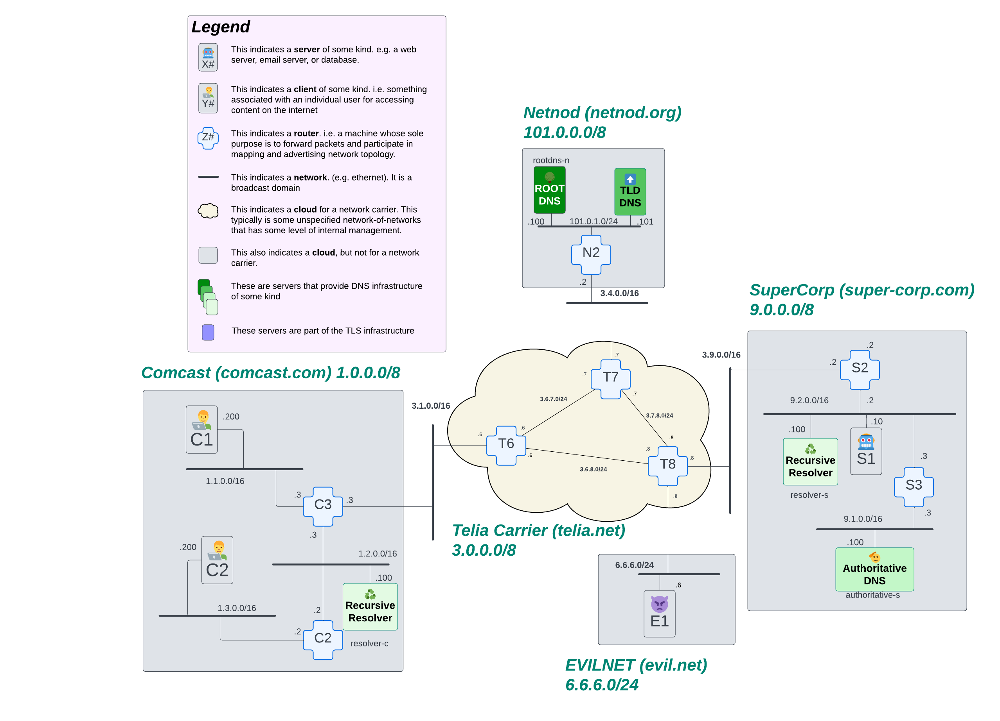

# X.1 Secure connections or: how do you trust who you're talking to?

Okay, so far our internet behaves the way it did in 1993* when the web was first invented. Back then, the internet was being used by academics sharing papers. Eventually, people started to buy things over the internet, and security has evolved to meet those needs.

There are several questions to ask when securing a connection from your client to a server:

1. Am I talking to who I think I'm talking to?
2. Is the communication between me and who I'm talking to private?

Clearly, in a modern internet, we need to have some assurance when we're communicating over the internet that the server we're trying to reach is *in fact* the server we think it is. This will be the focus of this first chapter on TLS. We will get more and more sophisticated in solving the problems of connection-security in later TLS chapters.

## Let's discover how easy it is to hijack a connection

Okay, so first let's do an experiment! We're going to see how easy it is to be confused about who you're trying to talk to over the internet. Let's see what it might look like for an attacker to intercept the traffic to a legitimate server with their own server. Let's `hopon client-c1` and make a web connection using `links http://server-s1.supercorp.com`. When you run that command, you should see something like this:

```unset
Welcome to server-s1!

We're here to meet all your server-s1 needs!

Please enter your credit card information:

Credit Card Number: __________________

Expiration Date: __________________

[ Submit ]

Thank you for visiting server-s1.
```

> To EXIT: press `esc` to open the menu. Press `enter` to open the `File` dropdown. Select `Exit`.

Okay. Now here's the experiment: is there a way we can replace that web server and direct your traffic to an attacker's web server instead without you knowing that anything is different? This is actually quite easy, and achievable in a number of different ways.The simplest way we can do this is by getting into `router-t8` and making a one-line configuration change:

```bash
root@router-t8:/# iptables -t nat -A PREROUTING -d 9.2.0.10 -j DNAT --to-destination 6.6.6.6
```

This uses a command called [iptables](../../chapters/command-reference-guide.md#iptables), which is a tool that exists on every linux computer which allows you to intercept and alter network packets. This specific command above will cause `router-t8` to alter packets destined for `9.2.0.10` and change the destination IP address to `6.6.6.6`. The router will then see that it needs to route the packet down to EVILNET, as shown the following diagram:



Okay, so now that this "hack" is in place on `router-t8`, let's go back to our `client-c1` machine and check what's happening. In order to illustrate this clearly, let's also have a terminal running on our impersonating server, `server-e1`. On `server-e1`, let's run `tcpdump -n`:

```bash
root@server-e1:/# tcpdump -n
tcpdump: verbose output suppressed, use -v[v]... for full protocol decode
listening on eth0, link-type EN10MB (Ethernet), snapshot length 262144 bytes
```

Then, on `client-c1`, let's perform a `ping`:

```bash
root@client-c1:/# ping 9.2.0.10 -c2
PING 9.2.0.10 (9.2.0.10) 56(84) bytes of data.
64 bytes from 9.2.0.10: icmp_seq=1 ttl=60 time=0.220 ms
64 bytes from 9.2.0.10: icmp_seq=2 ttl=60 time=0.336 ms
```

You'll notice on `client-c1`, it thinks its packets are reaching `9.2.0.10`. Nothing has changed from its perspective. However, take a look at the `tcpdump` output on `server-e1`:

```bash
19:35:55.854823 IP 1.1.0.200 > 6.6.6.6: ICMP echo request, id 101, seq 1, length 64
19:35:55.854883 IP 6.6.6.6 > 1.1.0.200: ICMP echo reply, id 101, seq 1, length 64
19:35:56.872497 IP 1.1.0.200 > 6.6.6.6: ICMP echo request, id 101, seq 2, length 64
19:35:56.872525 IP 6.6.6.6 > 1.1.0.200: ICMP echo reply, id 101, seq 2, length 64
```

You can see that this server is now receiving packets from `1.1.0.200` (our client), but now those packets are destined for `6.6.6.6`, our attacking server. This attack is impossible for `client-c1` to detect. Furthermore, if `client-c1` attempts to make a web connection as it did before, the traffic gets directed to our new malicious server without the client being able to guess what happened:

```bash
root@client-c1:/# links http://server-s1.supercorp.com
```

And now you'll see the website from the attacking server:

```unset
Welcome to EVIL NET!

We're super EVIL over here!

Please enter your credit card information:

Credit Card Number: __________________

Expiration Date: __________________

[ Submit ]

We will def take good care of your credit card information...
:maniacal laugh:
```

So now we understand the problem.What do we do about this?

Just like we've done in other chapters, let's start with the simplest possible thing that could work. How can we get two machines to talk securely to each other so that this attack fails?

## Goals

1. Understand why /how internet requests can get intercepted
2. understand what tools are available to secure a connection between two machines: openssh (two different modes) and vtunnel
3. use one of those tools to build a secure connection
4. show how the attack we did now fails
5. maybe talk about how this scales or doesn't

### OpenSSH: or -- the swiss-army-knife of network security

OpenSSH is a tool that network and computer administrators have been using for decades whenever they want to add a little security to their networks. It is amazingly versatile. You can use it to make a secure connection from one computer to another or even from one network to another. It's very much a swiss-army knife for network security, so let's dig in and see how we can make it work in this situation!

#### Option 1. Make a secure connection from one computer to another using openssh

Openssh requires authentication between computers that want to communicate over the internet. This means that the client needs to generate some kind of key that the server can identify it by. Then that key needs to be installed on the server for reference. So let's try this out!

> Note 📝: you do not have to share keys and instead could use passwords with openssh, but we're not going to demonstrate that approach in this chapter. Feel free to experiment on your own if that's of interest.

1. We're going to start by generating a key on `client-c1`

```unset
root@client-c1:/# ssh-keygen -f /root/.ssh/id_ed25519 -N ""
Generating public/private ed25519 key pair.
Your identification has been saved in /root/.ssh/id_ed25519
Your public key has been saved in /root/.ssh/id_ed25519.pub
The key fingerprint is:
SHA256:2FenEHW7/oa5MSFyCrddJm6o5hofmPvwSuNj6/EnQjg root@client-c1
The key's randomart image is:
+--[ED25519 256]--+
|          ... .  |
|           . . . |
|          . . o  |
|       o   o o . |
|     .. S + = =  |
|    E .o + O * . |
|     oO . + + +o |
|     o+Xoo..  o+.|
|     oBXBo    .o.|
+----[SHA256]-----+
```

From the output of this command (`ssh-keygen`), you can gather that it will generate a public/private key pair and save those keys in the `/root/.ssh` directory on your `client-c1` machine. The private key is named `id_ed25519` and the public key will be named `id_ed25519.pub`. Also, incidentally, the private key on your machine could be protected by a password, for simplicity, we included the `-N ""` flag on this command, which indicates an empty password.

<!-- TODO: some level of explanation of what the hell public/private cryptography even is -->

2. Copy the public key on `client-c1` over to `server-s1`

Next, we're going to copy the public key to the server. To do that, simply run `cat /root/.ssh/id_ed25519.pub` (*NOTE* the `.pub` at the end of that filename!) and copy it.

Next, we're going to install the client's public key on `server-s1`. To do that, exit the `client-c1` machine and `hopon server-s1`.

Now, use `vim /root/.ssh/authorized_keys` to install the client's public key by simply pasting it in and saving the file and exiting `vim`.

When you're finished, you should be able to run `cat /root/.ssh/authorized_keys` and see something like this:

```unset
root@server-s1:/# cat /root/.ssh/authorized_keys
ssh-ed25519 AAAAC3NzaC1lZDI1NTE5AAAAIBgG+rtdb4VOFC+JF+NJodUD9APr/r+CEqeY0ypqLMF0 root@client-c1
```

> *NOTE*: the contents of that file will be different than the example shown above, but should look very similar.

3. Start the openssh server on server-s1

To start the ssh process, you're going to have to run three commands on `server-s1`:

```bash
root@server-s1:/# mkdir -p /var/run/sshd
root@server-s1:/# chmod 0755 /var/run/sshd
root@server-s1:/# sshd
```

For some reason, `openssh` doesn't create this crucial directory for us when its installed. Confirm that the server process is running by using the `ps aux` command:

```bash
root@server-s1:/# ps aux
USER         PID %CPU %MEM    VSZ   RSS TTY      STAT START   TIME COMMAND
root           1  0.0  0.0   4032  2816 ?        Ss   21:19   0:00 /bin/bash /host-start-up.sh
root          16  0.0  0.0  10516  1576 ?        Ss   21:19   0:00 nginx: master process nginx
www-data      17  0.0  0.0  12124  4136 ?        S    21:19   0:00 nginx: worker process
www-data      18  0.0  0.0  12124  4136 ?        S    21:19   0:00 nginx: worker process
root          19  0.0  0.0   2268  1024 ?        S    21:19   0:00 /bin/sleep infinity
www-data      20  0.0  0.0  12124  4136 ?        S    21:19   0:00 nginx: worker process
www-data      21  0.0  0.0  12124  4136 ?        S    21:19   0:00 nginx: worker process
www-data      22  0.0  0.0  12124  4136 ?        S    21:19   0:00 nginx: worker process
www-data      23  0.0  0.0  12124  4136 ?        S    21:19   0:00 nginx: worker process
root          36  0.0  0.0   4296  3584 pts/0    Ss   21:52   0:00 /bin/bash
root          54  0.0  0.0  12052  2764 ?        Ss   21:57   0:00 sshd: sshd [listener] 0 of 10-100 startups
root          55  0.0  0.0   7628  3456 pts/0    R+   21:57   0:00 ps aux
```

See that line which has `sshd` in it? That means it's running!

4. Copy keys from `server-s1` to `client-c1`

Okay, so when we generated keys on `client-c1` and copied them to `server-s1`, that enabled `server-s1` to trust `client-c1`. But trust has to flow *both ways*. We need `client-c1` to be able to trust `server-s1` too. Therefore, before we leave `server-s1`, we need to copy its public keys so that we can install them on `client-c1`.

The server's public key is stored in `/etc/ssh/ssh_host_ed25519_key.pub`. `cat` that file out and copy it. Then exit `server-s1` and return to `client-c1`.

On `client-c1`, you're going to `vim` the file `/root/.ssh/known_hosts`

The first thing we need to do is identify which host this is. So in the `known_hosts` file, type `server-s1.supercorp.com` on the first line. Then add a space. Then paste in what you copied from `server-s1`. When you're finished, the contents of the `/root/.ssh/known_hosts` file should look something this:

```unset
server-s1.supercorp.com ssh-ed25519 AAAAC3NzaC1lZDI1NTE5AAAAIL5FLNU4DT6SwM1RivVJmd4UO242BdzaqMpn1A/5JRvS root@buildkitsandbox
```

5. Test the connection from `client-c1` to `server-s1`

Now that we have everything setup, let's test that everything works! We'll an `ssh` command to access `server-s1` from `client-c1`!

```bash
root@client-c1:/# ssh -v -o PasswordAuthentication=no server-s1.supercorp.com
OpenSSH_9.6p1 Ubuntu-3ubuntu13.5, OpenSSL 3.0.13 30 Jan 2024
debug1: Reading configuration data /etc/ssh/ssh_config
debug1: /etc/ssh/ssh_config line 19: include /etc/ssh/ssh_config.d/*.conf matched no files
debug1: /etc/ssh/ssh_config line 21: Applying options for *
debug1: Connecting to server-s1.supercorp.com [9.2.0.10] port 22.
debug1: Connection established.
debug1: identity file /root/.ssh/id_rsa type -1
debug1: identity file /root/.ssh/id_rsa-cert type -1
debug1: identity file /root/.ssh/id_ecdsa type -1
debug1: identity file /root/.ssh/id_ecdsa-cert type -1
debug1: identity file /root/.ssh/id_ecdsa_sk type -1
debug1: identity file /root/.ssh/id_ecdsa_sk-cert type -1
debug1: identity file /root/.ssh/id_ed25519 type 3
debug1: identity file /root/.ssh/id_ed25519-cert type -1
debug1: identity file /root/.ssh/id_ed25519_sk type -1
debug1: identity file /root/.ssh/id_ed25519_sk-cert type -1
debug1: identity file /root/.ssh/id_xmss type -1
debug1: identity file /root/.ssh/id_xmss-cert type -1
debug1: identity file /root/.ssh/id_dsa type -1
debug1: identity file /root/.ssh/id_dsa-cert type -1
debug1: Local version string SSH-2.0-OpenSSH_9.6p1 Ubuntu-3ubuntu13.5
debug1: Remote protocol version 2.0, remote software version OpenSSH_9.6p1 Ubuntu-3ubuntu13.5
debug1: compat_banner: match: OpenSSH_9.6p1 Ubuntu-3ubuntu13.5 pat OpenSSH* compat 0x04000000
debug1: Authenticating to server-s1.supercorp.com:22 as 'root'
debug1: load_hostkeys: fopen /root/.ssh/known_hosts2: No such file or directory
debug1: load_hostkeys: fopen /etc/ssh/ssh_known_hosts: No such file or directory
debug1: load_hostkeys: fopen /etc/ssh/ssh_known_hosts2: No such file or directory
debug1: SSH2_MSG_KEXINIT sent
debug1: SSH2_MSG_KEXINIT received
debug1: kex: algorithm: sntrup761x25519-sha512@openssh.com
debug1: kex: host key algorithm: ssh-ed25519
debug1: kex: server->client cipher: chacha20-poly1305@openssh.com MAC: <implicit> compression: none
debug1: kex: client->server cipher: chacha20-poly1305@openssh.com MAC: <implicit> compression: none
debug1: expecting SSH2_MSG_KEX_ECDH_REPLY
debug1: SSH2_MSG_KEX_ECDH_REPLY received
debug1: Server host key: ssh-ed25519 SHA256:hzydfBasIMJNIg3Hba4N5F5SBzn0dHblKnEG0R/PiuQ
debug1: load_hostkeys: fopen /root/.ssh/known_hosts2: No such file or directory
debug1: load_hostkeys: fopen /etc/ssh/ssh_known_hosts: No such file or directory
debug1: load_hostkeys: fopen /etc/ssh/ssh_known_hosts2: No such file or directory
debug1: Host 'server-s1.supercorp.com' is known and matches the ED25519 host key.
debug1: Found key in /root/.ssh/known_hosts:1
debug1: ssh_packet_send2_wrapped: resetting send seqnr 3
debug1: rekey out after 134217728 blocks
debug1: SSH2_MSG_NEWKEYS sent
debug1: Sending SSH2_MSG_EXT_INFO
debug1: expecting SSH2_MSG_NEWKEYS
debug1: ssh_packet_read_poll2: resetting read seqnr 3
debug1: SSH2_MSG_NEWKEYS received
debug1: rekey in after 134217728 blocks
debug1: SSH2_MSG_EXT_INFO received
debug1: kex_ext_info_client_parse: server-sig-algs=<ssh-ed25519,ecdsa-sha2-nistp256,ecdsa-sha2-nistp384,ecdsa-sha2-nistp521,sk-ssh-ed25519@openssh.com,sk-ecdsa-sha2-nistp256@openssh.com,rsa-sha2-512,rsa-sha2-256>
debug1: kex_ext_info_check_ver: publickey-hostbound@openssh.com=<0>
debug1: kex_ext_info_check_ver: ping@openssh.com=<0>
debug1: SSH2_MSG_SERVICE_ACCEPT received
debug1: SSH2_MSG_EXT_INFO received
debug1: kex_ext_info_client_parse: server-sig-algs=<ssh-ed25519,ecdsa-sha2-nistp256,ecdsa-sha2-nistp384,ecdsa-sha2-nistp521,sk-ssh-ed25519@openssh.com,sk-ecdsa-sha2-nistp256@openssh.com,rsa-sha2-512,rsa-sha2-256>
debug1: Authentications that can continue: publickey,password
debug1: Next authentication method: publickey
debug1: Will attempt key: /root/.ssh/id_rsa
debug1: Will attempt key: /root/.ssh/id_ecdsa
debug1: Will attempt key: /root/.ssh/id_ecdsa_sk
debug1: Will attempt key: /root/.ssh/id_ed25519 ED25519 SHA256:md3fwq1E0rxdpEmmZqXwd8iA5fn5Zmtw/mWODXRyyeY
debug1: Will attempt key: /root/.ssh/id_ed25519_sk
debug1: Will attempt key: /root/.ssh/id_xmss
debug1: Will attempt key: /root/.ssh/id_dsa
debug1: Trying private key: /root/.ssh/id_rsa
debug1: Trying private key: /root/.ssh/id_ecdsa
debug1: Trying private key: /root/.ssh/id_ecdsa_sk
debug1: Offering public key: /root/.ssh/id_ed25519 ED25519 SHA256:md3fwq1E0rxdpEmmZqXwd8iA5fn5Zmtw/mWODXRyyeY
debug1: Authentications that can continue: publickey,password
debug1: Trying private key: /root/.ssh/id_ed25519_sk
debug1: Trying private key: /root/.ssh/id_xmss
debug1: Trying private key: /root/.ssh/id_dsa
debug1: No more authentication methods to try.
root@server-s1.supercorp.com: Permission denied (publickey,password).
```

OK. There's a lot going on there. The beginning of this output is dealing with loading various ssh configurations. We can look at that more a bit later. Instead, let's focus on the end of this output:

```bash
debug1: Authentications that can continue: publickey,password
debug1: Next authentication method: publickey
debug1: Will attempt key: /root/.ssh/id_rsa
debug1: Will attempt key: /root/.ssh/id_ecdsa
debug1: Will attempt key: /root/.ssh/id_ecdsa_sk
debug1: Will attempt key: /root/.ssh/id_ed25519 ED25519 SHA256:md3fwq1E0rxdpEmmZqXwd8iA5fn5Zmtw/mWODXRyyeY
debug1: Will attempt key: /root/.ssh/id_ed25519_sk
debug1: Will attempt key: /root/.ssh/id_xmss
debug1: Will attempt key: /root/.ssh/id_dsa
debug1: Trying private key: /root/.ssh/id_rsa
debug1: Trying private key: /root/.ssh/id_ecdsa
debug1: Trying private key: /root/.ssh/id_ecdsa_sk
debug1: Offering public key: /root/.ssh/id_ed25519 ED25519 SHA256:md3fwq1E0rxdpEmmZqXwd8iA5fn5Zmtw/mWODXRyyeY
debug1: Authentications that can continue: publickey,password
debug1: Trying private key: /root/.ssh/id_ed25519_sk
debug1: Trying private key: /root/.ssh/id_xmss
debug1: Trying private key: /root/.ssh/id_dsa
debug1: No more authentication methods to try.
root@server-s1.supercorp.com: Permission denied (publickey,password).
```

This is telling us that `openssh` is going to try several methods of authentication to access `server-s1`. It lists the keys and encryption methods it's going to try, trys them, then, when it runs out of keys to try, it throws a `Permission denied` error. What this means is that the server we're attempting to connect to doesn't have a matching public key for the private key we're using to initiate connection. But why? We just went through all that setup!

Remember our EVIL attacking computer from the first exercise? It still has it's rules installed on `router-t8`! If we `hopon server-e1` and run a `tcpdump` while making the request again, we'll see our request landing there:

```bash
root@server-e1:/# tcpdump -n

23:25:54.714745 IP 1.1.0.200.37518 > 6.6.6.6.22: Flags [S], seq 3097370418, win 64240, options [mss 1460,sackOK,TS val 2668185149 ecr 0,nop,wscale 7], length 0
23:25:54.714856 IP 6.6.6.6.22 > 1.1.0.200.37518: Flags [R.], seq 0, ack 3097370419, win 0, length 0
```

What we see happening here is the very thing we would want to see if there was an attack on one of our servers. We try to make a connection, but the connection is never created because the destination machine doesn't have the correct credentials. The connection is terminated before the attacking machine can cause any harm!

But... we still want to see what it looks like when the connection works. Fortunately, we control every aspect of this internet. We can remove the rule on `router-t8` and make our request between `client-c1` and `server-s1` work again! To do this, `hopon router-t8` and issue this `iptables` command:

```bash
root@router-t8:/# iptables -t nat -F
```

Now try running your `ssh` command again. You're going to get A LOT of output. Don't worry. Per usual, we'll take it line by line and examine what's going on there!

```bash
root@client-c1:/# ssh -v -o PasswordAuthentication=no server-s1.supercorp.com
OpenSSH_9.6p1 Ubuntu-3ubuntu13.5, OpenSSL 3.0.13 30 Jan 2024
debug1: Reading configuration data /etc/ssh/ssh_config
debug1: /etc/ssh/ssh_config line 19: include /etc/ssh/ssh_config.d/*.conf matched no files
debug1: /etc/ssh/ssh_config line 21: Applying options for *
debug1: Connecting to server-s1.supercorp.com [9.2.0.10] port 22.
debug1: Connection established.
debug1: identity file /root/.ssh/id_rsa type -1
debug1: identity file /root/.ssh/id_rsa-cert type -1
debug1: identity file /root/.ssh/id_ecdsa type -1
debug1: identity file /root/.ssh/id_ecdsa-cert type -1
debug1: identity file /root/.ssh/id_ecdsa_sk type -1
debug1: identity file /root/.ssh/id_ecdsa_sk-cert type -1
debug1: identity file /root/.ssh/id_ed25519 type 3
debug1: identity file /root/.ssh/id_ed25519-cert type -1
debug1: identity file /root/.ssh/id_ed25519_sk type -1
debug1: identity file /root/.ssh/id_ed25519_sk-cert type -1
debug1: identity file /root/.ssh/id_xmss type -1
debug1: identity file /root/.ssh/id_xmss-cert type -1
debug1: identity file /root/.ssh/id_dsa type -1
debug1: identity file /root/.ssh/id_dsa-cert type -1
debug1: Local version string SSH-2.0-OpenSSH_9.6p1 Ubuntu-3ubuntu13.5
debug1: Remote protocol version 2.0, remote software version OpenSSH_9.6p1 Ubuntu-3ubuntu13.5
debug1: compat_banner: match: OpenSSH_9.6p1 Ubuntu-3ubuntu13.5 pat OpenSSH* compat 0x04000000
debug1: Authenticating to server-s1.supercorp.com:22 as 'root'
debug1: load_hostkeys: fopen /root/.ssh/known_hosts2: No such file or directory
debug1: load_hostkeys: fopen /etc/ssh/ssh_known_hosts: No such file or directory
debug1: load_hostkeys: fopen /etc/ssh/ssh_known_hosts2: No such file or directory
debug1: SSH2_MSG_KEXINIT sent
debug1: SSH2_MSG_KEXINIT received
debug1: kex: algorithm: sntrup761x25519-sha512@openssh.com
debug1: kex: host key algorithm: ssh-ed25519
debug1: kex: server->client cipher: chacha20-poly1305@openssh.com MAC: <implicit> compression: none
debug1: kex: client->server cipher: chacha20-poly1305@openssh.com MAC: <implicit> compression: none
debug1: expecting SSH2_MSG_KEX_ECDH_REPLY
debug1: SSH2_MSG_KEX_ECDH_REPLY received
debug1: Server host key: ssh-ed25519 SHA256:cnsZMibc+rac/Opl6KtkckFzJ6EeNc6licOSWr4669Q
debug1: load_hostkeys: fopen /root/.ssh/known_hosts2: No such file or directory
debug1: load_hostkeys: fopen /etc/ssh/ssh_known_hosts: No such file or directory
debug1: load_hostkeys: fopen /etc/ssh/ssh_known_hosts2: No such file or directory
debug1: Host 'server-s1.supercorp.com' is known and matches the ED25519 host key.
debug1: Found key in /root/.ssh/known_hosts:1
debug1: ssh_packet_send2_wrapped: resetting send seqnr 3
debug1: rekey out after 134217728 blocks
debug1: SSH2_MSG_NEWKEYS sent
debug1: Sending SSH2_MSG_EXT_INFO
debug1: expecting SSH2_MSG_NEWKEYS
debug1: ssh_packet_read_poll2: resetting read seqnr 3
debug1: SSH2_MSG_NEWKEYS received
debug1: rekey in after 134217728 blocks
debug1: SSH2_MSG_EXT_INFO received
debug1: kex_ext_info_client_parse: server-sig-algs=<ssh-ed25519,ecdsa-sha2-nistp256,ecdsa-sha2-nistp384,ecdsa-sha2-nistp521,sk-ssh-ed25519@openssh.com,sk-ecdsa-sha2-nistp256@openssh.com,rsa-sha2-512,rsa-sha2-256>
debug1: kex_ext_info_check_ver: publickey-hostbound@openssh.com=<0>
debug1: kex_ext_info_check_ver: ping@openssh.com=<0>
debug1: SSH2_MSG_SERVICE_ACCEPT received
debug1: SSH2_MSG_EXT_INFO received
debug1: kex_ext_info_client_parse: server-sig-algs=<ssh-ed25519,ecdsa-sha2-nistp256,ecdsa-sha2-nistp384,ecdsa-sha2-nistp521,sk-ssh-ed25519@openssh.com,sk-ecdsa-sha2-nistp256@openssh.com,rsa-sha2-512,rsa-sha2-256>
debug1: Authentications that can continue: publickey,password
debug1: Next authentication method: publickey
debug1: Will attempt key: /root/.ssh/id_rsa
debug1: Will attempt key: /root/.ssh/id_ecdsa
debug1: Will attempt key: /root/.ssh/id_ecdsa_sk
debug1: Will attempt key: /root/.ssh/id_ed25519 ED25519 SHA256:RE/TNMufC0Q1YX7SmjgRdzzzPtJtFfooQN1H7xG4Ygo
debug1: Will attempt key: /root/.ssh/id_ed25519_sk
debug1: Will attempt key: /root/.ssh/id_xmss
debug1: Will attempt key: /root/.ssh/id_dsa
debug1: Trying private key: /root/.ssh/id_rsa
debug1: Trying private key: /root/.ssh/id_ecdsa
debug1: Trying private key: /root/.ssh/id_ecdsa_sk
debug1: Offering public key: /root/.ssh/id_ed25519 ED25519 SHA256:RE/TNMufC0Q1YX7SmjgRdzzzPtJtFfooQN1H7xG4Ygo
debug1: Server accepts key: /root/.ssh/id_ed25519 ED25519 SHA256:RE/TNMufC0Q1YX7SmjgRdzzzPtJtFfooQN1H7xG4Ygo
Authenticated to server-s1.supercorp.com ([9.2.0.10]:22) using "publickey".
debug1: channel 0: new session [client-session] (inactive timeout: 0)
debug1: Requesting no-more-sessions@openssh.com
debug1: Entering interactive session.
debug1: pledge: filesystem
debug1: client_input_global_request: rtype hostkeys-00@openssh.com want_reply 0
debug1: client_input_hostkeys: searching /root/.ssh/known_hosts for server-s1.supercorp.com / (none)
debug1: client_input_hostkeys: searching /root/.ssh/known_hosts2 for server-s1.supercorp.com / (none)
debug1: client_input_hostkeys: hostkeys file /root/.ssh/known_hosts2 does not exist
debug1: client_input_hostkeys: no new or deprecated keys from server
debug1: Remote: /root/.ssh/authorized_keys:1: key options: agent-forwarding port-forwarding pty user-rc x11-forwarding
debug1: Remote: /root/.ssh/authorized_keys:1: key options: agent-forwarding port-forwarding pty user-rc x11-forwarding
debug1: Sending environment.
debug1: pledge: fork
Welcome to Ubuntu 24.04.1 LTS (GNU/Linux 6.8.0-47-generic x86_64)

 * Documentation:  https://help.ubuntu.com
 * Management:     https://landscape.canonical.com
 * Support:        https://ubuntu.com/pro

This system has been minimized by removing packages and content that are
not required on a system that users do not log into.

To restore this content, you can run the 'unminimize' command.
Last login: Fri Jan 24 23:21:43 2025 from 1.1.0.200
root@server-s1:~#
```

Before we do anything else... Look at the command line! Notice that we're on `server-s1`! 

### Option 2. That's nice, but what if we'd like more computers to talk to each other: openssh port-forwarding

### Vtunnel. That's nice, but openssh doesn't scale well. implement a real VPN
