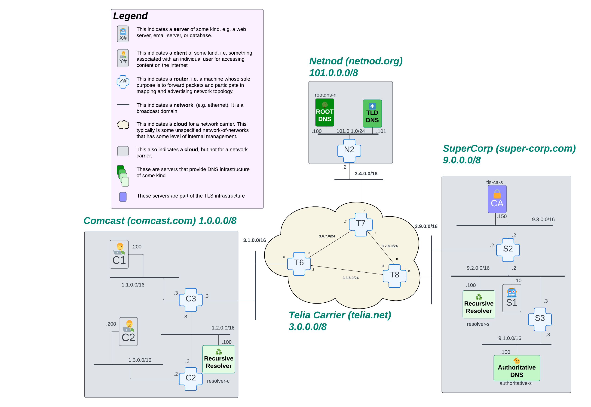

# TLS (Transport-Layer-Security) or: how do you make web pages private?

Okay, so far our internet behaves the way it did in 1993* when the web was first invented. Back then, the internet was being used by academics sharing papers. Eventually, people started to buy things over the internet, and security has evolved to meet those needs.

Clearly, in a modern internet, we need to have some assurance when we're communicating over the internet that the server we're trying to reach is *in fact* the server we think it is. We would also like our communications with that server to be private.

These types of assurances are provided by a technology we refer to as "TLS", which stands for Transport Layer Security. You will also know this technology by the protocol, "https", which is the same HTTP protocol we've been using in other chapters, but with the TLS technology glued onto it so that you can interact with web pages with the kind of security you're used to.

With HTTP, data goes back and forth in clear text. Anyone that can run `tcpdump` on a router between a client and a server can reconstruct the entire conversation and see what was said between both parties. With HTTPS, this is impossible*. Also, with HTTP, it would possible to divert the traffic from the client to a fake server and the client would never know the difference. HTTPS provides additional assurance to the client that the server they are intending to communicate with is guaranteed not to have been compromised in this way.

<!-- TODO: provide some references for people to go study up on some of this stuff if they want. -->

## Goals

<!-- TODO: fix -->

In this chapter, we'll explore a bit about how encrypted connections are established between machines on the internet. We'll take a high level look at how websites are vetted, and we'll create a manual process for generating the artifacts that servers use to prove that clients have landed on the correct machine.

## How is Trust established on the internet?

Trust is something that we intuitively know in our daily lives. We trust a lot of things implicitly: our friends, our family (potentially), and some institutions. Computers also have to be able to trust each other, but computers are not intuitive, and we probably don't want them to be. We need to figure out some methodology to have computers trust each other on the internet.

This is possible, but let's start with an analogy. Let's say you have a plumbing problem, and you know that *Acme Plumbing* is the best plumber in town. You don't have their phone number saved, but you want to call them and schedule an appointment. How do you do this?

Well, before everyone used the Internet, we would have gone to the Yellow Pages and looked them up, because we all trusted the phone company to have accurate information. Today, we typically use some kind of mapping service on the Internet, such as Google Maps. Because Acme Plumbing knows that you trust Google Maps, they are motivated to make sure their contact information is accurate on that service. Then, when you look them up and find the phone number, you have some confidence that the number you're calling is correct. Google, as a company, wants to be able to sell you ads so they can make money. They need your trust in their information to be high so that you keep coming back. Therefore, they are also motivated to make sure the information in their system is vetted.

Let's break this down a little. You understand that Google has a motivation to keep the information in their system accurate, so you have some level of trust in that data. You also understand that companies in your local area also trust Google Maps for the same reason. Google is therefore a trusted third-party that can hold information like telephone numbers for businesses.

When you pick up the phone and call Acme Plumbing, you implicitly trust that the telephone company is going to route your call to the business that owns that telephone number. In the wild world of the internet, there is an additional problem though: you don't know, after obtaining the address of the website you're trying to reach, if that website is legitimate or not. There are many ways of re-routing traffic or otherwise spoofing a destination that your computer cannot detect. So you, as a customer of acme plumbing, having to do some additional checking to make sure that the person who answered the phone is in fact someone who works for acme. How would you possibly go about doing this? In the world of the Internet, we handle this through public-private key cryptography, which we'll discuss later.

Similar to the role Google plays in this example, there are third-party companies called "Certification Authorities" (or CAs) that have established trust with the Internet as a whole. These CAs perform vetting services to ensure that domains on the internet are who they say they are. A company, let's say *Dixit Enterprises*, will approach the CA and say that they want their website, `www.dixit.com` to be verified. The CA will vet Dixit Enterprises by asking them to prove that they control the `dixit.com` domain usually by adding some DNS record to the domain. Once the CA verifies that the task was done correctly, they sign an artifact called a "certificate". That certificate essentially says "any server bearing this certificate has been proven to be the correct server for this domain and you can trust that you've reached the correct place". They also provide a "private key" to Dixit Enterprises that prevents their credentials from being stolen.

Let's talk about how these private keys and certificates are used. First, there's a form of cryptography called "public/private key cryptography." The way this works is that there are two keys: one is public and one is private. If I want to send a secret message to people, I give out the public key to everyone. Then, if I want to send them a message, I encrypt it with my private key. As long as I make sure that my private key is always kept secret, I can always send messages to people that have the public key.

When I, as a client, attempt to make a connection to `www.dixit.com` using my web browser, my browser is going to download the certificate that was issued to Dixit Enterprises from that server, then it's going to verify that it came from a trusted CA, and finally then it's going to use the public/private key system to send and receive messages that only that server can encrypt and decrypt.

Okay, but how did the internet as a whole establish trust in this CA? Well, there is a thing called a "root certificate." Each CA has one of these root certificates that proves they are one of these this third-party trusted entities. Furthermore, the manufacturer of the computer (or the browser) you're using right now has installed each CA's root certificates on your computer. This means that your computer *already* knows who to trust on the Internet. For example, let's take a look at the root certificates installed on one of the machines on our toy internet. `hopon client-c1` and run:

```bash
ls /etc/ssl/certs
```

You'll see ~300 certs come automatically installed with the Ubuntu (Linux) operating system we use for that machine. If you scroll through that list of certs, you'll see that some of the names look pretty familiar, e.g. `Amazon_Root_CA_1.pem`. We can see some of the details of that cert using a command line tool called `openssl`:

```bash
root@client-c1:/# openssl x509 -in /etc/ssl/certs/Amazon_Root_CA_1.pem -text -noout
Certificate:
    Data:
        Version: 3 (0x2)
        Serial Number:
            06:6c:9f:cf:99:bf:8c:0a:39:e2:f0:78:8a:43:e6:96:36:5b:ca
        Signature Algorithm: sha256WithRSAEncryption
        Issuer: C = US, O = Amazon, CN = Amazon Root CA 1
        Validity
            Not Before: May 26 00:00:00 2015 GMT
            Not After : Jan 17 00:00:00 2038 GMT
        Subject: C = US, O = Amazon, CN = Amazon Root CA 1
        Subject Public Key Info:
            Public Key Algorithm: rsaEncryption
                Public-Key: (2048 bit)
                Modulus:
                    00:b2:78:80:71:ca:78:d5:e3:71:af:47:80:50:74:
                    7d:6e:d8:d7:88:76:f4:99:68:f7:58:21:60:f9:74:
                    84:01:2f:ac:02:2d:86:d3:a0:43:7a:4e:b2:a4:d0:
                    36:ba:01:be:8d:db:48:c8:07:17:36:4c:f4:ee:88:
                    23:c7:3e:eb:37:f5:b5:19:f8:49:68:b0:de:d7:b9:
                    76:38:1d:61:9e:a4:fe:82:36:a5:e5:4a:56:e4:45:
                    e1:f9:fd:b4:16:fa:74:da:9c:9b:35:39:2f:fa:b0:
                    20:50:06:6c:7a:d0:80:b2:a6:f9:af:ec:47:19:8f:
                    50:38:07:dc:a2:87:39:58:f8:ba:d5:a9:f9:48:67:
                    30:96:ee:94:78:5e:6f:89:a3:51:c0:30:86:66:a1:
                    45:66:ba:54:eb:a3:c3:91:f9:48:dc:ff:d1:e8:30:
                    2d:7d:2d:74:70:35:d7:88:24:f7:9e:c4:59:6e:bb:
                    73:87:17:f2:32:46:28:b8:43:fa:b7:1d:aa:ca:b4:
                    f2:9f:24:0e:2d:4b:f7:71:5c:5e:69:ff:ea:95:02:
                    cb:38:8a:ae:50:38:6f:db:fb:2d:62:1b:c5:c7:1e:
                    54:e1:77:e0:67:c8:0f:9c:87:23:d6:3f:40:20:7f:
                    20:80:c4:80:4c:3e:3b:24:26:8e:04:ae:6c:9a:c8:
                    aa:0d
                Exponent: 65537 (0x10001)
        X509v3 extensions:
            X509v3 Basic Constraints: critical
                CA:TRUE
            X509v3 Key Usage: critical
                Digital Signature, Certificate Sign, CRL Sign
            X509v3 Subject Key Identifier:
                84:18:CC:85:34:EC:BC:0C:94:94:2E:08:59:9C:C7:B2:10:4E:0A:08
    Signature Algorithm: sha256WithRSAEncryption
    Signature Value:
        98:f2:37:5a:41:90:a1:1a:c5:76:51:28:20:36:23:0e:ae:e6:
        28:bb:aa:f8:94:ae:48:a4:30:7f:1b:fc:24:8d:4b:b4:c8:a1:
        97:f6:b6:f1:7a:70:c8:53:93:cc:08:28:e3:98:25:cf:23:a4:
        f9:de:21:d3:7c:85:09:ad:4e:9a:75:3a:c2:0b:6a:89:78:76:
        44:47:18:65:6c:8d:41:8e:3b:7f:9a:cb:f4:b5:a7:50:d7:05:
        2c:37:e8:03:4b:ad:e9:61:a0:02:6e:f5:f2:f0:c5:b2:ed:5b:
        b7:dc:fa:94:5c:77:9e:13:a5:7f:52:ad:95:f2:f8:93:3b:de:
        8b:5c:5b:ca:5a:52:5b:60:af:14:f7:4b:ef:a3:fb:9f:40:95:
        6d:31:54:fc:42:d3:c7:46:1f:23:ad:d9:0f:48:70:9a:d9:75:
        78:71:d1:72:43:34:75:6e:57:59:c2:02:5c:26:60:29:cf:23:
        19:16:8e:88:43:a5:d4:e4:cb:08:fb:23:11:43:e8:43:29:72:
        62:a1:a9:5d:5e:08:d4:90:ae:b8:d8:ce:14:c2:d0:55:f2:86:
        f6:c4:93:43:77:66:61:c0:b9:e8:41:d7:97:78:60:03:6e:4a:
        72:ae:a5:d1:7d:ba:10:9e:86:6c:1b:8a:b9:59:33:f8:eb:c4:
        90:be:f1:b9
```

A lot of this certificate probably doesn't make any sense, but that's OK. Most of it doesn't need to make sense to humans. But a few things we might call out here:

* `Issuer`: Who actually provided this certificate.
* `Validity`: This section tells us *when* clients should respect the use of this certificate. If a certificate is expired, don't trust the connection made using it.

Because this certificate is a *root* certificate, it doesn't have any domains (like `www.dixit.com`) associated with it. That's because it's a certificate that is used to sign *other* certificates. As we look at certificates that are issued for websites, later in this chapter, we'll start seeing other sections that are important to us (like the name of the website, for example).

<!-- TODO  note that we will not be proving ownership of domains in this chapter since we manage all the machines on our toy internet. We're just going to go around creating and signing certificates so we can make this technology work -->

Ok, so we can look at this root certificate, but what's the significance of it? Why does it matter? In order to talk about how computers transfer trust around the internet, we're going to have to take a brief detour into the world of public/private key cryptography.

When a cert is created for a website, we need to know the Certification Authority that is vouching for domain. This is done by "signing" the certificate being issued. The artifact used to sign is called a "private key." Let's start with talking about how public and private key encryption works.

After a company has proven ownership over a domain, the CA will use their root certificate to "sign" a certificate for that domain. This imbues the new certificate with the trust that was granted to the root certificate. After the company installs the certificate signed by the root certificate on their server, any client attempting to establish an encrypted connection will receive that certificate as part of the TLS handshake. The client then checks the certificate to see who signed it, and validates that it has the root certificate installed locally. If it does, all is good in the world! If it doesn't, it will not trust the connection.

If you want to check out what a certificate looks like on the "real" Internet, you can use `openssl`'s `s_client` command to do so; e.g.:

```bash
openssl s_client -connect www.denverlibrary.org:443 | openssl x509 -text -noout
```

<!-- TODO: I haven't mentioned anything about the public key or what the request process looks like to establish a TLS connection -->

### Trust of the Client Versus Trust of the User

One important distinction we'd like to make here is the difference between the trust of the client and the trust of the person actually browsing The Internet. The trust we've been talking about is specific to machines. If you request an encryted connection to a domain, you want some guarantee that you're talking to the server that is responsible for that domain. Not a server pretending to be that domain.

However, this has it's limitations in the real world of humans. It doesn't protect against typos when trying to reach a site. And it doesn't vet the content of any site. Just because a machine can prove that you're talking to the site you made a request to, doesn't mean that site itself isn't disreputable. If you visit breitbart, you're going to be able to establish an encrypted connection to the correct website, but you're still going to be innundated with misinformation.

## Building a basic trust infrastructure between a client and a server using a Certification Authority

In this chapter, we are going to use the command line tool `openssl` to manually create this trust between the client and the server. We'll do this by designating a machine which holds secret credentials that the client trusts. We will then use these secret credentials to sign a certificate for a domain, `www.dixit.com`, that will be hosted by a server on our toy internet. Then, when a client makes a request for any thing at `www.dixit.com`, the client can verify who that server is and the client and server will have tools to establish an encrypted connection.

Here's what our internet will look like for this chapter:



<!-- TODO: consider moving network maps to after the exposition for each chapter? -->

This toy internet is pretty basic. We have a few networks and the basic infrastructure for DNS. To add some basic infrastructure for TLS, we'll need to:

1. Designate a Certification Authority (CA)
2. Extend the trust of the CA (install the CA's root certificate on the clients we'll be using for this chapter)
3. Extend trust to a server using a Certificate Signing Request (CSR) for `www.dixit.com`
4. Install the signed certificate on the server

Let's see what this looks like in action!

### Step 1. Designate the Certification Authority (CA)

If you look at the network map in the Supercorp network, we've designated `tls-ca-s` to be our Certification Authority for this chapter. We need to start there. But, before we can generate the root certificate, we need to create a private key. That key is what the CA will use to sign all certificates for domains the CA is vouching for. 

<!-- TODO: explain the private key more here. Maybe geneology as a metaphor? Everything can be traced back genetically to a common ancestor - the root cert of this CA? -->

As we mentioned before, we're going to use a command line tool called `openssl`. `openssl` allows users to create and examine both private keys and certificates.

Let's start `hopon tls-ca-s` and generate the private key:

```bash
openssl genrsa -out /etc/ssl/private/rootCA.key 4096
```

We can use another `openssl` command to verify that the certificate was created correctly:

```bash
openssl rsa -noout -text -in /etc/ssl/private/rootCA.key -check
```

> This dumps all kinds of linux to the screen and tells us that stuff is working well.

2. Create a Self-Signed Root CA Certificate

```bash
openssl req -x509 -new -nodes -key /etc/ssl/private/rootCA.key -sha256 -days 3650 -out /etc/ssl/certs/rootCA.crt
```

This does not go through the interview process:

```bash
openssl req -x509 -new -nodes -key /etc/ssl/private/rootCA.key -sha256 -days 3650 -out /etc/ssl/certs/rootCA.crt -subj "/C=/ST=/L=/O=/OU=/CN=buildyourowninternet.dev"
```

This command has you skip an 'interview process' where `openssl` helps you correctly build your cert. If you'd rather walk through the interview process and generate a cert that looks a little more like what you'd expect, skip the `-subj "/C=/ST=/L=/O=/OU=/CN=buildyourowninternet.dev"` part of this command.

And check out the cert you just created:

```bash
openssl x509 -in /etc/ssl/certs/rootCA.crt -text -noout
```

Check what was created for that cert:

```bash
root@tls-ca-s:/# openssl x509 -in /etc/ssl/certs/rootCA.crt -text -noout
Certificate:
    Data:
        Version: 3 (0x2)
        Serial Number:
            6d:c5:f9:61:84:5c:99:bf:c6:14:59:88:43:e6:dc:58:42:27:5b:4e
        Signature Algorithm: sha256WithRSAEncryption
        Issuer: CN = buildyourowninternet.dev
        Validity
            Not Before: Dec 31 22:41:11 2024 GMT
            Not After : Dec 29 22:41:11 2034 GMT
        Subject: CN = buildyourowninternet.dev
        Subject Public Key Info:
            Public Key Algorithm: rsaEncryption
                Public-Key: (4096 bit)
                Modulus:
                    00:af:9c:2e:c4:f3:5b:74:c2:37:a6:27:11:ac:43:
                    13:05:6f:ea:88:bb:7d:a9:4b:59:44:8a:ba:f8:67:
                    10:2e:3e:8b:33:98:a6:ef:6e:92:04:68:89:7a:35:
                    0a:72:06:88:b2:9b:f7:fe:03:c0:a0:5f:98:45:c1:
                    45:5e:f4:1f:78:46:4b:bf:4d:4f:d5:6a:fb:0f:be:
                    1b:86:a9:40:72:e8:2c:15:78:0d:4a:0b:1b:72:fb:
                    6e:02:52:40:52:e3:53:45:af:3d:91:88:7c:0f:02:
                    b9:b7:2f:89:68:87:68:47:fa:b4:81:50:a5:ae:76:
                    38:0c:94:82:07:4f:2b:3f:77:8b:63:1c:81:bc:08:
                    c8:55:28:7f:0c:3a:06:0a:89:cc:96:87:79:64:2e:
                    00:4a:8b:7b:23:70:9d:c5:af:6f:d4:d3:78:44:17:
                    86:0d:be:8b:50:d6:86:bf:b6:69:ec:45:98:f0:56:
                    3d:bd:1a:0e:4a:2f:cb:b0:ca:bd:52:23:42:2c:6a:
                    33:d1:a9:b4:4c:51:a3:e5:3c:5a:ea:6b:35:9a:c0:
                    76:6b:a8:23:35:bf:e2:88:c6:9f:7b:e4:8f:2a:28:
                    b4:a2:e0:a2:a2:92:5c:3c:b9:ee:6a:f6:d6:73:6e:
                    1b:1e:f7:0f:92:f6:e7:18:85:6d:84:be:7c:05:6a:
                    5c:d8:9c:cf:d9:76:1b:58:0e:f6:1d:b3:61:50:30:
                    0b:1b:81:dc:a5:65:a1:c7:e5:fd:06:08:dc:04:68:
                    84:b5:27:10:67:dc:fb:d0:ca:01:b2:e7:2c:d2:d4:
                    b0:54:32:13:24:b2:11:3d:16:41:4d:f1:52:f6:5f:
                    c0:16:f5:36:8a:60:5c:0a:e9:ca:61:8b:d9:c6:95:
                    08:2a:95:4c:90:c7:bc:ef:97:5a:b8:b7:6d:a5:ea:
                    14:99:e5:7f:60:74:70:1a:00:6e:9c:37:7a:cc:ce:
                    26:f0:a6:be:04:0c:c2:8f:2a:93:23:ad:ee:1f:cf:
                    c8:b6:61:b7:38:77:8f:2f:e7:4c:0b:06:94:fc:5c:
                    28:f3:b8:cc:0e:99:30:ea:08:0d:d5:e2:24:48:a9:
                    e2:ec:b8:6c:fe:ee:b8:da:db:ba:2a:5d:77:5a:81:
                    35:f8:a0:52:58:a5:ae:29:15:5f:7c:c9:b7:e0:8e:
                    e4:5f:48:04:bb:cf:c4:ee:87:ba:d3:d3:ea:3a:73:
                    e9:48:c8:ee:01:14:e6:32:30:d6:50:08:63:ac:ba:
                    63:66:ea:a3:78:c1:74:a2:52:ae:d8:ce:61:d6:62:
                    02:10:44:39:ba:55:26:67:08:dc:35:af:ff:ec:fc:
                    29:4b:63:68:02:8a:da:c6:cb:9f:4f:55:e1:fc:a7:
                    f0:40:23
                Exponent: 65537 (0x10001)
        X509v3 extensions:
            X509v3 Subject Key Identifier:
                D7:AA:9A:22:7E:25:FE:C5:3E:8B:1A:0C:0A:8E:20:68:2C:E2:ED:99
            X509v3 Authority Key Identifier:
                D7:AA:9A:22:7E:25:FE:C5:3E:8B:1A:0C:0A:8E:20:68:2C:E2:ED:99
            X509v3 Basic Constraints: critical
                CA:TRUE
    Signature Algorithm: sha256WithRSAEncryption
    Signature Value:
        27:be:b6:7e:70:1f:1d:4c:57:2f:81:c8:f3:12:50:2e:97:96:
        a2:60:60:b2:9d:d4:4d:af:8d:f1:2b:c9:8a:a3:09:28:53:0c:
        b9:54:36:b3:76:9f:62:78:e6:b2:3a:0d:c1:46:a5:9d:c5:82:
        4e:9c:38:40:31:5d:f0:02:f4:d6:83:59:92:db:5d:0f:7e:eb:
        90:68:79:4c:1d:10:eb:06:ee:88:3e:c1:2f:36:ab:70:2c:53:
        4f:5e:f2:1d:49:49:69:de:a2:9e:f7:3c:d1:07:f6:16:1e:0e:
        6b:e8:6b:62:f1:4b:9d:fc:75:f2:db:23:88:63:6b:bf:0d:39:
        e4:f4:6a:b4:f5:2f:fa:24:74:b7:2e:d6:95:3b:79:5d:da:f8:
        e6:7a:17:7e:75:55:b0:1e:7b:6f:20:30:e0:7f:5e:b0:3e:96:
        78:16:9c:8b:8d:66:a5:41:ed:ef:93:24:bb:e2:63:aa:90:86:
        56:6e:ac:bb:8e:e4:b8:6e:2d:85:23:86:35:6b:20:dc:8b:f9:
        57:ac:8f:50:68:a2:b2:75:00:c4:68:97:64:31:f9:19:3e:c1:
        9e:48:9d:10:f4:46:87:2a:be:98:66:86:30:4f:d6:38:b0:61:
        cd:7f:83:d9:d8:47:33:6e:b3:0a:0a:8a:61:f4:f3:02:52:3d:
        4c:c1:4d:ea:34:77:1f:4d:c9:66:81:50:48:f6:fd:d8:1c:78:
        af:31:5e:9b:03:c0:a0:eb:01:46:b6:dd:c5:8a:e7:bd:c3:8d:
        8e:85:54:59:55:26:ed:b1:95:69:6b:b3:b4:01:4b:e9:0e:62:
        1b:66:34:e0:cf:ba:ff:31:ce:8f:2f:cc:34:2d:dd:16:82:41:
        17:ad:c6:ce:72:f3:33:74:11:48:a0:67:fb:dd:57:37:68:42:
        6d:2e:40:01:13:57:a6:dd:02:44:7c:be:17:91:94:bf:f7:f6:
        e6:88:65:fd:bf:96:f0:5f:43:33:16:20:a4:9d:ff:e4:2a:68:
        fb:81:64:b3:27:60:fc:ad:88:25:c1:03:45:bc:2f:c3:2e:81:
        e8:ac:57:67:c3:72:84:85:93:01:bc:fd:72:0f:67:61:a3:73:
        13:d9:75:d0:4d:cb:c9:90:f8:84:4b:67:4f:17:c0:72:7d:82:
        e9:e5:72:b9:b6:90:a2:78:16:db:85:09:00:62:b2:74:4d:ad:
        68:7b:63:9e:df:e2:91:de:8e:64:4e:ca:56:da:d4:bb:ac:de:
        b5:9a:0e:b1:dd:d1:77:f6:34:c7:37:e9:8b:ec:98:36:55:29:
        d3:7a:27:da:db:b4:1b:95:0b:76:ba:ed:b6:18:9a:6c:ae:24:
        bb:4a:11:f0:18:3d:1b:bf
```

<!-- TODO: what should we highlight about this output? -->
Something something notice that the public key modulus is the same as what we saw for the key we just generated. 

## Step 2. Extend the trust of the CA to the client

We're about to do this next step manually. But, as you can imagine, that's now how it works in The Real Internet. Any machine you use will come with all trusted root certificates already installed. This exercise is just to show how all the bits and bobs of TLS fit together!

At this point, we don't have a great way of copying files between machines on our internet (hopefully we'll do a chapter on `ssh` at some point). So we're going to do this in a very inelagant way... Ye ol' copy/pasta... So to start, while you're still on `tls-ca-s`:

```bash
root@tls-ca-s:/# cat /etc/ssl/certs/rootCA.crt
```

Copy all of the text that appears on your screen, INCLUDING the `-----BEGIN CERTIFICATE-----` and `-----END CERTIFICATE-----`. Then, go ahead and `hopon client-c1`. We need to install this certificate in a directory where our machine will know how to find it when it's validating certificates it receives from servers. Run `vim /usr/local/share/ca-certificates/rootCA.crt` and paste in the certificate you just copied.

We added the cert, but that doesn't mean the machine actually knows about it yet... We've got one more step to teach the client about it's new root cert. 

```bash
root@client-c1:/# update-ca-certificates
```

<!-- TODO: WHAT? WHY DID THAT WORK? Let's find out and explain what happened here. Something something bash script in `/usr/sbin/update-ca-certificates` -->

Great! Now the client knows about out new root cert. Next step... start having some servers actually use it!

### Step 3. Extend trust to a server using a Certificate Signing Request (CSR)

Just like we saw with the root certificate, the server needs a private key that it can use to encrypt any packets it sends. That key needs to be tied to the certificate, so let's start by making the key. These commands should look pretty similar to what you saw when we created the root cert. A cert is a cert is a cert. It's how you use them that matters ;) 

`hopon server-s1` and run:

```bash
openssl genrsa -out /etc/ssl/private/server-s1.key 2048
```

Now that we have a key, we can generate a Certificate Signing Request for the server. This is NOT the actual cert yet! However, this command creates the basic structure of the cert. Once we have a CSR, we can present that to our CA to sign. It is only once the CSR has been signed by the CA that it becomes a certificate in its own right!

So, let's make that CSR:

```bash
openssl req -new -key /etc/ssl/private/server-s1.key -out /tmp/server-s1.csr -subj "/C=/ST=/L=/O=/OU=/CN=dixit.com"
```

If you'd rather go through the interview process, skip the `-subj` flag at the end of this command. You can check what was created with the following:

```bash
openssl req -text -noout -verify -in /tmp/server-s1.csr
```

Now we need take the CSR to the CA and ask them to sign it. Again, this is gonna be some copy/pasta. `cat /tmp/server-s1.csr` and grab everything that's output to your screen. 

Then we'll need to head on over to `tls-ca-s` and save the certificate locally. Run `vim /tmp/server-s1.csr` and paste in your copied certificate. Now that the CSR exists on the CA, we can use the root CA key to sign it:

```bash
root@tls-ca-s:/# openssl x509 -req -in /tmp/server-s1.csr -CA /etc/ssl/certs/rootCA.crt -CAkey /etc/ssl/private/rootCA.key -CAcreateserial -out /tmp/server-s1.crt -days 365 -sha256
```

### Step 4. Install the signed certificate on the server

Now we need to install that signed certificate back on `server-s1`. 


=========================================
STOPPED HERE
=========================================


ALL THIS IS HAPPENING ON `server-s1`

Install the certificate into nginx

vim /etc/ssl/certs/server-s1.crt

vim /etc/nginx/snippets/byoi-certificate.conf

and that has the following content:

```
ssl_certificate /etc/ssl/certs/server-s1.crt;
ssl_certificate_key /etc/ssl/private/server-s1.key;
```

vim /etc/nginx/snippets/ssl-params.conf

TODO: Decide if we want ssl_stapling in the config or not
```
ssl_protocols TLSv1.3;
ssl_prefer_server_ciphers on;
ssl_dhparam /etc/nginx/dhparam.pem;
ssl_ciphers EECDH+AESGCM:EDH+AESGCM;
ssl_ecdh_curve secp384r1;
ssl_session_timeout  10m;
ssl_session_cache shared:SSL:10m;
ssl_session_tickets off;
#ssl_stapling on;
#ssl_stapling_verify on;
resolver 9.2.0.100 valid=300s;
resolver_timeout 5s;
# Disable strict transport security for now. You can uncomment the following
# line if you understand the implications.
#add_header Strict-Transport-Security "max-age=63072000; includeSubDomains; preload";
add_header X-Frame-Options DENY;
add_header X-Content-Type-Options nosniff;
add_header X-XSS-Protection "1; mode=block";
```

Set up diffie-helman parameters

openssl dhparam -out /etc/nginx/dhparam.pem 4096

ALSO SET UP THE WEB SERVER

vim /etc/nginx/sites-available/dixit.com

```
server {
        listen 443 ssl;
        listen [::]:443 ssl;
        include snippets/byoi-certificate.conf;
        include snippets/ssl-params.conf;

        root /var/www/dixit.com/html;
        index index.html

        server_name dixit.com www.dixit.com;

        location / {
                try_files $uri $uri/ =404;
        }
}

server {
    listen 80;
    listen [::]:80;

    server_name dixit.com www.dixit.com;

    return 302 https://$server_name$request_uri;
}
```

Set up our website:
mkdir -p /var/www/dixit.com/html

vim /var/www/dixit.com/html/index.html

```
<html>
  <body>
    <h1>hello dixit.com</h1>
  </body>
</html>
```

cd /etc/nginx/sites-enabled
rm default
ln -s /etc/nginx/sites-available/dixit.com

verify your config:

nginx -t

you should get:
```
nginx: the configuration file /etc/nginx/nginx.conf syntax is ok
nginx: configuration file /etc/nginx/nginx.conf test is successful
```

try from server-s1:
```
* Host localhost:80 was resolved.
* IPv6: ::1
* IPv4: 127.0.0.1
*   Trying [::1]:80...
* Immediate connect fail for ::1: Cannot assign requested address
*   Trying 127.0.0.1:80...
* Connected to localhost (127.0.0.1) port 80
> GET / HTTP/1.1
> Host: localhost
> User-Agent: curl/8.5.0
> Accept: */*
>
< HTTP/1.1 302 Moved Temporarily
< Server: nginx/1.24.0 (Ubuntu)
< Date: Wed, 18 Dec 2024 22:14:56 GMT
< Content-Type: text/html
< Content-Length: 154
< Connection: keep-alive
< Location: https://dixit.com/
<
<html>
<head><title>302 Found</title></head>
<body>
<center><h1>302 Found</h1></center>
<hr><center>nginx/1.24.0 (Ubuntu)</center>
</body>
</html>
```

Great! we got the 302 to work. Next, let's try it from client-c1.

curl -vvv --resolve dixit.com:80:9.2.0.10 http://dixit.com/index.html

here we use the `--resolve` flag in curl because we haven't set up dns yet.

Next, let's try the full https:

curl -vvv --resolve dixit.com:443:9.2.0.10 https://dixit.com/index.html

```
* Added dixit.com:443:9.2.0.10 to DNS cache
* Hostname dixit.com was found in DNS cache
*   Trying 9.2.0.10:443...
* Connected to dixit.com (9.2.0.10) port 443
* ALPN: curl offers h2,http/1.1
* TLSv1.3 (OUT), TLS handshake, Client hello (1):
*  CAfile: /etc/ssl/certs/ca-certificates.crt
*  CApath: /etc/ssl/certs
* TLSv1.3 (IN), TLS handshake, Server hello (2):
* TLSv1.3 (OUT), TLS change cipher, Change cipher spec (1):
* TLSv1.3 (OUT), TLS handshake, Client hello (1):
* TLSv1.3 (IN), TLS handshake, Server hello (2):
* TLSv1.3 (IN), TLS handshake, Encrypted Extensions (8):
* TLSv1.3 (IN), TLS handshake, Certificate (11):
* TLSv1.3 (IN), TLS handshake, CERT verify (15):
* TLSv1.3 (IN), TLS handshake, Finished (20):
* TLSv1.3 (OUT), TLS handshake, Finished (20):
* SSL connection using TLSv1.3 / TLS_AES_256_GCM_SHA384 / secp384r1 / RSASSA-PSS
* ALPN: server accepted http/1.1
* Server certificate:
*  subject: CN=dixit.com
*  start date: Dec 18 21:39:09 2024 GMT
*  expire date: Dec 18 21:39:09 2025 GMT
*  common name: dixit.com (matched)
*  issuer: CN=buildyourowninternet.dev
*  SSL certificate verify ok.
*   Certificate level 0: Public key type RSA (2048/112 Bits/secBits), signed using sha256WithRSAEncryption
*   Certificate level 1: Public key type RSA (4096/152 Bits/secBits), signed using sha256WithRSAEncryption
* using HTTP/1.x
> GET /index.html HTTP/1.1
> Host: dixit.com
> User-Agent: curl/8.5.0
> Accept: */*
>
* TLSv1.3 (IN), TLS handshake, Newsession Ticket (4):
* TLSv1.3 (IN), TLS handshake, Newsession Ticket (4):
* old SSL session ID is stale, removing
< HTTP/1.1 200 OK
< Server: nginx/1.24.0 (Ubuntu)
< Date: Thu, 19 Dec 2024 19:15:26 GMT
< Content-Type: text/html
< Content-Length: 63
< Last-Modified: Wed, 18 Dec 2024 22:03:25 GMT
< Connection: keep-alive
< ETag: "676346ad-3f"
< X-Frame-Options: DENY
< X-Content-Type-Options: nosniff
< X-XSS-Protection: 1; mode=block
< Accept-Ranges: bytes
<
<html>
  <body>
    <h1>hello dixit.com</h1>
  </body>
</html>
```

Finally, we need to set up DNS to do the simple curl

NEXT TIME: get www.dixit.com resolving or re-issue certificate for server-s1.supercorp.com

### FUTURE WORK:
